# New Territories

### Aden Territory

A wide range of areas has been added with Aden Territory, including Aden Castle, Aden Castle Town, Cave of Giants, Angel Waterfall, Forest of Mirrors, Cemetery of Kings and Sealing of Shilen. These areas are designed for high-level adventurers and those less experienced travelers would be well advised to hunt elsewhere.

### Aden Castle

As the largest castle in all of Aden, Aden Castle is supported by pillars, surrounded by a large outer area that contains the castle and town. The size, scale and grandeur of the castle is the largest in the continent, known far and wide as an extremely well-protected stronghold.

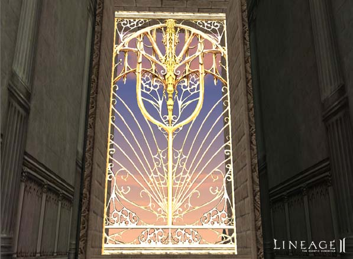
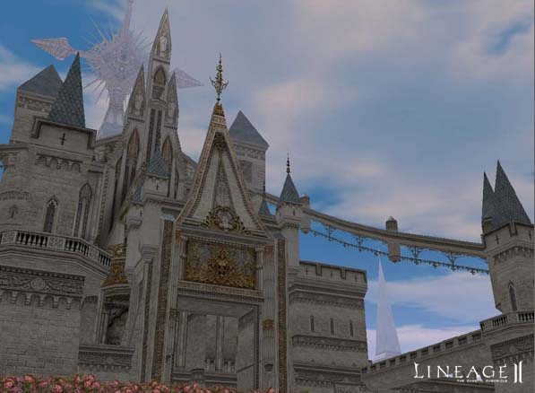
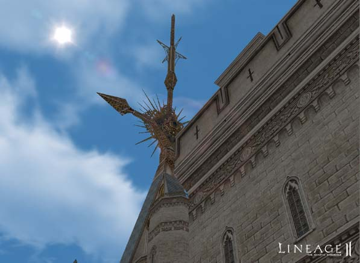
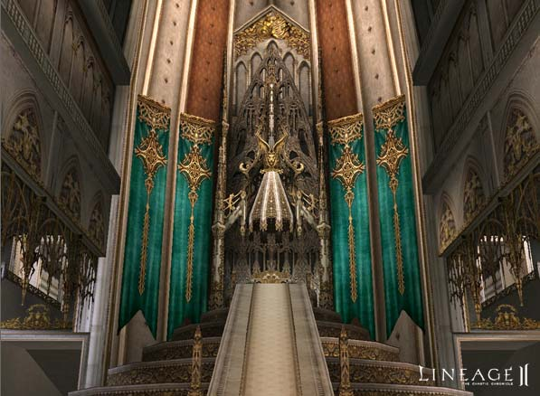
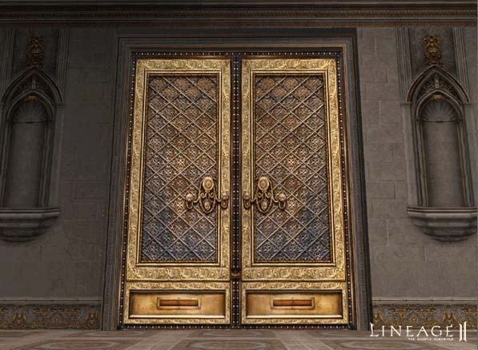

### Town of Aden

Built within the large outer walls of Aden Castle, the scale and splendor of the incomparable town of Aden matches its position as the capital city of the kingdom.

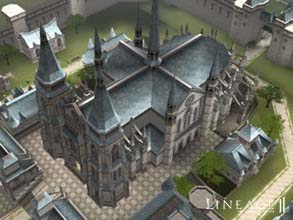 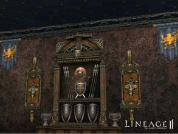

### Cave of Giants

In mythical times, the giants avoided the wrath of Einhasad's cold eyes, fleeing into the caves of the lost high plateau. With the passing of time, the giants degenerated gradually, until they found themselves controlled by the mechanical devices they had themselves created. Those unfortunate giants that were absorbed by the machines lost the dignity of a high race and descended to the status of pitiful creatures. Although these giants had greatly degenerated, their large, strong bodies still made them creatures feared by Humans.

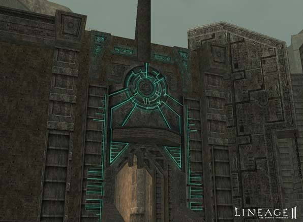
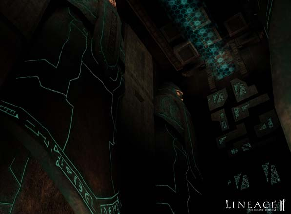
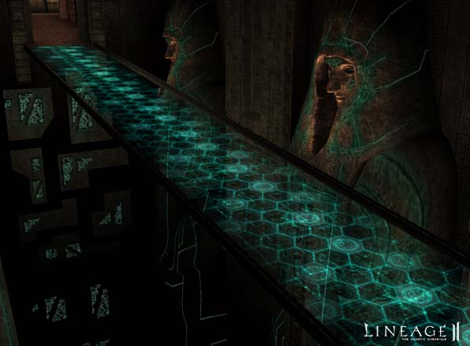
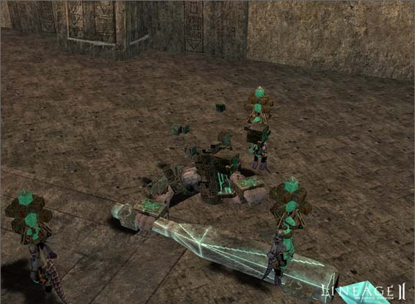
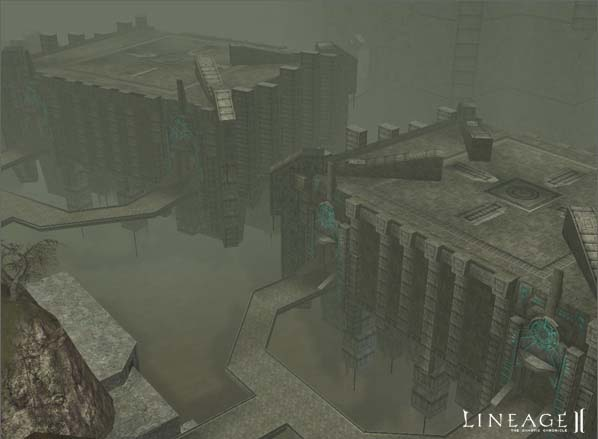

### Angel Waterfall

When the lost high plateau was formed by the power of Gran Kain, the originally small waterfalls reached thousands of meters in height due to rapid topographical changes. The citizens of Aden, awed by the majestic waterfalls, believed they were built by the power of the angels and named them Angel Waterfalls.

### Forest of Mirrors

The Forest of Mirrors is where Doppelgangers, creatures of Shilen, are found. These beings, also known as the dark children of mirror, have the ability to appear in the image of the other races, such as Humans and Elves. Because they merely imitate other beings and exist without an identity of their own, Doppelgangers have only hostile feelings for other races.

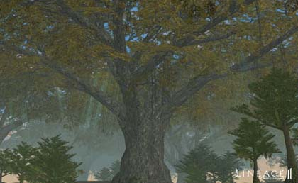 
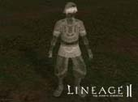 
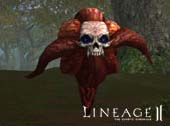

### Cemetery of Kings

The Cemetery of Kings is where the royalty of the Elmoreden Empire were buried. Even today, high royalty and saints are still enshrined in this place when they die. King Raul, who unified the Aden Kingdom and his son Travis are also buried here. Due to frequent wars and invasions, care of the cemetery has been neglected and grave robbery has become prevalent.

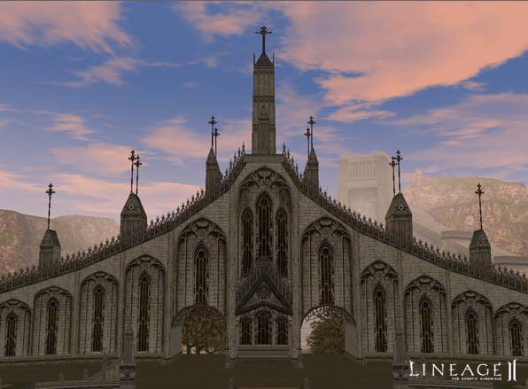
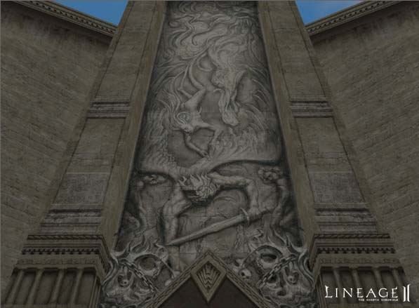
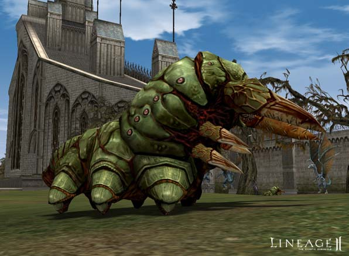
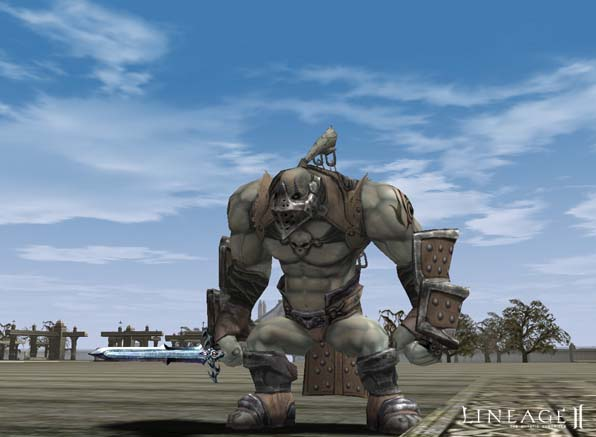
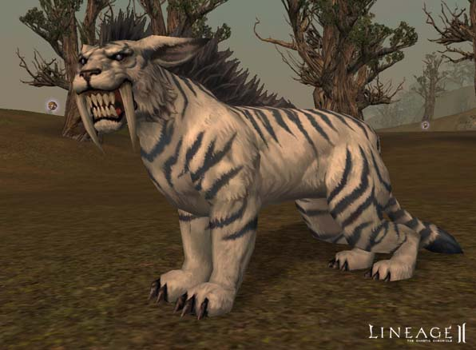

### Sealing of Shilen

According to legend, the Temple of Shilen marks the place where the goddess of Shilen, banished from paradise, gave birth to dragons and evil beings. She eventually became the goddess of death herself. Shunaiman, the first emperor of the Elmoreden Empire, left the temple of Shilen for the land of Humans. Over the years, he organized a vast force to block the creatures from wreaking death and destruction in the temple of Shilen. Many evil forces gather to collect the dark magic flowing from the temple of Shilen, making this a very dangerous place.

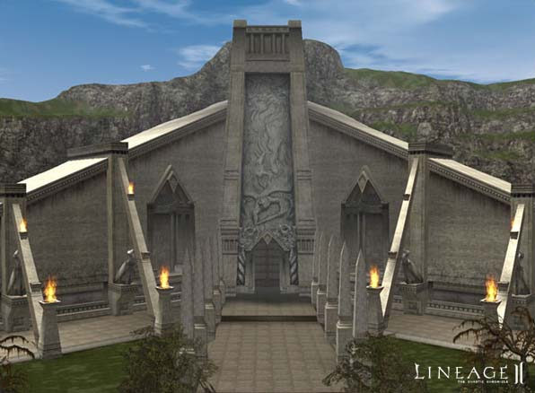

### Blazing Swamp

This was originally an ordinary swamp until the arrival of the fire wizard Manak, who experimented on beings living in the area, filling it with evil mutant beings of fire. This area now known as the cursed swamp of flames is only approached by those who want to test their bravery.

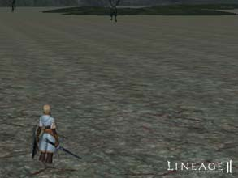 
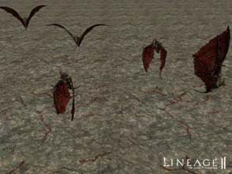

### Tower of Insolence

Baium was an emperor of the Elmoreden Empire who became obsessed with the desire to attain the power of the gods. He mobilized his forces to build an Eternal Tower, resolving to reach the gods in the heavens above. Einhasad became angered at the arrogance of Humans. She cursed the engineers and Wizards with deadly disease and condemned Baium to immortality, locked away at the top of the tower, where he was forced to observe the destruction of his empire for hundreds of years. In the end, Baium went insane and slowly transformed into a monster. This tower became known as the Tower of Insolence and was sealed tightly from the populous.

### Giran Region

### Lair of Antharas

After Antharas was defeated in the war with the gods, he sought sanctuary in this cave, where he yet resides. It is in this very dangerous place where Antharas has regained his enormous power.

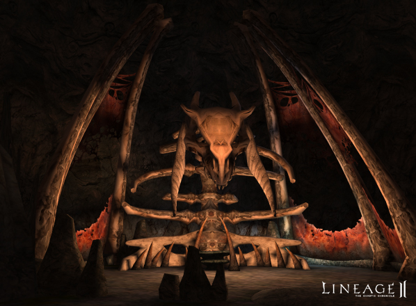
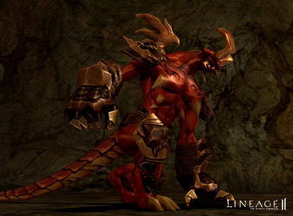
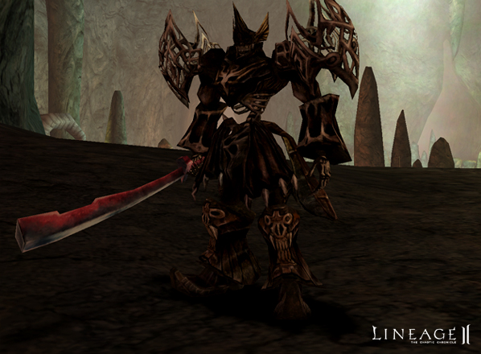
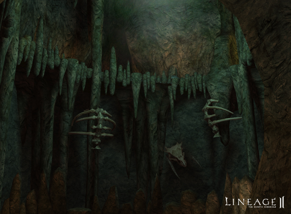
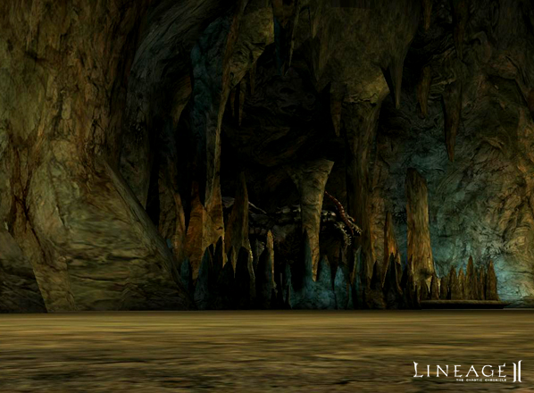

### Hardin's Academy

Great Wizard Hardin trains students and carries out his personal research activities in this former hiding place of Lich King Icarus. Hardin defeated Icarus in one-on-one battle and procured the facility for his own laboratory.

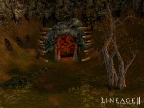 
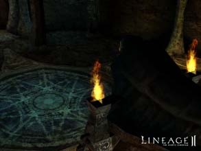

### Giran Harbor

Many boats now commute between Talking Island and Giran Harbor, which is the leading trade port on the continent.

A dueling area has been added to the Giran territory. In the dueling area, there are no PK or PvP penalties.

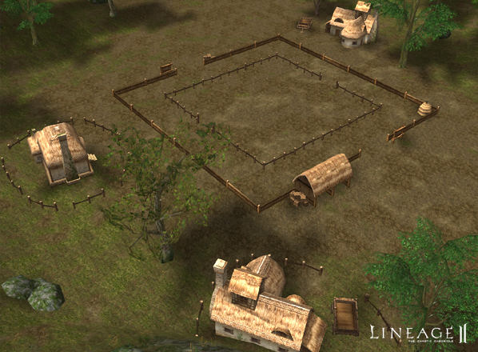

### Oren

### Bandit Stronghold

During the long war between Oren and Elmore, many prisoners and deserters engaged in banditry. United under a charismatic leader, this group of outlaws became feared throughout all of Oren.

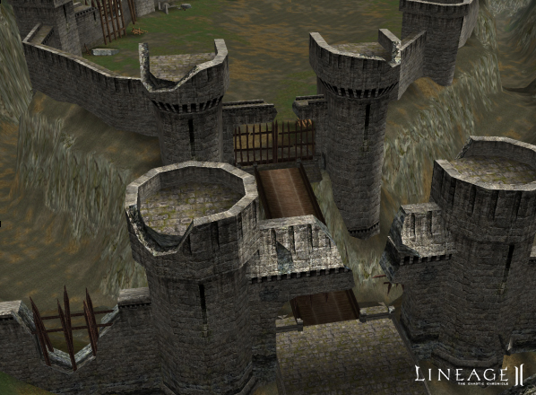
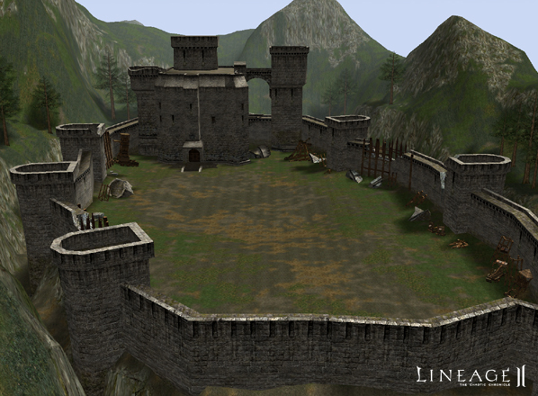
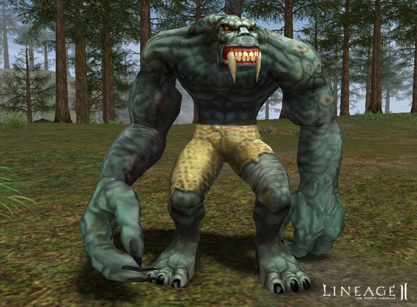
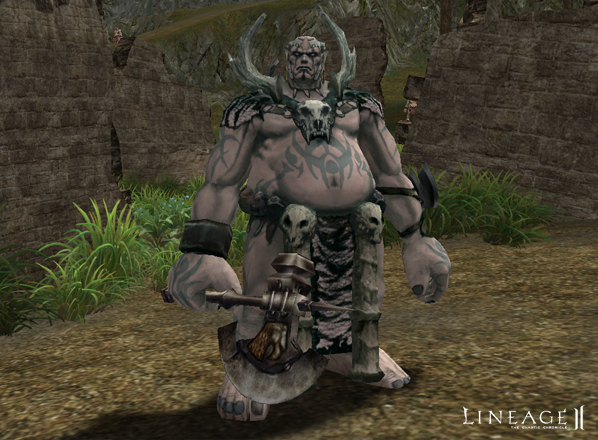
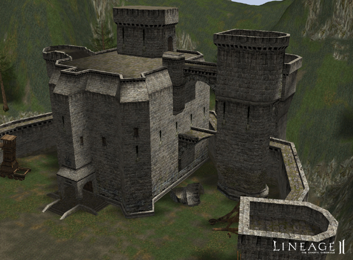

### Gludio

- A dueling area has been added to the Gludio territory. In the dueling area, there are no PK or PvP penalties.
- The Queen Ant's lair has been changed so the guardian ants are no longer trapped inside.
- In addition, the buildings in the Dwarven Village have been partially modified.
