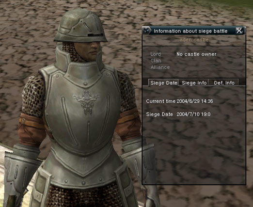
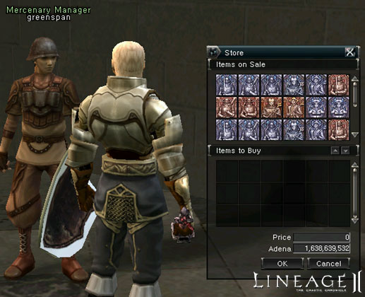
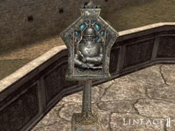
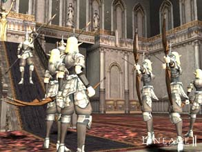
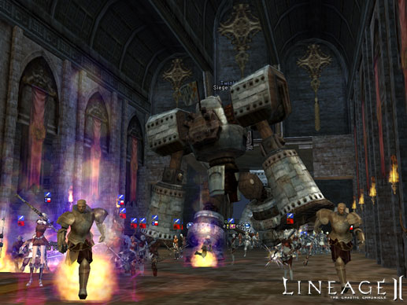
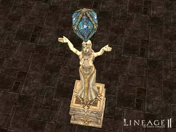
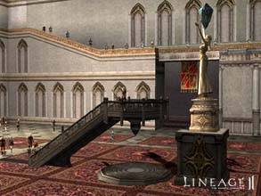

# Castle Sieges

### Castle Siege Basics

**Siege Qualifications:**

- Any clan of level four or higher may normally participate in a siege.
- Clans below level four and clan-less players may also participate, but they cannot own a castle.

**Siege Locations:**

Castle Sieges can take place at five castles:

- Gludio
- Dion
- Giran
- Oren
- Aden

**Default Castle State:**

- Initially, NPC clans occupy all castles.
- A PC clan that defeats an NPC clan in battle and occupies the castle becomes the first owner of that castle, other clans may attempt to claim the castle from the initial PC clan if there is still time in the siege period.
- The victorious clan leader must designate the next siege period within twenty-four hours of becoming the castle lord. If the castle lord fails to designate a siege period, the standard siege period is automatically applied.
- The castle also returns to its default state (of being owned by NPCs) if the clan controlling the castle is dissolved.

**Siege Period:**

- Only the castle lord may select a siege period through the messenger NPC in front of the castle.
- Once set, siege times cannot be changed.
- The new castle lord must designate the next siege period within twenty-four hours of occupation. Failure to select a siege period will result in the automatic setting of the siege period two weeks later.
- The castle can only be damaged during castle siege periods.
- A clan that has occupied a castle may possess the castle for up to two weeks.
- At the time of a scheduled siege, a system message is sent to everyone in the Lineage II world.

### Siege Preparations

**Siege Participation Registration:**

- Clans that wish to participate in a siege for a chance to occupy the castle must register for siege participation.
- Only clans may participate in sieges and only the clan leader may request registration. However, registration is not possible until the castle lord has designated a siege period.
- Siege participation registration is closed twenty-four hours before the start of the siege.
- Players may request participation through the Messenger NPC outside the castle and the Chamberlain NPC inside the castle. Cancellation of registration may also be done through these NPCs.

**Attacker Registration:**

- The clan leader must have a clan of level 4 or higher to participate in a siege.
- Select Register for Siege Attacker from the NPC menu to be added to the attacker list after undergoing a simple confirmation process.

**Defender Registration:**

- All clans wishing to defend the castle must register.
- Like the attacker clans, the skill Siege Participation Possible is required.
- To participate as a defender in a siege, select Request Siege Defender Registration from the NPC menu (the castle lord must later approve participation).
- The castle lord has up to twenty-four hours before the start of the siege to review and approve the defender's list. Adjustments may also be made within this period.
- The clan occupying the castle automatically becomes registered on the siege defender list, even if it does not register itself, and cannot be removed from the list.

**Mercenary System:**

Types of Mercenaries:

- Sword Mercenary
- Spear Mercenary
- Bow Mercenary
- Healer
- Mage

- The castle lord can hire the NPC mercenaries necessary for the defense of the castle and deploy them to the appropriate locations.
- The castle lord can hire the types of mercenaries needed through the mercenary chief NPC located in the castle.
- The castle lord can also set NPCs to defend a specific location or be mobile.

Purchase and Placement of Mercenaries:

- The castle lord may purchase mercenary token from the chief mercenary NPC. Mercenary tokens are specific to each castle, as the castle name and type of mercenary is indicated in the item's tool tip. These tokens cannot be traded and only the castle owner may purchase them. If they are not used right away, they may be saved for later use.
- Mercenary tokens can be placed around the castle. They may be seen by anyone, but can only be picked up by the castle lord.
- Only one mercenary token may be placed in the same immediate area.
- The direction the castle lord is facing when placing mercenary tokens will be the same direction the NPC faces.
- Mercenary tokens that are placed will no disappear after a server goes down.
- When the siege begins, these tokens change to mercenary NPCs.

 

### Siege Rules and Related Systems

**Beginning of the Siege:**

- A castle siege begins when the designated period is reached.
- The castle siege time is two hours, which does not include any server downtime during the siege period.
- The area inside and around the castle is designated as the battlefield. A number of NPCs in the village closest to the castle suspend their functions during the siege.
- During a castle siege, players are unable to respawn at the castle's associated village. Instead, they must respawn at the next closest village.
- When the siege begins, all characters within the castle that are not listed on the defender's list will be transported to the second closest village.
- The outer castle walls are automatically shut.

**Siege Rules:**

During a siege, participants are divided into attacker, defender, or not on the list. According to their status, they are sorted into allies, enemies, or neutral. These relationships may change as the siege progresses.

- Defenders and attackers are enemies.
- Members of the same alliance and same clan are allies.
- Clans that are not part of an alliance or players not belonging to a clan are neutral.
- When attacking enemies or neutral characters, automatic attack is possible, but attacking allies requires a forced attack (using the Ctrl key).
- Defenders are designated by a shield symbol and attackers are designated by a sword symbol above their clan's symbol. The background color of the mark is either red or white, depending on whether a character is an enemy or ally.
- PK count and karma penalties are not applied on the battlefield. A character does not become chaotic for killing another PC.
- If an enemy steps out of the boundaries of the battlefield, the siege status is still maintained and there are no PK penalties.
- A neutral character who steps outside the battlefield receives a purple status for ten seconds.
- During a siege, the experience penalty for death has been reduced by seventy-five percent. In addition, characters do not drop items when they die.

**Castle Gates:**

- The castle lord may open and close the castle gates. The number of castle gates depends on the size and structure of the castle.
- The castle gates have HP and it is only possible to attack them during a siege.
- It is not possible to buff, debuff or heal castle gates.
- Once destroyed, castle gates cannot be repaired during the siege.
- New castle gates are raised when the castle ownership changes, but only at fifty percent the standard amount of HP, while a siege is still active.

**Siege Headquarters:**

- The attacking clan leader can build a headquarters within a certain area using the build headquarters skill.
- Build headquarters is a skill that can be used only once per siege period and disappears automatically when the siege is over.
- A headquarters allows clan members to restart at the headquarter flag location instead of the second closest village during a siege. Every attacking clan leader must build their own headquarters to gain the benefits, even if allied with other clans.
- A headquarters has a certain amount of HP. It is destroyed when its HP is gone. Like castle gates, headquarters cannot be buffed or debuffed, nor can their HP be recovered.
- The clan that loses its camp must restart at the second closest village when returning home or dying.
- Clan members who possess a headquarters can regenerate their HP and MP quickly when near their flag.
- When the clan leader builds a headquarters, it consumes a certain amount of MP, along with 300 C-grade gemstones.

**The Castle Grounds:**

- The members of the defending clans will restart inside the castle upon death.
- After restarting, there is a thirty-second waiting period before characters can return to the battlefield.
- Life crystals determine the return waiting period for defends. If all three life crystals in a castle are destroyed, defenders are teleported every eight minutes, instead of every thirty seconds.

**Conditions for Victory:**

- A holy relic resides in a certain location inside the castle.
- When the attacking clan leader interacts with the holy relic for a set period of time, the holy relic acknowledges the player as the new castle lord.
- Only the clan leader may interact with the holy relic.
- If attacked while interacting with the holy relic, this period will be restarted.
- Clan leaders allied with the defender may not interact with the holy relic.

 

**Mid Victory:**

- If the attacking side succeeds at communing with the holy relic, the attacking and defending sides switch places.
- Everything that belonged to the clan that held the castle, including the restart point, is now transferred to the new defending clan, whose former encampment automatically disappears.
- All PCs other than the clan that just took the castle are removed to their respective restarting points.
- Clans that were allied with the clan that just took the castle are automatically transferred to the defending side. However, those that were not registered for the siege are all kicked out.
- The clan that lost the castle during the siege is now able to build an encampment on the battlefield.

**Exceptions to the Rules:**

Server and NPC Server Down:

- If the server goes down during a siege, the server will restart at the same point in the siege as when the server went down.
- The defending NPC and castle gate HP, encampment HP and character locations are all restarted at the same point as when the server went down.
- For a short period after a server goes down, no characters will be able to move, attack, recover HP, enter or exit the battlefield. After this freeze period, the siege will resume and everything will return to the same point as before the server went down.

Client Forced Quit:

- While in battle, the player remains in the game for fifteen seconds and will continue to attack their target during that period, also vulnerable to attacks themselves.

### Castle Structure and Taxation

**Taxation:**

- In the Lineage II world, the castle is the one structure in each territory where taxes are received, government matters are administrated and the economy is managed.
- The castle lord may set taxes levied on the NPC stores in territory the castle controls by talking to the Chamberlain located within the castle.
- Since Aden Kingdom is the central power for all of the territories, Aden Castle collects taxes from Gludio Castle, Oren Castle, Giran Castle and Dion Castle, in addition to taxes earned in the Aden territory.
- When a castle is taken, much like a clan hall, the castle lord gains exclusive use of a treasury and a gatekeeper to teleport in and out of the castle.

**Structure of Gludio, Dion, Oren and Giran Castles:**

- There is one outer castle gate and one inner castle gate.
- The internal living area of the inner castle is the restarting point for the defending clan.
- The holy relic is located in the inner castle.
- The defenders may exit the castle during the siege period, but no characters may enter the castle until the gates are destroyed.

**Structure of Aden Castle:**

- Aden Castle has two outer walls that must be breached before reaching the castle itself.
- There is only a front entrance to the outermost wall, but there is more than one possible entrance to the next outer wall.
- The area between the first and second outer walls is affected by the fire control tower.
- Other than the above, Aden Castle is similar to the other castles.
- When defending Aden Castle, the Chamberlain may be used to place traps that continuously decrease HP or slow zone traps that reduce movement speed and strength.
- The flame control towers can be destroyed.
