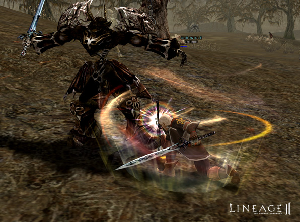
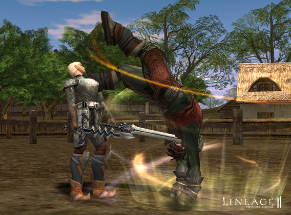
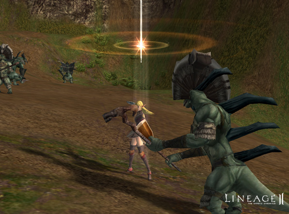
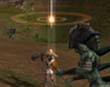
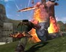
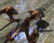

# New Skills

| Skill | Description | Class | Level Required |
|:--:|:--|:--:|:--:|
| [Summon Siege Golem] | [Summons a siege golem] Can summon a siege golem, only during sieges. Costs 300 C-grade crystals to summon and 60 C-grade gemstones/minute to maintain. | Warsmith | 49 |
| [Hurricane Assault] | [Unleashes a flurry of continuous attacks on an enemy. Can be used when wielding duel weapons. Requires charging prior to use.] | Monk | 36 |
| [Mass Resurrection] | [Resurrects clan members] Resurrects nearby clan members. The higher the skill, the more experience points are recovered. | Bishop | 44 |
| [Party Recall] | [Teleports party members to village] Teleports nearby party members to town. The higher the level, the shorter the casting time. | Elven Elder | 48 |
| [Heart of Paagrio] | [Quickly recovers the HP of clan members] Increases the HP recovery rate of nearby clan members. | Overlord | 44 |
| [Decrease Weight] | [Lessens the effect of carrying items] The weight penalties are adjusted. | Elven Oracle | 35 |
| [Provoke] | Draws in monsters from one's large surrounding area. | Warlord | 43 |
| [Lion Heart] | Reduces the probability rate of falling into a state of paralysis, hold, sleep, or shock. | Warrior / Orc Raider | 36 |
| [Guard Stance] | Increases P. Def. and shield defense rate (MP will continue to be consumed). | Temple Knight | 43 |
| [Life Leech] | Absorbs enemy's HP. | Shillien Knight | 40 |
| [Mana Regenerative] | Increases MP recovery speed (consumes seven runestones). | Spellsinger | 40 |
| [Pact of Paagrio] | Temporarily makes clan members go into the state of berserk. | Overlord | 40 |
| [Transfer Pain] | Transfers partial damage to a servitor (MP will continue to be consumed). | Warlock / Necromancer / Elemental Summoner / Phantom Summoner | 56 |
| [Curse Gloom] | Reduces an enemy's M. Def. | Necromancer | 52 |

- Expertise skills and other similar skills that are learned automatically will disappear when the player's level goes below the minimum level for that skill. Of course, the skill is recovered once the player again reaches the level at which the skill is learned.
- Due to play balance between naturally fast and slow moving characters, the following skills now add a fixed amount of speed to player movement, regardless of natural speed: Wind Walk, Sprint, Servitor Haste, Quick Step and Song of Wind. The effect is similar to that of speed potions used to increase speed.
- The effect of stun has been lengthened from five to eight seconds. However, if the player is attacked while stunned, the stun effect may be removed.
- With some dagger skills, the chance of striking a target is now more successful from behind than from all other angles. To preserve play balance, the MP cost for these skills is now reduced.
- Mystics' casting ranges for the following spells have been increased by approximately twenty-five percent: Aqua Swirl, Twister, Blaze and Frost Flame.
- Casting ranges for the following spells used by high-level spell casters have been increased by approximately fifty percent: Death Spike, Prominence, Vampiric Claw, Hydro Blast, Frost Bolt, Ice Dagger, Hurricane, Freezing Flame, Steal Essence.
- Purple and chaotic players can no longer use specific skills to cause damage in non-PVP enabled areas, such as towns.
- Players now become purple when using the Spinning Slash or Thunderstorm skills on purple characters.
- Lightning Strike is now properly categorized as a magical skill instead of physical.
- Players now receive a message when the Curse Discord spell succeeds. No message appears when it fails.
- Players no longer receive a message that the Corpse Plague skill failed when it has succeeded.
- For a certain amount of time, a player (or their party) is now given priority when using Search after successfully casting Spoil on a monster.
- Search is now properly applied after using Spoil successfully on two monsters.
- The animations for the following skills are now enhanced: Deadly Blow, Iron Punch, Cripple, Stunning Fist, Soul Breaker, Force Storm, Force Blaster, Burning Fist, Hurricane Assault, Force Buster, Song-type magic, Dance-type magic, Fake Death.
- The graphical effects for the following skills are now enhanced: Frozen Shackles, Hydro Blast, Aura Flare, Shield Stun, Triple Sonic Slash, Double Sonic Slash, Sonic Blaster, Sonic Storm, Heart of Paagrio, Blessing of Paagrio, Shield Chant, Soul Shield, Fire Chant, Glory of Paagrio, Shield of Paagrio, Chant of Evasion, Silence
- The twentieth buff effect is now always displayed properly in the user interface.

Gallery

    

