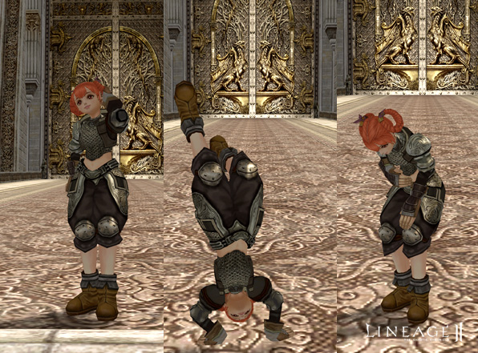

# Fighting and Player Character Systems

- For damage-over-time attacks such as poison and bleeding, the experience the attacker gains will now accurately reflect the proportion of damage given to the target.
- Since the use of Spoil against a monster is considered an attack action, the character will automatically attack the target after using Spoil.
- Dexterity now increases the chance for shield defense to be applied. Characters with high dexterity now have an added probability for blocking with the shield.
- The direction of an attack now affects its power and effectiveness, as well as the success of critical hits, shield blocking and attacks.
- To prevent a player from forcefully quitting the game to avoid a dangerous situation during battle, their character will remain in the game for fifteen seconds, continuing to attack its target and also be vulnerable to attacks.
- For easier confirmation and the prevention of possible exploits, a character's purple name now blinks for five seconds prior to returning to neutral status.
- If you cast spells that help purple or chaotic players, or if you cast spells that help monsters, you will now become purple.
- Three types of social actions have been added: laughing, waiting and unaware.

