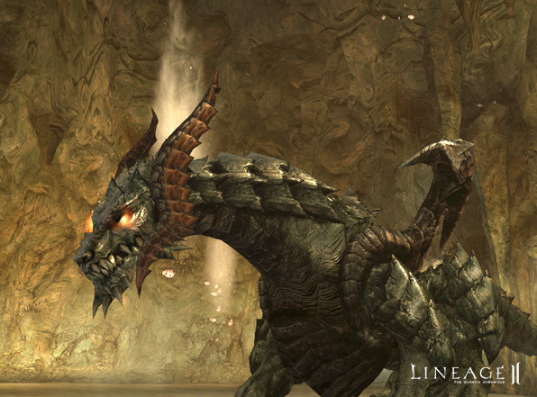
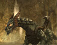
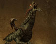
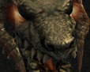
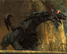
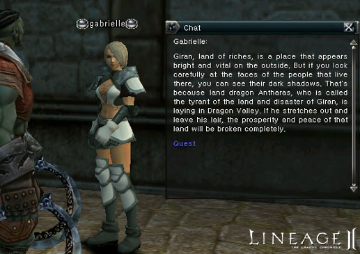
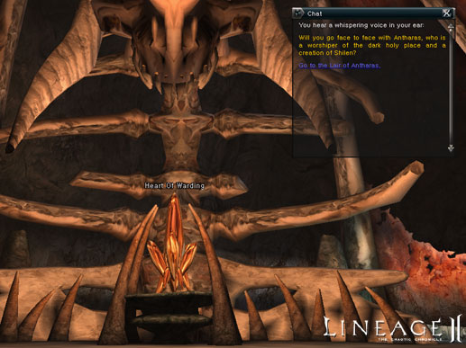

# Antharas the Land Dragon

### Antharas

Gallery

    

Antharas is one of the great dragons in the history of Aden. This dragon is by far the most fearsome creature in the Lineage II world. The earth tyrant Antharas, also known as Giran's Disaster, has finally awakened from a long, deep slumber.

**Conditions for Meeting Antharas**

- To enter the lair of Antharas, a portal stone must be obtained, which is only possible for characters level fifty or above.
- To obtain a portal stone, first seek Gabriel and fulfill her tasks and those of the other seal guardians. With the portal stone, it is possible to cross the barrier surrounding Antharas' lair.
- The entrance to the lair of Antharas is located in an underground floor of a dungeon deep in Dragon Valley.

**Attacking Antharas**

- Characters who have managed to gain entrance to his lair will be overwhelmed, as the ancient and incredibly powerful Antharas dramatically emerges.
- Once inside, players will no longer be able to enter or leave, until the great dragon falls or their forces are completely wiped out.
- Be forewarned! Doing battle with Antharas is the penultimate challenge, requiring many sacrifices, intense coordination and the gathering of the mightiest forces of Aden. Only those willing to struggle against incredible odds for many hours have even the slightest chance for victory.

**Exceptions to the Rules**

- If the main or NPC server goes down, the HP of Antharas is saved at the same status as before the server went down.
- After entering the lair, if a player logs out the game for longer than thirty minutes, they will be returned to the nearest village upon reconnecting.
