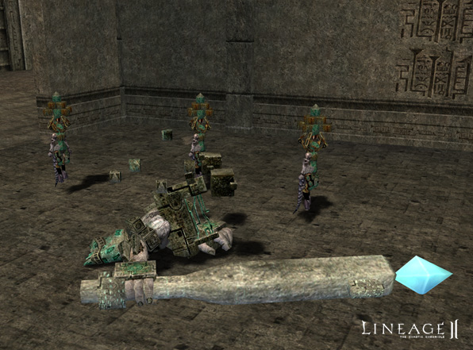
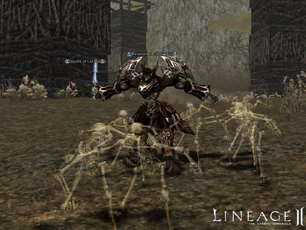
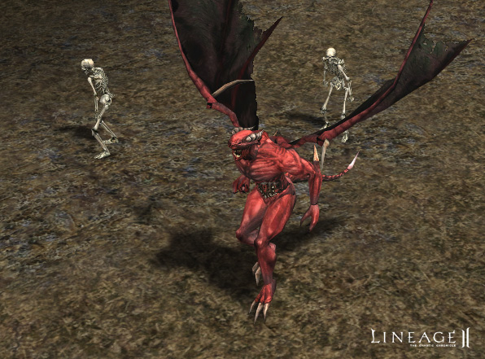
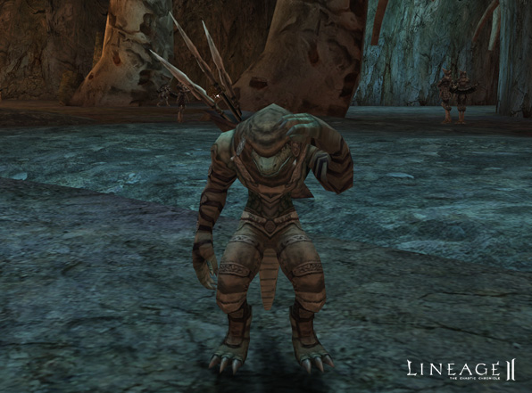

# Monsters and other NPC

### Monsters

- Groups of four to five monsters have been added that give more experience points and items than other monsters. They can be found in the following locations: Wasteland, Forgotten Temple, Cruma Tower, Partisan Hideaway, Dragon Valley, Lair of Antharas, northern and southern parts of Oren, Cave of Giants and Blazing Swamp.

- The movement speed of all monsters was increased by approximately ten percent. The movement speed of monsters of level fifty and above was increased by approximately fifty percent. The speeds of some other monsters were adjusted individually for balance reasons.
- Monsters now use a wider variety of skills and use them more frequently. Item drop rates have been further balanced according to monster difficulty.
- When a monster uses a skill, there is now a delay before reuse.
- When hunting monsters for a quest, regular experience points and skill points are acquired, but items and adena are not given for these monsters.
- The overall number of monsters has been reduced, but their spawn rate is now faster.
- Monsters have been added to Aden Territory, a high-level hunting ground.
- Monsters can now be found near the Ivory Tower, Oren Castle Town and the Bandit Stronghold of Oren Territory.
- Some low-level monsters have been replaced with higher-level monsters around Talking Island and the Elven and Dark Elven Villages.
- Powerful boss monsters have been added to following areas:
  - Dion Territory
  - Giran Territory
  - Oren Territory
  - Aden Territory
  - Orc Kingdom
  - Dwarf Kingdom

- Boss monsters now have three times the health of ordinary monsters, but they will also drop three times as much when killed.
- Some boss monsters now have dialogue.
- For the Rogue job change quest, pet manager Martin and his roommate Netty could not pay their rent, so they were kicked out of their house.
- The NPC guide for each race now always acknowledges a character's class change, even if they have since de-leveled.
- The Stun effect graphic now appears overhead when using stun on Silenos.
- The following are now recognized correctly as undead monsters in regards to skill use: Skeleton Raider, Neer Ghoul Berserker, Cave Servant, Cave Servant Archer, Cave Servant Warrior, Cave Servant Captain, Royal Cave Servant, Red Arachne, Spore Zombie, Patin Archer, Ritmal Swordsman
- Monsters with the ability to throw spears have been added.

