# Items

- Enchanting weapons and armor now has a better chance for success.
  - The probability for success has been doubled when using a scroll of enchant weapon on an enchantment level of three or higher.
  - The enchant effect has been tripled when using a scroll of enchant armor successfully on an enchantment of level three or higher.
  - When successfully crystallizing an enchanted item of level four or higher, the quantity of additional crystals has been doubled. This increase also applies when receiving crystals from an unsuccessful enchant.
  - *These rules are applied retroactively to already existing enchanted items.
- The number of soul shots and the MP used by bows have been changed.

| Name | Grade | Soul Shot Before | Soul Shot Now | MP Before | MP Now |
|:--:|:--:|:--:|:--:|:--:|:--:|
| Hunting Bow | None | 4 | 6 | 2 | 2 |
| Forest Bow | None | 4 | 7 | 3 | 3 |
| Composition Bow | None | 4 | 7 | 4 | 3 |
| Strengthened Bow | D | 4 | 6 | 4 | 4 |
| Long Bow | D | 4 | 6 | 5 | 5 |
| Elven Bow | D | 4 | 6 | 5 | 5 |
| Dark Elven Bow | D | 4 | 6 | 5 | 5 |
| Gastraphetes | D | 4 | 8 | 5 | 5 |
| Strengthened Long Bow | D | 7 | 10 | 7 | 6 |
| Light Crossbow | D | 7 | 10 | 7 | 6 |
| Crystallized Ice Bow | C | 4 | 8 | 8 | 7 |
| Crossbow | C | 4 | 8 | 8 | 8 |
| Akat Long Bow | C | 7 | 9 | 9 | 8 |
| Elven Bow of Nobility | C | 4 | 8 | 8 | 8 |
| Eminence Bow | C | 9 | 10 | 10 | 9 |
| Neti's Bow | None | 4 | 6 | 3 | 3 |
| Guard's Bow | None | 4 | 7 | 3 | 3 |
| Crescent Moon Bow | None | 4 | 6 | 2 | 2 |

- The types of bows have been categorized into ordinary bows and long bows. The difference between the two is that long bows have a slower attack speed and a have higher attack and magic strength. The following are categorized as long bows: Long Bow, Akat Long Bow, Dark Elven Bow, Soul Bow.

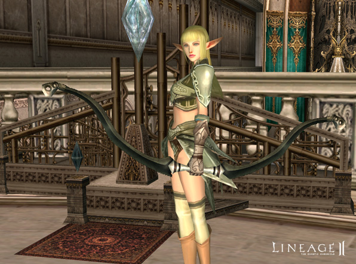

Gallery

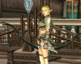 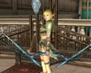 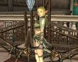 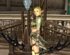 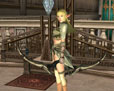

- The price for arrows has been reduced. Their recipes and contents have been modified accordingly. Also, more arrows can be made from the same ingredients.
- Bows and throwing spears now fly along a more realistic, parabolic path.
- Monsters now drop a greater variety of items, at a slightly greater probability. The items from Spoil have not been changed.
- Damage from polearms has been slightly reduced and their range has been slightly increased.
- The magic casting speed has been increased from thirty to forty percent when using spirit shot.
- The number of ingredients needed for making spirit shot has been slightly increased.
- Blessed spirit shot and its recipe has been added. When using blessed spirit shot, the strength has been doubled.
- New item sets have been added.

| Name | Upper Garments | Lower Garments | Helmet | Gloves | Boots | Shield |
|:--:|:--|:--|:--|:--|:--|:--|
| Devotion | Tunic of Devotion | Stockings of Devotion | Leather Helmet | | | |
| Mithril | Mithril Breastplate | Mithril Greaves | Helmet | | | Hoplon |
| Knowledge | Tunic of Knowledge | Stockings of Knowledge | | Gloves of Knowledge | | |
| Manticore | Manticore Leather Shirt | Manticore Leather Greaves | | | Manticore Leather Boots | |
| Elven Mithril | Mithril Tunic | Mithril Stockings | | Elven Mithril Gloves | | |
| Enchanted Mithril | Enchanted Mithril Shirts | Enchanted Mithril Greaves | | | Enchanted Mithril Boots | |
| Chain | Chain Mail Shirt | Chain Greaves | Steel Chain Hood | | | |
| Plated Leather | Plated Leather Armor | Plated Leather Greaves | | | Plated Leather Boots | |
| Composite | Composite Armor | | Composite Helmet | | | Composite Shield |
| Demon's | Demon's Tunic | Demon's Stockings | | Demon's Gloves | | |
| Theca Leather | Theca Leather Mail | Theca Leather Greaves | | | Theca Leather Boots | |
| Drake Leather | Drake Leather Mail | | | | Drake Leather Boots | |
| Full Plate | Full Plate Armor | | Full Plate Helmet | | | Full Plate Shield |
| Divine | Divine Tunic | Divine Stockings | | Divine Gloves | | |

**Karmian**

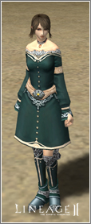 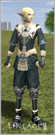 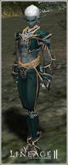 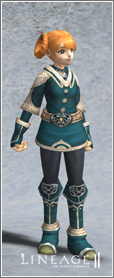 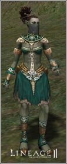

**Demon's**

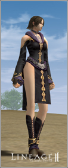 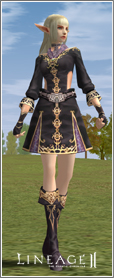 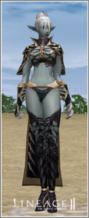 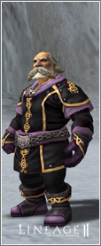 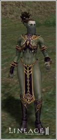

**Chain**

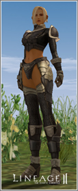 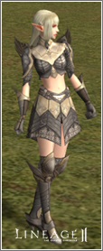 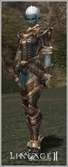 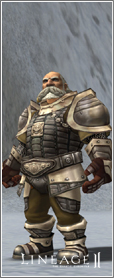 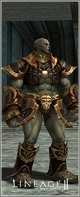

**Divine**

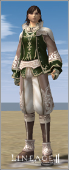 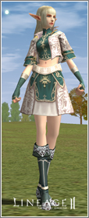 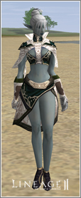 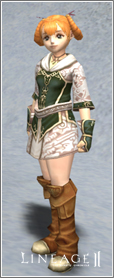 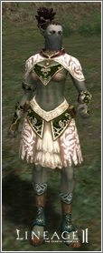

**Dwarven Chain**

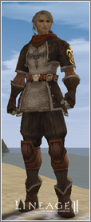 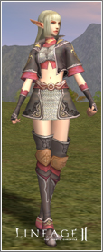 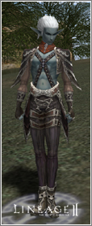 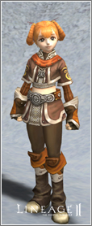 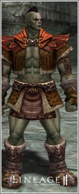

**Theca Leather**

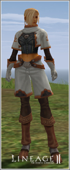 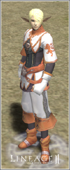 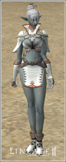 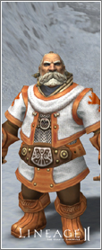 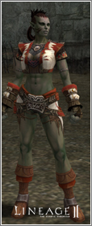

- Items for wolves and hatchlings of level twenty and above have been added.
- New spell books that correspond to the new skills have been added.
  - Purchased in shops: Spellbook: Decrease Weight
  - Obtained through a quest: Talisman: Heart of Paagrio
  - Acquired by hunting monsters: Design Map: Summon Siege Golem, Spellbook: Mass Regeneration and Spellbook: Party Recall
- The icons for the different types of spell books have been changed. Some armor and shield icons have also been changed.
- Wooden gaiters are now sold in Orc shops as well as other shops.
- Boat tickets for Giran Harbor — Talking Island can now be acquired from Wharf Managers Fallius and Pelton.
- Because new areas have been added to the world of Aden, the territory range in the world map has been increased.
- Because one-piece and two-handed items actually take up two slots when worn, the icons for each take up two slots now.
- The appearances of the following items have been changed:

  **Weapons:** Aspis, Atuba Mace, Bow, Buzdygan, Crystal Staff, Crystallized Ice Bow, Doom Hammer, Dwarven Mace, Heavy Doom Axe, Mace of Judgment, Saber, Spiked Gloves, Spinebone Sword, Stick of Faith.

  **Shields:** Bone Shield, Brigandine Shield, Bronze Shield, Buckler, Composite Shield, Chain Shield, Doom Shield, Dwarven Chain Shield, Full Plate Shield, Kite Shield, Knight Shield, Leather Shield, Eldarake, Hoplon, Plate Shield, Round Shield, Shield of Nightmare, Skeleton Buckler, Small Shield, Square Shield, Tower Shield.

  **Armor Sets:**
  - Chain: Boots, Gaiters, Gloves, Mail Shirt
  - Demon's: Boots, Gloves, Stockings, Tunic
  - Divine: Boots, Gloves, Stockings, Tunic
  - Dwarven Chain: Boots, Gaiters, Gloves, Mail Shirt
  - Karmian: Boots, Gloves, Stockings, Tunic
  - Mithril: Boots, Gaiters, Gloves, Shirt
  - Theca Leather: Armor, Boots, Gaiters, Gloves

- Temporary graphics of other boots have been added for some boots that previously had no graphics: Drake Leather Boots, Rind Leather Boots, Dragon Leather Boots, Theca Leather Boots, Plated Leather Boots
