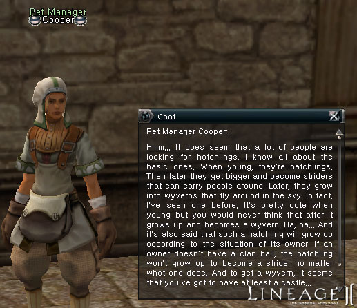

# Quests

**Eight new quests have been added:**

> **Hunt of the Black Lion**
> The Hunt of the Black Lion is an upgraded version of the Vanquish Remnants quest. You can only begin working on it after receiving the Black Lion Mark from the Vanquish Remnants quest.
> This quest is repeatable.
>
> **The Wishing Potion**
> The young female dwarf Matild is very interested in alchemy and desires to create a wish potion. You will need to achieve level thirty or above in order to attempt take Matild's challenge.
> This quest is repeatable.
>
> **Song of the Hunter**
> Those who dream of making a fortune in a single quest have begun to flock to Hunters Village in the hopes of upgrading their level and receiving a bonus item of great value.
> This quest is repeatable.
>
> **Coin of Magic**
> Warehouse Keeper Sorint, whose hobby is coin collecting, lusts for rare coins possessed by others. Should you carry out his request, he will give you a very special reward.
> This quest is repeatable.
>
> **Audience with the Land Dragon**
> The Land Dragon Antharas has finally awakened from a deep slumber! Obtain the portal stone to enter his hidden lair. An enormous number of warriors must be recruited to defeat Antharas.

> **Little Wing**
> Players can finally hope to acquire a pet worthy of their labors. Follow the Little Wing quest to obtain a dragon hatchling that can be grown into a wyvern or dragon.

> **Proof of Clan Alliance**
> Level three clans must work together as a team to carry out this quest and upgrade their levels. Find Sir Kristoff Rodemai, who will give a test to earn the Proof of Alliance needed to expand a clan's power and influence.
>
> **Pursuit of Clan Aspiration**
> This quest offers the chance to raise a clan's level from four to five. All clan members can participate in a boss raid war to fortify their clan's solidarity. Players may also repeat the quest to win bonus items. Talk to Gustov Athebaldt to begin this quest.

- Descriptions for all quests are now available in the quest window.
- During the Dark Elf Tutorial quest, the Elf and Dark Elf Village guide indicators are now displayed properly.
- During the Raider's first promotion quest, the honey and marble items can no longer be obtained without using Spoil.
- Only one Footprint of Thief item can now be obtained during the Artisan's promotion quest.
