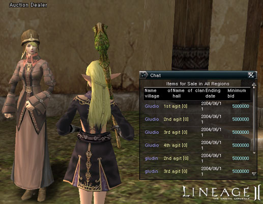
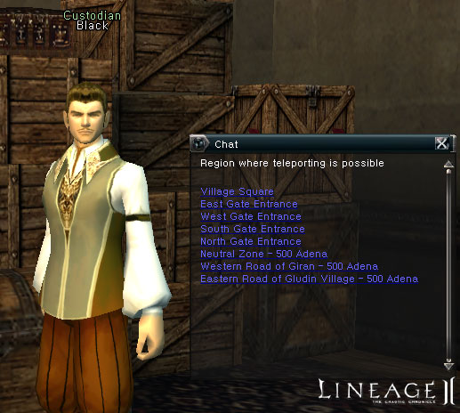
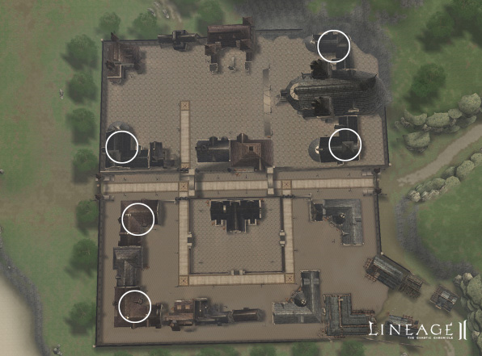
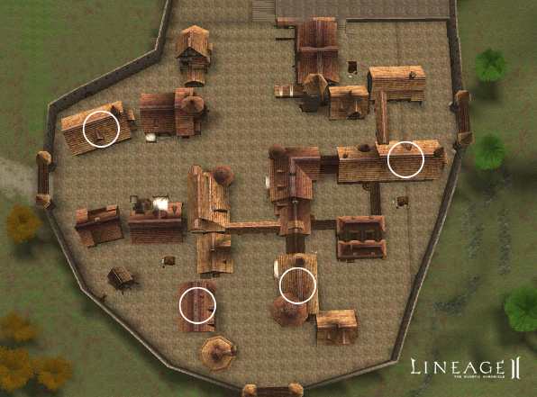
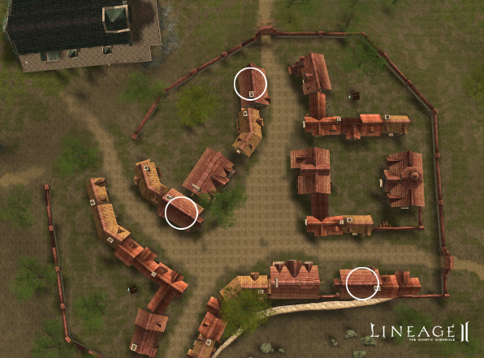

# Clan Halls

### Purchasing Clan Halls

- The clan leader who placed the highest bid at the end of the auction wins the clan hall. Players cannot see how much others have bid.
- Any player can view the clan halls in the auction, even if they are not qualified to make a bid.
- When a clan leader places a bid on a clan hall, the bid amount of adena is taken from the clan's warehouse. Bids must be higher than the previous bid. Clan leaders cannot bid more than the amount of adena in the clan's warehouse.
- Bids can be changed once they have been made by pressing the Rebid button, as long as the new bid is higher than the original.
- If a bid is cancelled, the adena is returned, minus a ten percent tax fee.
- If a clan disbands after placing a bid, the amount of the bid disappears.
- If a clan acquires another clan hall while bidding, the bid is canceled automatically and the adena is returned to the clan's warehouse, minus taxes.
- If two different clans placed the highest bid at the end of an auction, the clan hall is sold to the clan that bid first.
- If a clan is successful in purchasing a clan hall, the clan leader receives a message that they won. Any previous residents that are still in the clan hall are kicked out.
- The bid amounts of the clan leaders who bid unsuccessfully are returned to their clan's warehouses.

### Selling Clan Halls

- Clan leaders may put their clan hall up for auction through the clan hall manager.
- Auction periods can be set for seven days, three days or one day. For example, if a three-day auction were set on Nov. 13 at 7:27pm, the end would be November 16 at 8:00pm.
- Clan leaders can write a simple description of the clan hall they wish to auction.
- Clan leaders must pay a deposit to put their clan hall up for auction.
- The clan leader can cancel the auction during the set time, but the deposit is not returned and they cannot set up another auction for seven days.
- When a clan hall does not have an owner, or has not been maintained sufficiently, it will be set up automatically for a seven-day auction period.
- If the clan breaks up before the end of an auction period for their clan hall, the auction will continue, but the proceeds and deposit from selling the clan hall cannot be received.
- If no one participates in an auction, the clan hall is returned to the owners, but their deposit is not returned.
- If a clan successfully sells a clan hall, the clan leader will receive a message. The highest bid, minus taxes, is placed in the selling clan's warehouse, along with the deposit.

### Clan Hall Maintenance and Expenses

- The clan that owns the clan hall must deposit usage fees in the clan warehouse, collected weekly. If the usage fees are not paid, the clan leader receives a message and is given a grace period of one week. If the usage fees are still not paid after that time, the clan hall is repossessed and put up for auction.
- HP and MP can be regenerated within the clan hall for a fee.
- A warehouse is available in the clan hall.
- Teleporters are available in the clan hall for members to travel to the village entrance and square. Teleporting to other areas requires a fee.

### Limitations in Acquiring Clan Halls

- Only leaders of a level two or higher clan without a clan hall may obtain one.
- Clans still in the dissolution grace period may not bid on a clan hall.
- A clan with a clan hall may not apply for dissolution.
- Clan leaders can only bid on one clan hall in an auction. They may not participate in more than one clan hall auctions at once.

### Clan Halls for Each Region

- Gludio Village: Four small clan halls
- Gludin Village: Five large clan halls
- Dion Village: Three small clan halls

**Gludin Village**

**Gludio Village**

**Dion Village**

