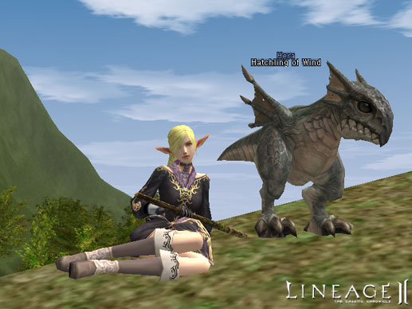
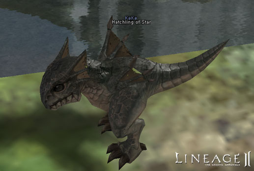

# Summon and Pet Systems

- Three types of hatchlings were added (Twilight, Star, and Wind). To obtain a hatchling, the Small Wing Quest must be completed.

- When a pet is recalled, the items from the pet's inventory are added to the owner's inventory. If the owner's inventory is full, the items are dropped and the owner has priority to pick them up for fifteen seconds. If the NPC or main server goes down, the pet retains the items in its inventory.
- To reduce pet reliance on items, some pet abilities have been enhanced.
- Once their weight reaches over a hundred percent, pets receive the same weight penalties as player characters.
- If an owner dies after summoning a pet or monster, they can no longer issue pet commands while dead.
- Along with spells that cause monsters to fight among themselves or to flee, other strange condition magic spells can now be used on summoned monsters and pets.
- Characters no longer drop items when killed by another player's summoned monster or pet.
- After a server restart, there is now a short delay before a pet can be summoned.
- The pet status window now disappears automatically whenever a pet is recalled.
- A confirmation now appears when a player attempts to recall a pet using the shortcut window.
- The following changes have been made in relation to the summoned monsters system:
- The duration for summoned monsters has increased from fifteen to twenty minutes.
  - Players receive only seventy percent of their experience points, as well as a reduction in the amount of crystals used for summoning monsters less than level forty (and an increase above level forty), while hunting with the following summoned monsters: Summoned Cat the cat, Summoned Shadow, Summoned Boon Unicorn, Summoned Mechanical Golem, Summoned Black Panther, Summoned Reanimated Man
  - Players receive only ten percent of their experience points, as well as a major reduction in the amount of crystals used for summoning monsters less than level forty (and only a slight decrease above level forty), while hunting with the following summoned monsters: Summoned Mew the cat, Summoned Silhouette, Summoned Unicorn Mirage, Summoned Corrupted Man
  - Human, Elf and Dark Elf Wizards of level forty and below must wait six hours to re-use their summon skills.
- The summoned monster's status window now has a gauge that displays their remaining summoned time.
- When a summoned monster uses a skill, there is now a delay before it can use another skill.
- The MP is now higher for summoned monsters of level four and above.
- Summoned monsters can no longer use scrolls in their inventory.
- A summoned monster no longer must have its target reselected when using its special abilities, such as Servitor Heal.
- The summoning cost for a cubic has been reduced. The duration is still fifteen minutes.
- The cubic's AI has been improved (For example, when its HP is low, the cubic will poison or curse opponents less).
