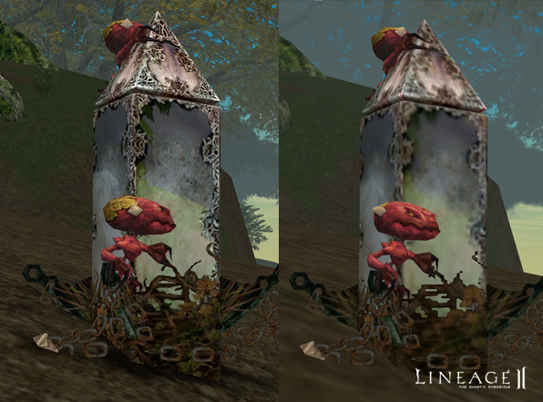
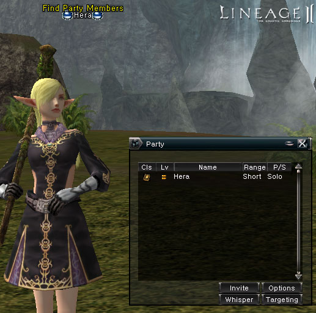
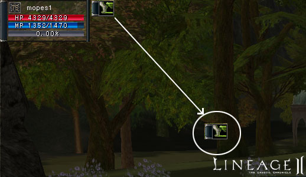
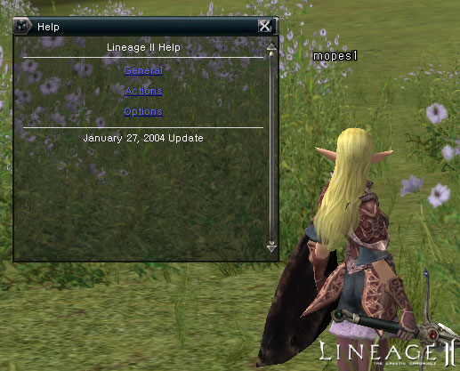
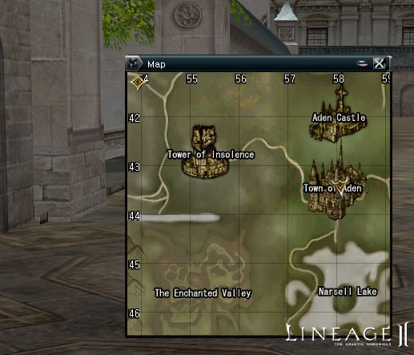
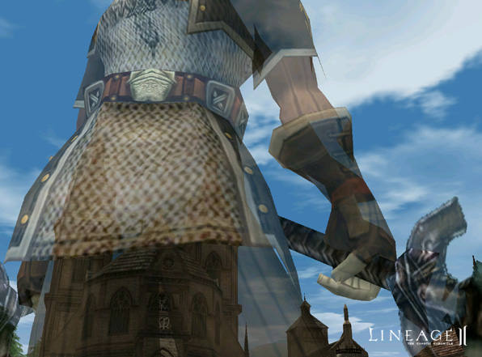

# The Interface

- A video option to change the detail setting for models was added to the video options section. The default setting is high to experience the full beauty of the game, but for better performance, players can now set it to low.

- An alliance channel has been added to the chat window.
- The order of the chat window tabs has been changed to: All, Trade, Party, Clan and Alliance.
- The channel tab is grayed out if a character is not affiliated with a clan or alliance.
- Shortcut keys can now be used to change channel tabs (alt-pageup, alt-pagedown).

- The summary status window can now be resized and the changes saved. The status ailment and menu windows can be relocated as well.
- The text font has been enhanced with a shadow effect to make it easier to read.
- Coordinates can now be confirmed in the world map.
- A timer to automatically dismiss the Invite and Trade pop-up windows has been added.
- When using the party matching system, a Looking for Party marker now appears above the character's head.

- The delay indicator for skills now displays correctly even after restarting.
- Assist is now possible by clicking with the right mouse button on the party member in the party window.
- Players can now be ignored. When ignoring a player, whispers, trades, party invites and clan invites are all blocked. Up to sixty-four players can be added to this list.
- When whispering, using the " (double quotes) key no longer brings up the name of the last person whispered to. It is now possible to cycle through whisper commands using the up arrow key. Pressing the down arrow key deletes the character's name.

- No actions, such as setting up a personal store, can be done while casting magic.
- A personal shop can no longer be set up while under a sleep effect.

- When continuously pressing a social action, characters no longer stop before moving or attacking.
- The experience display now shows up properly at all levels.
- It is no longer possible to equip or remove items while using skills or casting spells.
- If a character wielding a bow runs out of arrows and later acquires more, the inventory now updates to indicate the proper number of arrows.
- After using all arrows and then switching weapons, 0 arrows is no longer displayed in inventory.
- Various actions with the slash (/) command have been added. Explanations for each are available in the action window.
- Players will now receive an error message when attempting to exceed the maximum number of friends on their friends list, which is sixty-four.
- The tool tip explanations are no longer cut off in Windows 98 and Windows Me.
- When targeting characters, their affiliated clan and alliance can be seen by clicking the enlarge button in the target window.
