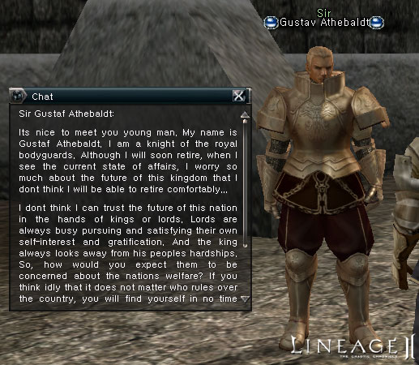
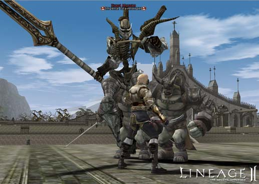
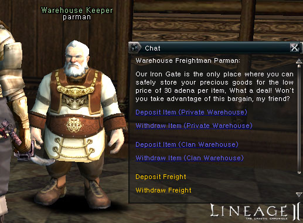
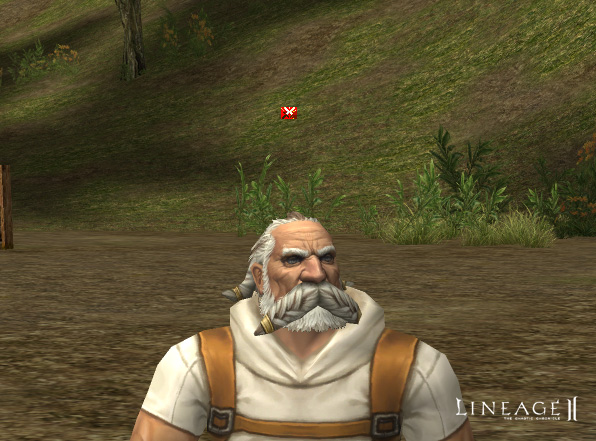
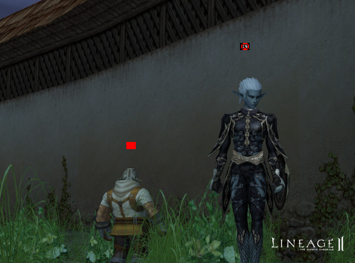

# Clans and Alliances

- Quest items are required to raise a clan's level to four and five.

- Clan and alliance wars will now continue indefinitely, until one clan surrenders or they both agree to a truce.
- The maximum number of clans that can form an alliance has been increased from three to five.
- At any given time, a single clan may be involved in up to ten clan wars and five alliance wars. It is not possible to initiate a new clan war while another one is in progress, but it is possible to accept an application for a clan war from another clan.
- Level two to five clans now have access to a clan warehouse. Only the clan leader can retrieve items from the clan warehouse, but any clan member may deposit items.

- It is now possible to start, stop and surrender in clan battles.
- In alliance, clan and siege wars, characters will have a mark above their heads to reflect this status.

- A system message now appears properly if a truce is rejected.
