# New Territories

**Region of Innadril**

The region of Innadril is where humans have lived from a comparatively long time before. A hunter dynasty ruled after the collapse of the Elmore-Aden Empire and it maintained friendly relations with the powerful clans of the Aden region. When King Raul announced the establishment of the Kingdom of Aden, Lionel Hunter, his long-time friend, swore allegiance to him and received the title of duke, making Innadril became a region in the Kingdom of Aden.

**Field of Silence**

Even though there are a lot of small lakes that aren't deep and the fields that cover the area have a lot of water, the humidity isn't high. It is cool and pleasant thanks to the wind from the sea and river. The water spirit Gildor, who ruled this place as a spirit since Shilen lived in Innadril, had a quiet and soft character. However, when the master of Innadril changed from Shilen to Eva, Gildor was unable to abandon Shilen, although she accepted Eva as the master of Innadril. She was a superior spirit, but was unable to oppose the decision of the gods. She agonized over this, to the point that she killed all the sounds of the fields and went into seclusion. The sounds of the insects and the songs of the birds in the fields could no longer be heard. It became such a quiet place that even the whispers of the fields could barely be heard.

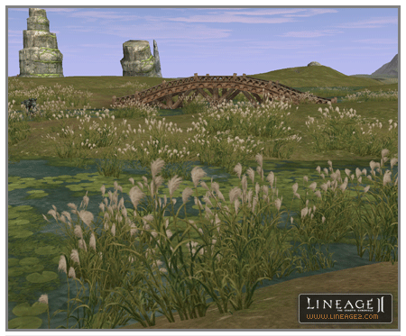

**Field of Whispers**

The field that unfolds to the west of Heine village was a place unvisited by many people for a long time. It became a popular place for going on dates. The field of reeds that were taller than people, the cool wind blowing in from the sea and the sounds of birds made for a romantic area. It was the ideal place for young people in love. In the past, a girl with a beautiful voice and a blacksmith boy fell in love. These helpers to a vagabond female shaman and a blacksmith were a well-matched couple, but the sons of royalty of Heine were jealous. The girl ended up losing her footing while running away to the field of reeds and died of her injuries. Eva, who loved music and poetry, took pity on this girl and changed her into a spirit of water. Thus, the legend was passed down that she will appear if one whispers of love in the field of reeds.

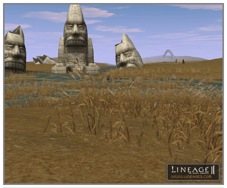

**Eva's Underwater Garden**

Eva, the goddess of water, built a palace in Innadril, which is the largest lake in the territory, and lives there. In order to prevent humans from approaching carelessly, the entranceway to the castle was made into a complicated labyrinth and dangerous monsters were released there. It is a lot of trouble for Eva that the forces of Farfurion sometimes attack as far as the front of the castle.

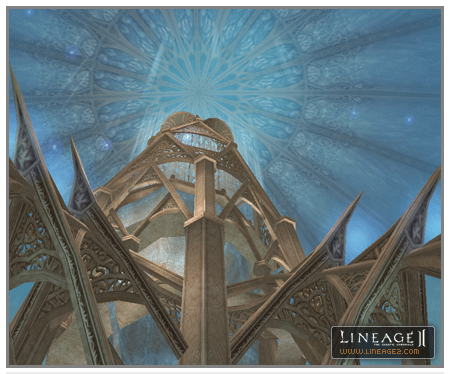

**Alligator Island**

It is the abode of groups of dreadful alligators. The alligators that came in through the Avella region long ago are breeding quickly nowadays so that they are threatening the residents. The alligators are regarded as a nuisance at Innadril Castle but as they are aggressive by nature, it is not easy to get rid of them. They don't roam far from Alligator Island but sometimes they also attack people riding in boats.

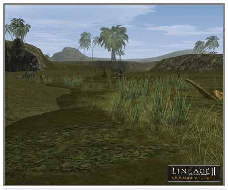

**Heine the Floating City**

As a floating city that was originally built in a wild area, the water and buildings match each other to make for a beautiful view. Water is flowing all over the city and it is made up of stone buildings that have an overall bright and refined feeling. Humans and Elves live here in harmony.

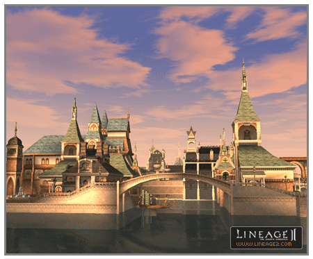

**Giran Region**

**Pirate Tunnel**

The Pirate Tunnel is an underground dungeon that leads to Devil's Isle, which is the stronghold of the great pirate Zaken. It is a natural tunnel that was further excavated by the people taken as slaves by the underlings of Zaken. When the tunnel was completed, Zaken killed all his underlings and slaves that had participated in the construction. It is an extremely dangerous place because of the various booby traps set up by the underlings of Zaken and the souls of the slaves cruelly killed, which continue to live as undead.

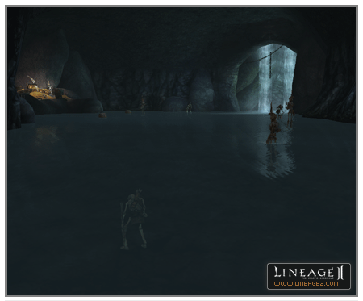

**Devil's Isle**

Devil's Isle is a stone island on which Pirate Zaken, who was notorious in the past for having chased the legends about the treasures of the titans, ended his difficult adventures. In the process of searching for that treasure, he lost the confidence of his underlings and was finally imprisoned on this island. The underlings thought that Zaken would die alone in that place, but he used the power of the ancient inheritance of the giants and achieved everlasting life. The use of that power was incomplete for a human using it the first time, so Zaken completely lost his identity as a pirate and was changed into a vampire that must drink the blood of humans in order to survive.

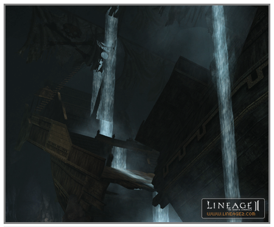

**Aden Region**

**Tower of Insolence**

Baium, who was the emperor of the Elmore-Aden Empire, was overtaken by the illusion of wanting to achieve power like the gods and resolved to reach the skies where the gods lived. He mobilized the power of the entire empire and started to build the "Infinite Tower". Einhasad was enraged at the arrogance of the humans that were trying to challenge the position of the gods and sent down plagues so that all the engineers and mages that were building the tower died. Also, Einhasad confined Emperor Baium in the top of the tower and cursed him with immortality so that he was made to watch his kingdom collapse while he was confined to the tower for hundreds of years. Finally, Baium went completely crazy and took a disgusting appearance that is really no different than a monster. Later, people would point to this tower and call it "Tower of Insolence," fearful of the anger of the gods. Thus, they avoided building very tall buildings.

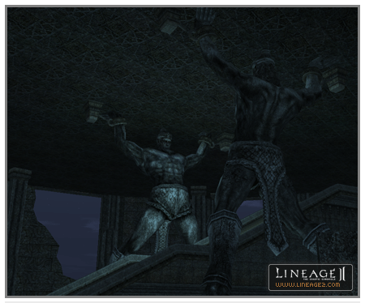

**Devastated Castle**

It is a castle that went to ruin because of the repeated battles with the Kingdom of Elmore. This large castle was built in order to deal with the invasions of Elmore to the north, Avella to the east and other invaders. The large outer castle walls were partially destroyed because of the war with Elmore dozens of years earlier. The inner fortifications were almost completely destroyed and the people living there were massacred. In particular, the invading army of Elmore put poison in the wells so that many residents were poisoned. Later, people said that this castle was a place of bad luck where spirits roamed, so no one went near.

Gustaf Ken Benaheim, Mihail Ken Yotun, Ditrihi Van Kaiser: (Headless Knight) Sir Ken Benaheim, who was the commander of the Elmore army that carried out the gruesome siege for 100 days on the grand fortress. He disobeyed the order of the king to retreat and swore that he would stay to completely conquer the fortress. He resisted for another 30 days but in the end was defeated. As the envoy sent by King Van Holter closed in, he beheaded his two assistants and then committed suicide. Their corpses could not be returned to their country, but were thrown into a grave in an overseas country. They came back to life a few days later as headless knights and lead the other undead of the cemetery. Sir Benaheim occupied the once grand fortress and now reigns as an immortal king. (The battle to occupy this clan hall is carried out against these undead occupiers.)

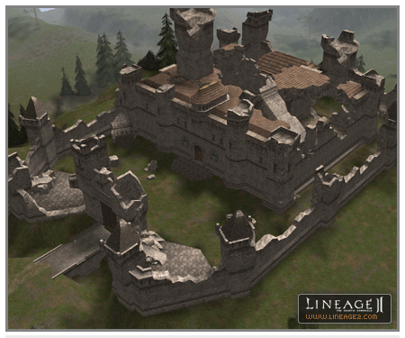

**Narsell Lake**

A coliseum has been added to the center of the lake.

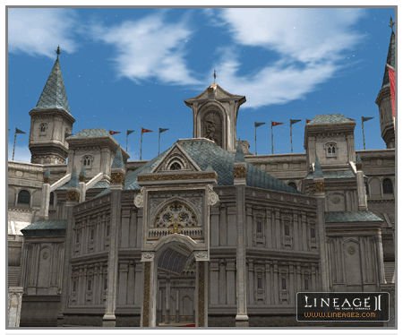

**Other Changes**

- Blazing Swamp has been enhanced.

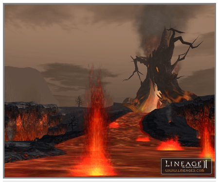

- The monster derby track was added in the southern part of Dion Region.

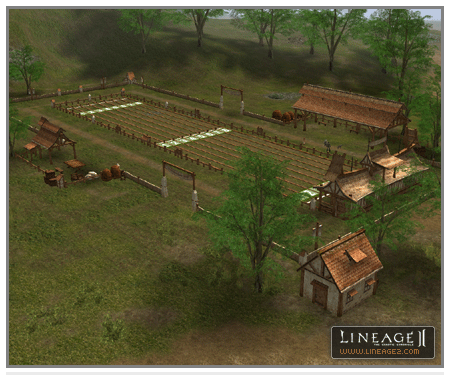

- The village map bulletin board was added.

> Bulletin boards were added in order to see the village map for the Talking Island and Elven, Dark Elven, Orc and Dwarven Villages. If a player clicks on the bulletin board that is posted at the entrance to the village, the player can see the map of the respective village. This map is different from an ordinary map in that one's current location is not shown but rather the location of the bulletin board that one is looking at is shown as an icon.

- At night, stars can now be seen in the night sky.
