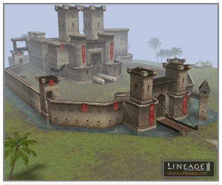

# Castle Siege Changes

**Changes to Castles**

1. Innadril, the sixth castle, has been added. Innadril Castle is a part of the Kingdom of Aden and has an effect on the entire region as well as the Floating City of Heine.

2. The structures of Gludio, Oren, Dion and Giran Castles were changed to behave in the following manner:

    A. Destroyable castle walls were added to these locations.
    B. Functions to operate the trap devices were added to certain locations.
    C. The structure of the seal room in the castle item storage room was changed to be similar to Aden Castle.
    D. Thrones were added.

3. It is now impossible to set up Headquarters at more than a certain distance from other clans during a siege. Clan Headquarters must now be set up a farther distance apart.
