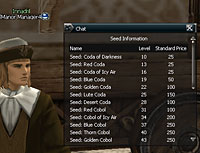

# Manor System

A manor is the area in which the lord of each castle has a productive effect on his/her own territory and the sells seeds in his own territory and carry out productive activities with the seeds that are sold in this way.

**1. Sale of seeds**

> Seeds sold in one's own territory bestow on monsters the ability to produce farm products. The types of farm products that can be produced by a monster vary according to the type of seed. Also, the types of seeds that can be made, as well as the maximum amount sold, are also fixed according to the manor.
>
> The lord of the castle chooses the types and quantities of seeds to be sold by NPCs and chooses how much to sell to consumers. Then, the castle lord is notified by the NPC how many adena he has to invest. At this time, depending on how many are sold, the unit price for each seed is decided and the unit price goes down as the quantity goes up. At the next noon hour, the manor NPC announces the sale of seeds at the consumer price at the same time that the invested amount is taken from the castle warehouse. If there is not enough money, the sale of seeds on that day is cancelled. However, it is not possible to sell during a siege.
>
> Players can purchase seeds from the manor manager of the respective territory. In order to prevent hoarding, one player cannot purchase all the seeds.
>
> The amount earned from selling through the seed-selling NPC is brought each day to the castle warehouse just like the taxes.

**2. Sowing and Harvest**

> Players that have finished purchasing seeds can use the seeds after targeting monsters in the respective territory. In order to use the seeds and complete the sowing successfully, the following conditions must be met.
>
> - Sowing is not possible for PCs, village NPCs, and guardians. Targets that cannot sow can be identified through a system message.
> - Monsters in which someone has already sown cannot be sown again.
> - Sowing is only possible for monsters within the respective territory. If not of the same territory, then the player will know through a system message that sowing is not possible for that monster.
> - In the event that there is a difference of up to +/- 5 levels between the level of seeds used and the respective monster, then sowing is 100% possible but after that, for each difference in level of 1, the probability of success is reduced by 5%.
> - In the event that there is a difference of +/- 5 levels between the level of monster and character, then sowing is 100% possible but after that, for each difference in level of 1, the probability of success is reduced by 5%.
> - If sowing is successful, an item is produced in the body of the monster. Items are not always produced even when sowing was successful.
> - Monsters for which sowing was successful do not drop items other than adena.
> - If a sowed monster dies, farm products can be removed from the body of the monster using a harvester.
> - In order to prevent the sowing by low level players but then the harvesting by high-level players more quickly, the evaluation of levels takes place again at the harvesting stage and when comparing the level of the monster and harvester, if it is within the range of +/- 5 levels, the success rate is 100% and then the probability of success falls by 5% for each greater difference of one level. If harvesting is unsuccessful, the item disappears.
> - Sowing and spoil can be used together. This means that a monster in which farm products have already been sown can also be cast with spoil and it is also possible to sow in a monster that has been cast with spoil.
>
> If a player succeeds at sowing, an item can be acquired using a harvester on the corpse of the monster that was sowed. Harvesters can be purchased from the manor manager.

**3. Purchasing**

> Players that harvest items from a monster in the territory can sell harvested products to the lord of the respective manor. Depending on what the harvested item is, there may be those things which can only be sold in one's own territory and others that can be sold more widely in other territories too. The manor manager NPC of each village can be used to sell farm products that have been harvested and the lord of the manor can decide in advance on the price and purchase quantity of farm products. When items come in through the manor manager, the costs for those items are automatically removed from the castle warehouse and if there is not enough money in the warehouse, the purchasing of farm products is suspended immediately. To restart purchasing, money must be put in the warehouse again.
>
> When reselling items that were harvested through the manor manager, the amount received will differ depending on what the method the lord chooses for compensation. If the lord of the respective territory has made it so that compensation is received fairly by everyone, the players that participate in the manor in that territory can expect more stable compensation and if the lord chooses to pay compensation in gambling-type ways, then the players that participate in the manor of the respective territory will expect gambling-type returns. The changing of these compensation factors takes place once per day.
>
> Compensation for farm products harvested is applied differently depending on the types of grains. The items purchased go through a process so that they enter the castle warehouse each day. For example, if the manor manager buys ice coda fruit from a player, what is placed into the castle warehouse is actually an ice coda extract that has been processed. 10% of a purchased item that has been processed is paid to the manor manager.

**4. Processing**

> The lord of the manor can process the harvest and produce final products. Final products cannot be sold separately through NPCs and are used directly by the lord of the castle as needed or can be sold through personal shops. The types of items that can be processed include things like consumable items such as potions that can be used in battle, ingredients for siege weapons to be used in sieges, or ingredients that can't be easily obtained on the market.
>
> Item processing is carried out by the blacksmith NPC in the castle. The quantities and types of harvested items that can be processed in the castle at this time depend on the rating that is based on how much facilities investment has been made in processing systems. If a player chooses to invest in production equipment through the chamberlain's menu, the NPC that is in charge of production can process products of somewhat higher added value or higher quantity. When producing items through the blacksmith, certain fees must be paid.
>
> In the event of investing in facilities, the results last for two weeks and even continue for the full term if the lord of the castle changes during the two weeks.
