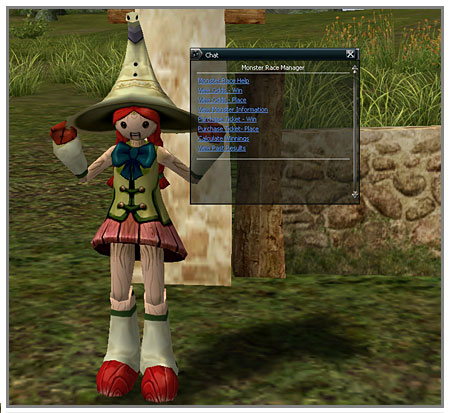
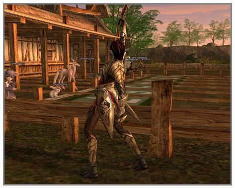
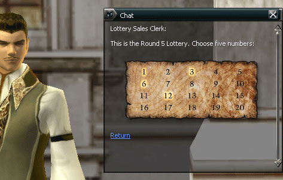
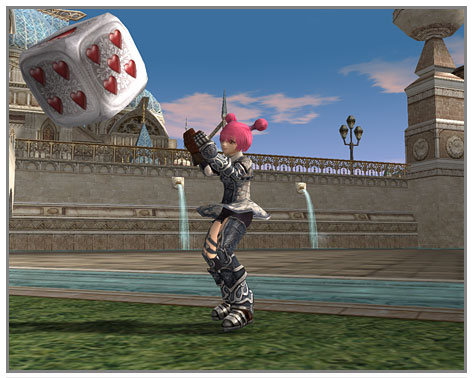
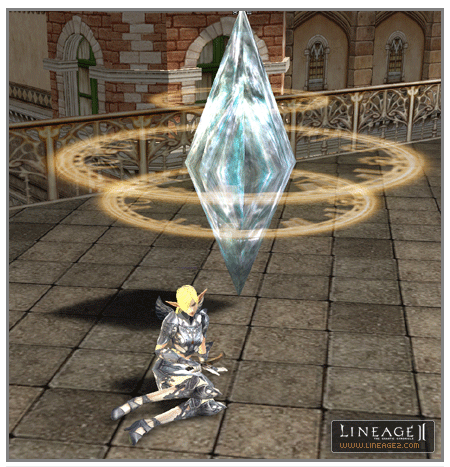

# Minigames and Conveniences

**Monster Race**

The Monster Derby Track is a place where eight monsters race together at the same time. A player predicts which monster will come in first and purchases a race ticket for the respective monster. They can then earn adena according to the payout rate for the winning monster.

A. **Holding of the race**

Monster races are only held in the daytime in the game and are held one time per 20 minutes of real time. If the race finishes at night, then tickets go on sale for the next race about 15 minutes after the sun rises. When races are not being held (at night), tickets cannot be purchased through the race operator NPC. However, it is possible to exchange previous winning game tickets.

B. **How to participate in a race**

Monster race tickets can be purchased through the race operator NPC. Purchase of tickets starts 18 minutes before the start of the race and tickets for the respective race can only be purchased up to 3 minutes before the race starts. When purchasing a ticket, you can confirm the names of the monsters for the respective race and the conditions on that day by conversing with the race operator. Three minutes before the race begins, the race operator stops selling tickets and the payout rates for each monster in the respective race are notified.

C. **Types of races**

There are two types. One is where the only way to win is to match the correct first-place winning monster and the other way is to choose both the first and second place monsters (without regard to their order).

D. **End of the race**

Once the race is over, the race operator calls out the results of the race and a player can exchange the tickets he has for adena by conversing with the operator. By looking at the winner confirmation section, a player can know the types and quantities for each different ticket and can know whether he/she won and the winning amounts. If a player wins, he/she can get the winning amount. Even if a player doesn't win, the race operator will purchase losing tickets for a very small amount.

**Lottery**

It is possible to purchase lottery tickets through the lottery seller in each village. It is a lottery where, rather than purchasing tickets having a predetermined number, the purchasing person directly selects five numbers from a total of 20. The lottery is held one time per two days in real time.

A. **Purchase of lottery tickets**

It is possible to know the current number of tickets sold through the lottery seller and if the Buy Lottery Ticket button is clicked, a menu appears where the player can select five of the twenty numbers. After clicking the five numbers, the ticket can be purchased. It can be confirmed how big the current accumulated jackpot is for this drawing through the lottery ticket seller. One lottery ticket costs 2,000 adena.

B. **Selection of winning numbers**

At noon two days after the lottery sale, the sale of lottery tickets for the respective drawing is stopped and the winning numbers are selected. It takes about five minutes to select the numbers. If a player clicks on the "Confirm Winnings" menu and selects the drawing for the tickets purchased, the winning numbers and winning amount details for first, second and third places can be confirmed. It is also possible to find out if the lottery jackpot is being carried over because nobody won the current drawing. If a player wins the lottery, he/she can receive the winnings by clicking on the "Exchange" button. Lottery tickets that didn't win can be resold at a low price through the lottery ticket seller.

**Dice**

Four kinds of dice (heart, clover, diamond and spade) were added, having the numbers 1 through 6. If the dice are double-clicked in the inventory, one of the six numbers is randomly displayed on the ground.

**Coliseum**

The coliseum has been set as a free battle zone in the same way as the current arena. There are two entrances are on either side of the coliseum. Near the entrance, there is a restart zone so that if a character dies inside the coliseum, it is restarted in this restart zone. The restart zone is set as a peace zone.

**Broadcast Towers**

Broadcast Towers have been set up in each village, coliseum, and race arena. It is possible to observe siege battles and coliseum and monster races at these towers. In order to observe, a certain fee must be paid and it can be used for one hour each time. In observation mode, the player can only change viewpoints in the direction that they want to see. All actions, including movement, become impossible, although conversation, clan chatting, alliance chatting and whisper are possible.

