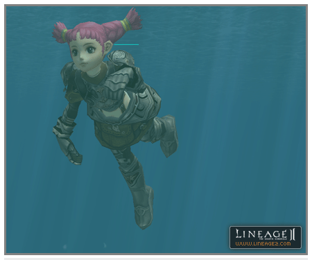

# Basic Systems

1. A penalty is applied according to the degree of contribution to killing a monster. Previously, the level of the player to apply the last hit was checked and then the item drop penalty applied. Now the penalty is applied by checking the level of the player that caused the greatest amount of damage to the respective NPC.

2. An adjustment was made so that, in the event that the karma increase amount that was increased in proportion to PK count is more than a certain value, no matter how high the PK value is, it is not increased more than the maximum value increased according to a one-time PK. The item drop probability when the karma value is relatively less was reduced to less than before.

3. When using good magic on purple players that are in a party, clan war, or siege, the PvP rule was changed so that the caster also becomes purple.

4. The underwater physical gauge now appears in all rivers and seas in the world and HP starts to be reduced if the gauge runs out and the character dies if HP is completely reduced. In order to restart this gauge, the character must come above ground. When a character moves under the water, it automatically swims. It is also possible to move up and down in the water by clicking the mouse. The character moves above the water when clicking above the water and if clicking on the ground under the water, it is possible to move down. Please note that when dropping an item on the surface of the water, the item is dropped to the bottom of the body of water.

5. When a character falls from a high place, it receives falling damage. The amount of falling damage is proportional to the height. However, a character cannot die because of falling damage alone.

6. A character's basic ability values can be adjusted through items. Please refer to the explanation about dyes and symbols regarding the way to change these basic ability values. The factors that each basic ability value affect for a character are as follows.

A. **Strength (STR)**

STR is the value that represents how strong a character is. This value has an effect in the following ways:

- **Amount of physical damage:** Damage from ordinary attacks and physical skills of the player increases as STR increases.

B. **Dexterity (DEX)**

DEX is the value that represents how nimble and precise are the body movements of the character. This value has an effect in the following ways:

- **Attack speed:** Ordinary attacks and casting speed of physical skills increase as the DEX value increases.
- **Accuracy:** Accuracy increases as the DEX value increases.
- **Evasion:** Evasive ability increases as the DEX value increases.
- **Critical probability:** As a rule, this changes depending on what weapon is being used but the critical probability also increases with the size of the DEX value. Because critical probability also has an effect on the probability of success of hitting vital areas when using skills such as Mortal Blow, the probability of success of skills of this type increase as the DEX value increases.
- **Shield defense success rate:** The shield defense success rate increases as the DEX value increases.
- **Movement speed:** Movement speed increases as the DEX value increases.

C. **Constitution (CON)**

CON is the value that represents how strong or how healthy a character is. This value has an effect in the following ways:

- **HP quantity:** The maximum HP value increases as the CON value increases.
- **HP recovery speed:** HP recovery speed increases as the CON value increases.
- **Breath:** CON has an effect on the ability of a PC to move underwater. The underwater physical strength gauge increases as the CON value of a character increases. The higher the CON value, the slower the HP reduction rate when the character's breath runs out.
- **Shock resistance:** Resistance to shock attacks increases and the probability of falling into a shocked condition falls as the CON value increases.
- **Bleeding resistance:** The probability of getting injured and bleeding falls as the CON value increases.

D. **Intelligence (INT)**

INT expresses how much intelligence a character has. The strength of magic increases as this value increases. This value has an effect in the following ways:

- **Magic Attack:** Damage caused when a PC uses damaging magic increases with the INT value.
- **Curse success probability:** The success probability increases with the INT value when using magic that causes all kinds of abnormal conditions.

E. **Wit (WIT)**

WIT is the value that expresses how quickly a character can think and his/her ability to make things happen. As INT is the value that demonstrates the level of understanding, WIT is the value that shows the character's ability to make things happen and the character's mental spontaneity. This value has an effect in the following ways:

- **Exceptional damage probability:** Exceptional damage can occur at a certain low probability when casting damage magic and the higher the WIT value, the higher the probability that this exceptional damage will occur.
- **Magic casting speed:** If the WIT value is high when using magic, the magic can be used more quickly.
- **Resistance to abnormal conditions:** WIT has an effect on one's ability to avoid various kinds of bad abnormal conditions. Abnormal conditions a character doesn't succumb to easily when WIT is high include curses that lower ability values, mental abnormalities (such as Hold, Silence, Sleep, Fear), paralysis, HP reduction magic of the four elements, MP reduction magic, HP recovery speed reduction, and magic that increases the delay for reusing skills and reduces heal effects.

F. **Mentality (MEN)**

MEN is the value that represents how strong a character is mentally. This value has an effect in the following ways:

- **Magic defense:** Magic defense ability increases as the MEN value increases, while the probability of receiving magic damage decreases, as does the probability of succumbing to curse magic.
- **MP quantity:** Maximum MP increases as MEN increases.
- **MP recovery speed:** The degree of MP recovery speed is determined by level, race, and MEN. MP recovery speed increases as MEN increases.
- **Probability of magic interruption:** There is a chance that when a player casts magic and is attacked, the magic that was cast will be interrupted. At this time, the probability that the magic won't be interrupted increases as MEN increases even for magic with higher damage.
- **Poison resistance:** The probability of succumbing to poison magic falls as the MEN value increases.
