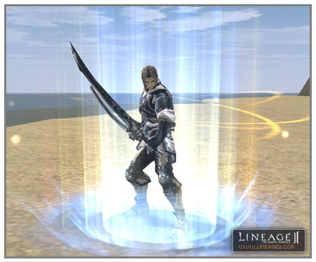
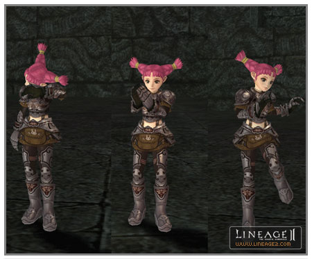

# Skills, Magic, Actions

**1. New skills have been added for each class.**

| Class | Name of Skill | Explanation of Skill | Levels at Which Acquired | Type |
|:--|:--|:--|:--|:--|
| Warrior | Vicious Stance | Increases damage when critical. MP is consumed continuously. | 20, 24, 28, 32, 36 | Toggle |
| Rogue | Vicious Stance | Increases damage when critical. MP is consumed continuously. | 20, 24, 28, 32, 36 | Toggle |
| Human Wizard | Energy Bolt | Performs slight non-elemental attack. | 20, 25, 30, 35 | Active |
| Warlord | Final Frenzy | P. Atk. increases automatically when HP falls. | 43, 46, 49, 52, 55, 58, 60, 62, 64, 66, 68, 70, 72, 74 | Passive |
| Warlord | Vicious Stance | Increases damage when critical. MP is consumed continuously. | 40, 43, 46, 49, 52, 55, 58, 60, 62, 64, 66, 68, 70, 72, 74 | Active |
| Gladiator | Final Frenzy | P. Atk. increases automatically when HP falls. | 43, 46, 49, 52, 55, 58, 60, 62, 64, 66, 68, 70, 72, 74 | Passive |
| Gladiator | Dualist Spirit | Dual sword weapons able to be wielded quickly. | 64, 72 | Active |
| Gladiator | Vicious Stance | Increases damage when critical. MP is consumed continuously. | 40, 43, 46, 49, 52, 55, 58, 60, 62, 64, 66, 68, 70, 72, 74 | Active |
| Paladin | Final Fortress | P. Def. increases automatically when HP falls. | 52, 56, 58, 60, 62, 64, 66, 68, 70, 72, 74 | Passive |
| Dark Avenger | Final Fortress | P. Def. increases automatically when HP falls. | 52, 56, 58, 60, 62, 64, 66, 68, 70, 72, 74 | Passive |
| Treasure Hunter | Vicious Stance | Increases damage when critical. MP is consumed continuously. | 40, 43, 46, 49, 52, 55, 58, 60, 62, 64, 66, 68, 70, 72, 74 | Active |
| Hawkeye | Soul of Sagittarius | One's own maximum MP is increased temporarily. HP is consumed. | 46, 58, 64, 70 | Active |
| Hawkeye | Vicious Stance | Increases damage when critical. MP is consumed continuously. | 40, 43, 46, 49, 52, 55, 58, 60, 62, 64, 66, 68, 70, 72, 74 | Active |
| Sorcerer/ss | Aura Bolt | Performs non-elemental attack. MP consumption is not much and casting time is short. | 40, 44, 48, 52, 56, 58, 60, 62, 64, 66, 68, 70, 72, 74 | Active |
| Sorcerer/ss | Seed of Fire | Energy of fire is infused. If a new energy isn't infused within five seconds, the energy completely disappears. | 66 | Active |
| Sorcerer/ss | Aura Symphony | Deathblow magic that causes large amount of damage. Requires two energies. | 68 | Active |
| Sorcerer/ss | Inferno | Deathblow magic that causes large amount of damage. Continuous fire-type damage is caused additionally. Requires two energies of fire. | 70 | Active |
| Sorcerer/ss | Elemental Assault | Deathblow magic that causes very big damages. Requires energy of water and energy of wind. | 72 | Active |
| Necromancer | Curse Disease | Reduces the effect of recovery magic. | 58, 60, 62, 64, 66, 68, 70, 72, 74 | Active |
| Warlock | Summon Binding Cubic | Summons binding cubic. A binding cubic uses paralysis. Crystal D grade is required when summoning. | 40, 44, 48, 52, 56, 60, 64, 68, 72 | Active |
| Warlock | Summon Storm Cubic | Summons a cubic to follow its master in attacking. Crystal D grade is required when summoning. | 40, 44, 52, 58, 62, 66, 70, 74 | Active |
| Warlock | Cubic Mastery | Makes it so that cubics can be summoned simultaneously. | 44, 56 | Passive |
| Warlock | Summon Kai the Cat | Summons Kai the Cat, a servitor. | 40, 44, 48, 52, 56, 58, 60, 62, 64, 66, 68, 70, 72, 74 | Active |
| Bishop | Benediction | Recovers all HP of party members. Can be used when less than 10% of HP is remaining. | 66 | Active |
| Prophet | Word of Fear | Plunges one's nearby enemies into fear so that they run away. | 44, 48, 52, 56, 58, 60, 62, 64, 66, 68, 70, 72, 74 | Active |
| Elven Scout | Vicious Stance | Increases damage when critical. MP is consumed continuously. | 20, 24, 28, 32, 36 | Toggle |
| Elven Wizard | Solar Spark | Performs holy-type attack. Over-hit is possible. | 25, 30, 35 | Active |
| Elven Wizard | Energy Bolt | Performs non-elemental attack. | 20, 25, 30, 35 | Active |
| Temple Knight | Final Fortress | P. Def. increases automatically when HP falls. | 52, 56, 58, 60, 62, 64, 66, 68, 70, 72, 74 | Passive |
| Swordsinger | Song of Vitality | Instantaneously increases maximum HP of party members. If a song is sung continuously, additional MP is consumed. | 66 | Active |
| Swordsinger | Song of Vengeance | Part of the damage applied to a party member is instantaneously returned to the enemy. If a song is sung continuously, additional MP is consumed. | 74 | Active |
| Swordsinger | Song of Flame Guard | Increases P. Def. to fire-type attack of a party member instantaneously. If a song is sung continuously, additional MP is consumed. | 62 | Active |
| Swordsinger | Song of Storm Guard | Increases P. Def to wind-type attack of a party member instantaneously. If a song is sung continuously, additional MP is consumed. | 70 | Active |
| Plainswalker | Rest of Chameleon | Is not attacked first by monsters while sitting. MP is consumed continuously. | 46 | Toggle |
| Plainswalker | Vicious Stance | Increases damage when critical. MP is consumed continuously. | 40, 43, 46, 49, 52, 55, 58, 60, 62, 64, 66, 68, 70, 72, 74 | Active |
| Silver Ranger | Soul of Sagittarius | One's own maximum MP is increased temporarily. HP is consumed. | 46, 58, 64, 70 | Active |
| Silver Ranger | Vicious Stance | Increases damage when critical. MP is consumed continuously. | 40, 43, 46, 49, 52, 55, 58, 60, 62, 64, 66, 68, 70, 72, 74 | Active |
| Spellsinger | Solar Flare | Performs holy-type attack. Over-hit is possible. | 40, 44, 48, 52, 56, 58, 60, 62, 64, 66, 68, 70, 72, 74 | Active |
| Spellsinger | Aura Bolt | Performs non-elemental attack. | 40, 44, 48, 52, 56, 58, 60, 62, 64, 66, 68, 70, 72, 74 | Active |
| Spellsinger | Seed of Water | Energy of water is infused. If a new energy isn't infused within five seconds, the energy completely disappears. | 66 | Active |
| Spellsinger | Aura Symphony | Deathblow magic that causes large amount of damage. Requires two energies. | 68 | Active |
| Spellsinger | Blizzard | Deathblow magic that causes large amount of damage. The movement speed of the target attacked slows down. Requires two water energies. | 70 | Active |
| Spellsinger | Elemental Symphony | Deathblow magic that causes large amount of damage. Requires energy of water and energy of wind. | 72 | Active |
| Elemental Summoner | Summon Aqua Cubic | Summons an aqua cubic that causes continuous damage with cold air. | 40, 44, 48, 52, 56, 62, 66, 70, 74 | Active |
| Elemental Summoner | Summon Life Cubic | Summons cubic that recovers HP of the summoner and members of the summoner's party. Crystal D grade is required when summoning. | 43, 49, 55, 60, 64, 68, 72 | Active |
| Elemental Summoner | Cubic Mastery | Makes it so that cubics can be summoned simultaneously. | 43, 55 | Passive |
| Elemental Summoner | Summon Unicorn Merrow | Summons Unicorn Merrow, a servitor. | 40, 44, 48, 52, 56, 58, 60, 62, 64, 66, 68, 70, 72, 74 | Active |
| Elven Elder | Serenade of Eva | Makes the minds of one's nearby enemies peaceful so that they don't have any urge to attack. | 44, 48, 52, 56, 58, 60, 62, 64, 66, 68, 70, 72, 74 | Active |
| Dark Fighter | Shadow Sense | Accuracy increases at night. | 15 | Passive |
| Assassin | Vicious Stance | Increases damage when critical. MP is consumed continuously. | 20, 24, 28, 32, 36 | Toggle |
| Dark Wizard | Shadow Spark | Performs dark-type attack. Over-hit is possible. | 25, 30, 35 | Active |
| Shillien Oracle | Vampiric Rage | When performing ordinary attack, part of the damage caused to an enemy temporarily recovers one's own physical strength. | 30 | Active |
| Shillien Knight | Final Fortress | P. Def. increases automatically when HP falls. | 52, 56, 58, 60, 62, 64, 66, 68, 70, 72, 74 | Passive |
| Bladedancer | Dance of Aqua Guard | Increases P. Def to water-type attack of a party member instantaneously. If a dance is danced continuously, additional MP is consumed. | 70 | Active |
| Bladedancer | Dance of Earth Guard | Increases P. Def to earth-type attack of a party member instantaneously. If a dance is danced continuously, additional MP is consumed. | 62 | Active |
| Bladedancer | Dance of Vampire | When performing ordinary attack on party members, part of the damage caused to an enemy instantaneously recovers one's own physical strength. If a dance is danced continuously, additional MP is consumed. | 74 | Active |
| Bladedancer | Dance of Protection | Increases P. Def to area damage of party members instantaneously. If a dance is danced continuously, additional MP is consumed. | 66 | Active |
| Abyss Walker | Vicious Stance | Increases damage when critical. MP is consumed continuously. | 40, 43, 46, 49, 52, 55, 58, 60, 62, 64, 66, 68, 70, 72, 74 | Active |
| Phantom Ranger | Soul of Sagittarius | One's own maximum MP is increased temporarily. HP is consumed. | 46, 58, 64, 70 | Active |
| Phantom Ranger | Vicious Stance | Increases damage when critical. MP is consumed continuously. | 40, 43, 46, 49, 52, 55, 58, 60, 62, 64, 66, 68, 70, 72, 74 | Active |
| Spellhowler | Shadow Flare | Performs dark-type attack. Over-hit is possible. | 40, 44, 48, 52, 56, 58, 60, 62, 64, 66, 68, 70, 72, 74 | Active |
| Spellhowler | Seed of Wind | Energy of wind is infused. If a new energy isn't infused within five seconds, the energy completely disappears. | 66 | Active |
| Spellhowler | Aura Symphony | Deathblow magic that causes large amount of damage. Requires two energies. | 68 | Active |
| Spellhowler | Demon Wind | Deathblow magic that causes large amount of damage. The victim is cast with a curse so that the effect of heal is reduced. Requires two wind energies. | 70 | Active |
| Spellhowler | Elemental Storm | Deathblow magic that causes large amount of damage. Requires energy of fire and energy of wind. | 72 | Active |
| Phantom Summoner | Summon Poltergeist Cubic | Summons a cubic that weakens the P. Atk., P. Def. and Atk. Spd. of an enemy. Crystal D grade is required when summoning. | 40, 46, 52, 58, 62, 66, 70, 74 | Active |
| Phantom Summoner | Cubic Mastery | Makes it so that cubics can be summoned simultaneously. | 43, 55 | Passive |
| Phantom Summoner | Summon Soulless | Summons Soulless, a servitor. | 40, 44, 48, 52, 56, 58, 60, 62, 64, 66, 68, 70, 72, 74 | Active |
| Phantom Summoner | Summon Spark Cubic | Summons Spark Cubic that puts enemy into a shocked state. | 40, 44, 48, 52, 56, 58, 60, 64, 68, 72 | Active |
| Shillien Elder | Vampiric Rage | Causes to temporarily absorb physical strength of and attack enemy. | 44, 58, 72 | Active |
| Orc Fighter | Iron Body | Creates resistance to earth-type damage. | 15 | Passive |
| Orc Raider | Two-Handed Weapon Mastery | P. Atk and accuracy increase when using two-handed swords and two-handed blunt weapons. | 20, 24, 28, 32, 36 | Passive |
| Orc Raider | Vicious Stance | Increases damage when critical. MP is consumed continuously. | 20, 24, 28, 32, 36 | Toggle |
| Destroyer | Two-Handed Weapon Mastery | P. Atk and accuracy increase when using two-handed swords and two-handed blunt weapons. | 40, 43, 46, 49, 52, 55, 58, 60, 62, 64, 66, 68, 70, 72, 74 | Passive |
| Destroyer | Vicious Stance | Increases damage when critical. MP is consumed continuously. | 40, 43, 46, 49, 52, 55, 58, 60, 62, 64, 66, 68, 70, 72, 74 | Active |
| Tyrant | Totem Spirit Bison | Takes on the spirit of a bison. P. Atk. and critical probability increase automatically when HP falls. | 68 | Active |
| Tyrant | Totem Spirit Rabbit | Takes on the spirit of a rabbit. Speed and evasion are increased greatly and P. Atk. falls by a large margin. | 62 | Active |
| Overlord | Speed of Paagrio | Speed of clan members increases. | 58, 64 | Active |
| Overlord | Soul Guard | One's own P. Def. increases. MP is consumed continuously. | 44, 48, 52, 56, 58, 60, 62, 64, 68, 70, 72, 74 | Active |
| Warcryer | Chant of Revenge | Part of the damage caused to a party member is instantaneously returned to the enemy. | 62, 68, 74 | Active |
| Scavenger | Spoil Festival | Casts spoil on enemies within a certain range. | 28, 36 | Active |
| Bounty Hunter | Spoil Festival | Casts spoil on enemies within a certain range. | 43, 49, 55, 62, 66, 70, 74 | Active |
| Warsmith | Summon Wild Hog Canon | Summons Wild Hog Cannon, a siege golem. | 58 | Active |
| Warsmith | Summon Big Boom | Summons Big Boom, a servitor. | 58, 62, 66, 70, 74 | Active |

**2. There are 74 levels that have been set as skill steps that can be learned for each class.**

| Class | Name of Skill | Explanation of Skill | Levels at Which Acquired | Type |
|:--|:--|:--|:--|:--|
| Warlord | Battle Roar | Temporarily increases one's own maximum HP. | 64, 70 | Active |
| Warlord | Boost HP | Increases maximum HP. | 62, 66, 70, 74 | Passive |
| Warlord | Fast HP Recovery | Rate of HP recovery increases. | 68, 74 | Passive |
| Warlord | Pole Arm Mastery | Increases P. Atk. when using spears. | 60, 62, 64, 66, 68, 70, 72, 74 | Passive |
| Warlord | Light Armor Mastery | Increases P. Atk and evasion when using light equipment. | 60, 62, 64, 66, 68, 70, 72, 74 | Passive |
| Warlord | Heavy Armor Mastery | Increases P. Def. when using heavy equipment. | 60, 62, 64, 66, 68, 70, 72, 74 | Passive |
| Warlord | Whirlwind | Causes damage to nearby enemies when wielding a spear. Can be used when carrying a spear. Over-hit is possible. | 60, 62, 64, 66, 68, 70, 72, 74 | Active |
| Warlord | Thunder Storm | Causes damage to enemies by putting them into a shocked condition. Can be used when carrying a spear. Over-hit is possible. | 60, 62, 64, 66, 68, 70, 72, 74 | Active |
| Warlord | Howl | Reduces P. Atk. of nearby enemies. | 60, 62, 64, 66, 68, 70, 72, 74 | Active |
| Warlord | Provoke | Attracts monsters in a wide area around oneself. | 60 | Active |
| Warlord | Lionheart | Temporarily greatly reduces the probability of falling into paralysis, hold, sleep and shock condition. | 62 | Active |
| Gladiator | Fast HP Recovery | Rate of HP recovery increases. | 68, 74 | Passive |
| Gladiator | Light Armor Mastery | Increases P. Atk and evasion when using light equipment. | 60, 62, 64, 66, 68, 70, 72, 74 | Passive |
| Gladiator | Heavy Armor Mastery | Increases P. Def. when using heavy equipment. | 60, 62, 64, 66, 68, 70, 72, 74 | Passive |
| Gladiator | Sword/Blunt Mastery | Increases P. Atk. when using swords and blunt weapons. | 60, 62, 64, 66, 68, 70, 72, 74 | Passive |
| Gladiator | Triple Slash | Strike three times quickly. Can be used when carrying dual swords. Over-hit is possible. | 60, 62, 64, 66, 68, 70, 72, 74 | Active |
| Gladiator | Double Sonic Slash | Recharges swords so that they are wielded more strongly. Can be used when carrying dual swords. Sword recharging required. | 60, 62, 64, 66, 68, 70, 72, 74 | Active |
| Gladiator | Sonic Blaster | Makes swords fly and hit enemies at a long distance. Can be used when carrying swords, blunt weapons and dual swords. | 60, 62, 64, 66, 68, 70, 72, 74 | Active |
| Gladiator | Sonic Storm | Makes swords fly and cause damage to multiple enemies at a long distance. Can be used when carrying swords, blunt weapons and dual swords. | 60, 62, 64, 66, 68, 70, 72, 74 | Active |
| Gladiator | Focus Sonic | Recharges swords. | 60, 66, 70 | Active |
| Gladiator | Sonic Buster | Causes swords to explode and damage enemies in front. Can be used when carrying swords, blunt weapons and dual swords. | 60, 62, 64, 66, 68, 70, 72, 74 | Active |
| Gladiator | Dual-Weapon Mastery | Increases P. Atk. when using dual swords. | 60, 62, 64, 66, 68, 70, 72, 74 | Passive |
| Gladiator | Fatal Strike | Gathers up energy and hits strongly. Can be used when carrying swords and blunt weapons. Over-hit is possible. | 60, 62, 64, 66, 68, 70, 72, 74 | Active |
| Gladiator | Hammer Crush | Attack that puts the target in a shocked condition. Can be used when carrying a blunt weapon. Over-hit is possible. | 60, 62, 64, 66, 68, 70, 72, 74 | Active |
| Gladiator | Triple Sonic Slash | Strike three times quickly. Can be used when carrying dual swords. Sword recharging required. | 60, 62, 64, 66, 68, 70, 72, 74 | Active |
| Gladiator | Lionheart | Temporarily greatly reduces the probability of falling into paralysis, hold, sleep and shock condition. | 62 | Active |
| Paladin | Aggression | Stimulates the urge of an enemy to attack. | 60, 62, 64, 66, 68, 70, 72, 74 | Active |
| Paladin | Shield Stun | Puts enemy in shocked condition. | 60, 62, 64, 66, 68, 70, 72, 74 | Active |
| Paladin | Magic Resistance | Increases magic resistance. | 60, 62, 64, 66, 68, 70, 72, 74 | Passive |
| Paladin | Focus Mind | Increases rate of MP recovery. | 64, 72 | Passive |
| Paladin | Sword/Blunt Mastery | Increases P. Atk. when using swords and blunt weapons. | 60, 62, 64, 66, 68, 70, 72, 74 | Passive |
| Paladin | Heavy Armor Mastery | Increases P. Def. when using heavy equipment. | 60, 62, 64, 66, 68, 70, 72, 74 | Passive |
| Paladin | Hate Aura | Stimulates the urge of nearby enemies to attack. | 60, 62, 64, 66, 68, 70, 72, 74 | Active |
| Paladin | Holy Strike | Causes damage to an undead monster. | 60, 62, 64, 66, 68, 70, 72, 74 | Active |
| Paladin | Sacrifice | Sacrifices one's own physical strength to recover HP. | 60, 62, 64, 66, 68, 70, 72, 74 | Active |
| Paladin | Sanctuary | Reduces P. Atk. of nearby undead monsters. | 60, 62, 64, 66, 68, 70, 72, 74 | Active |
| Paladin | Holy Blessing | Recovers HP. | 60, 62, 64, 66, 68, 70, 72, 74 | Active |
| Dark Avenger | Aggression | Stimulates the urge of an enemy to attack. | 60, 62, 64, 66, 68, 70, 72, 74 | Active |
| Dark Avenger | Drain Energy | Absorbs HP. | 60, 62, 64, 66, 68, 70, 72, 74 | Active |
| Dark Avenger | Shield Stun | Puts enemy in shocked condition. | 60, 62, 64, 66, 68, 70, 72, 74 | Active |
| Dark Avenger | Magic Resistance | Increases magic resistance. | 60, 62, 64, 66, 68, 70, 72, 74 | Passive |
| Dark Avenger | Focus Mind | Increases rate of MP recovery. | 64, 72 | Passive |
| Dark Avenger | Sword/Blunt Mastery | Increases P. Atk. when using swords and blunt weapons. | 60, 62, 64, 66, 68, 70, 72, 74 | Passive |
| Dark Avenger | Heavy Armor Mastery | Increases P. Def. when using heavy equipment. | 60, 62, 64, 66, 68, 70, 72, 74 | Passive |
| Dark Avenger | Hate Aura | Stimulates the urge of nearby enemies to attack. | 60, 62, 64, 66, 68, 70, 72, 74 | Active |
| Dark Avenger | Life Scavenger | Absorbs HP from corpses. | 60, 62, 64, 66, 68, 70, 72, 74 | Active |
| Dark Avenger | Horror | Plunges one's nearby enemies into fear so that they run away. | 60, 62, 64, 66, 68, 70, 72, 74 | Active |
| Dark Avenger | Corpse Plague | Causes venom to spew from corpses. | 62, 70 | Active |
| Dark Avenger | Hamstring | Reduces movement speed. | 60, 62, 64, 66, 68, 70, 72, 74 | Active |
| Dark Avenger | Summon Dark Panther | Summons a dark panther that moves with dexterity and attacks. Crystal D grade is required when summoning. Takes 30% of acquired experience points. | 62, 66, 70, 74 | Active |
| Treasure Hunter | Critical Power | Increases power of critical attack. | 64, 72 | Active |
| Treasure Hunter | Dagger Mastery | Increases P. Atk. when using a dagger. | 60, 62, 64, 66, 68, 70, 72, 74 | Passive |
| Treasure Hunter | Light Armor Mastery | Increases P. Def. and evasion when using light equipment. | 60, 62, 64, 66, 68, 70, 72, 74 | Passive |
| Treasure Hunter | Vital Force | Recovers quickly when sitting. | 64, 72 | Passive |
| Treasure Hunter | Esprit | Recovery speed increases while running. | 62, 68, 74 | Passive |
| Treasure Hunter | Unlock | Opens doors and boxes. Requires key of thief. | 60, 64, 68, 72 | Active |
| Treasure Hunter | Bleed | Causes injury with bleeding. Can be used when carrying a dagger. | 66, 70 | Active |
| Treasure Hunter | Trick | Removes the urge of enemies to attack the caster. | 60, 62, 64, 66, 68, 70, 72, 74 | Active |
| Treasure Hunter | Switch | Plunges one's nearby enemies into chaos and changes the target of their attack. | 60, 62, 64, 66, 68, 70, 72, 74 | Active |
| Treasure Hunter | Backstab | Causes a fatal injury to an enemy on its back. Can be used when carrying a dagger. | 60, 62, 64, 66, 68, 70, 72, 74 | Active |
| Treasure Hunter | Veil | Blocks the sight of enemies and makes it impossible for them to attack first. | 60, 62, 64, 66, 68, 70, 72, 74 | Active |
| Treasure Hunter | Deadly Blow | Tries strong critical attack. Can be used when carrying a dagger. | 60, 62, 64, 66, 68, 70, 72, 74 | Active |
| Hawkeye | Stun Shot | Attacks with bow and puts enemy in shocked condition. Over-hit is possible. | 60, 62, 64, 66, 68, 70, 72, 74 | Active |
| Hawkeye | Bow Mastery | Increases P. Atk. when using a bow. | 60, 62, 64, 66, 68, 70, 72, 74 | Passive |
| Hawkeye | Light Armor Mastery | Increases P. Def. and evasion when using light equipment. | 60, 62, 64, 66, 68, 70, 72, 74 | Passive |
| Hawkeye | Vital Force | Recovers quickly when sitting. | 64, 72 | Passive |
| Hawkeye | Esprit | Recovery speed increases while running. | 62, 68, 74 | Passive |
| Hawkeye | Double Shot | Sends two arrows consecutively. Can be used when carrying a bow. | 60, 62, 64, 66, 68, 70, 72, 74 | Active |
| Hawkeye | Burst Shot | Causes arrows to explode and cause damage to multiple enemies. Can be used when carrying a bow. Over-hit is possible. | 60, 62, 64, 66, 68, 70, 72, 74 | Active |
| Sorcerer/ss | Anti Magic | Increases magic resistance. | 58, 60, 62, 64, 66, 68, 70, 72, 74 | Passive |
| Sorcerer/ss | Boost Mana | Increases maximum MP. | 60, 66, 72 | Passive |
| Sorcerer/ss | Fast Mana Recovery | Increases rate of MP recovery. | 60, 68, 74 | Passive |
| Sorcerer/ss | Fast HP Recovery | Rate of HP recovery increases. | 58, 64, 74 | Passive |
| Sorcerer/ss | Robe Mastery | Increases P. Def. when wearing a robe. | 58, 60, 62, 64, 66, 68, 70, 72, 74 | Passive |
| Sorcerer/ss | Sleep | Causes momentary sleep. | 58, 60, 62, 64, 66, 68, 70, 72, 74 | Active |
| Sorcerer/ss | Greater Concentration | Reduces the probability of cancellation when receiving damage when magic is cast. | 60, 68 | Active |
| Sorcerer/ss | Surrender to Wind | Reduces resistance to wind temporarily. | 58, 60, 62, 64, 66, 68, 70, 72, 74 | Active |
| Sorcerer/ss | Slow | Reduces movement speed. | 58, 60, 62, 64, 66, 68, 70, 72, 74 | Active |
| Sorcerer/ss | Weapon Mastery | Increases P. Atk and magic P. Atk. | 58, 60, 62, 64, 66, 68, 70, 72, 74 | Passive |
| Sorcerer/ss | Cancel | Removes all abnormal conditions. | 58, 60, 62, 64, 66, 68, 70, 72, 74 | Active |
| Sorcerer/ss | Sleeping Cloud | Causes momentary sleep to multiple enemies. | 62, 66, 70 | Active |
| Sorcerer/ss | Surrender to Fire | Reduces resistance to fire temporarily. | 58, 60, 62, 64, 66, 68, 70, 72, 74 | Active |
| Sorcerer/ss | Blazing Circle | Spreads flames around in a ring shape. | 58, 60, 62, 64, 66, 68, 70, 72, 74 | Active |
| Sorcerer/ss | Prominence | Concentrates air to create a fire. | 58, 60, 62, 64, 66, 68, 70, 72, 74 | Active |
| Sorcerer/ss | Aura Flare | Performs non-elemental attack on an opponent that is in contact. | 58, 60, 62, 64, 66, 68, 70, 72, 74 | Active |
| Sorcerer/ss | Decay | Infiltrates poisonous sand into the body. | 64, 74 | Active |
| Sorcerer/ss | Higher Mana Gain | Increases amount of recovery when receiving MP recovery from recharge. | 58, 60, 62, 64, 66, 68, 70, 72, 74 | Passive |
| Necromancer | Anti Magic | Increases magic resistance. | 58, 60, 62, 64, 66, 68, 70, 72, 74 | Passive |
| Necromancer | Boost Mana | Increases maximum MP. | 60, 66, 72 | Passive |
| Necromancer | Fast Mana Recovery | Increases rate of MP recovery. | 60, 68, 74 | Passive |
| Necromancer | Robe Mastery | Increases P. Def. when wearing a robe. | 58, 60, 62, 64, 66, 68, 70, 72, 74 | Passive |
| Necromancer | Sleep | Causes momentary sleep. | 58, 60, 62, 64, 66, 68, 70, 72, 74 | Active |
| Necromancer | Curse Weakness | Casts curse to reduce P. Atk. | 58, 60, 62, 64, 66, 68, 70, 72, 74 | Active |
| Necromancer | Poison Cloud | Sends poison cloud. | 64, 74 | Active |
| Necromancer | Curse Poison | Causes poisoning. | 62, 72 | Active |
| Necromancer | Curse Chaos | Casts curse to reduce P. Atk. | 58, 60, 62, 64, 66, 68, 70, 72, 74 | Active |
| Necromancer | Weapon Mastery | Increases P. Atk and magic P. Atk. | 58, 60, 62, 64, 66, 68, 70, 72, 74 | Passive |
| Necromancer | Corpse Life Drain | Absorbs HP from corpses. | 58, 60, 62, 64, 66, 68, 70, 72, 74 | Active |
| Necromancer | Body to Mind | Reduces one's own physical strength to recover MP. | 58, 66 | Active |
| Necromancer | Silence | Makes it so that magic can't be used. | 58, 60, 62, 64, 66, 68, 70, 72, 74 | Active |
| Necromancer | Summon Reanimated Man | Summons a resurrected servitor from corpses. Crystal D grade is required when summoning. Takes 30% of acquired experience points. | 60, 64, 68, 72, 74 | Active |
| Necromancer | Summon Corrupted Man | Summons a rotting servitor from corpses. Crystal D grade is required when summoning. Takes 90% of acquired experience points. | 62, 66, 70 | Active |
| Necromancer | Death Spike | Makes a bone fly to cause damage to an enemy. Requires a cursed bone. | 58, 60, 62, 64, 66, 68, 70, 72, 74 | Active |
| Necromancer | Corpse Burst | Causes corpse to explode and attack nearby enemies. | 58, 60, 62, 64, 66, 68, 70, 72, 74 | Active |
| Necromancer | Forget | Removes the urge of enemies to attack the caster. | 58, 60, 62, 64, 66, 68, 70, 72, 74 | Active |
| Necromancer | Curse Death Link | Transfers one's suffering to an enemy. Power increases as HP falls. | 58, 60, 62, 64, 66, 68, 70, 72, 74 | Active |
| Necromancer | Curse Discord | Dazzles enemy and causes it to attack another enemy. | 58, 60, 62, 64, 66, 68, 70, 72, 74 | Active |
| Necromancer | Curse Fear | Plunges one's enemies into fear so that they run away. | 58, 60, 62, 64, 66, 68, 70, 72, 74 | Active |
| Necromancer | Anchor | Causes paralysis. | 58, 60, 62, 64, 66, 68, 70, 72, 74 | Active |
| Necromancer | Vampiric Claw | Absorbs HP. | 58, 60, 62, 64, 66, 68, 70, 72, 74 | Active |
| Necromancer | Higher Mana Gain | Increases amount of recovery when receiving MP recovery from recharge. | 58, 60, 62, 64, 66, 68, 70, 72, 74 | Passive |
| Necromancer | Fast HP Recovery | Rate of HP recovery increases. | 58, 64, 74 | Passive |
| Necromancer | Transfer Pain | Transfers some of one's own HP to a servitor. MP is consumed continuously. | 58, 70 | Toggle |
| Necromancer | Curse Gloom | Reduces magic P. Def. of enemy. | 58, 60, 62, 64, 66, 68, 70, 72, 74 | Active |
| Warlock | Anti Magic | Increases magic resistance. | 58, 60, 62, 64, 66, 68, 70, 72, 74 | Passive |
| Warlock | Boost Mana | Increases maximum MP. | 60, 66, 72 | Passive |
| Warlock | Fast Mana Recovery | Increases rate of MP recovery. | 60, 68, 74 | Passive |
| Warlock | Fast HP Recovery | Rate of HP recovery increases. | 58, 64, 74 | Passive |
| Warlock | Robe Mastery | Increases P. Def. when wearing a robe. | 58, 60, 62, 64, 66, 68, 70, 72, 74 | Passive |
| Warlock | Summon Kat the Cat | Summons a servitor. The cat supports MP. Crystal D grade is required when summoning. Takes 30% of acquired experience points. | 58, 60, 62, 64, 66, 68, 70, 72, 74 | Active |
| Warlock | Serviter Recharge | Recovers MP of summoned monster. | 58, 60, 62, 64, 66, 68, 70, 72, 74 | Active |
| Warlock | Serviter Heal | Recovers HP of summoned monster. | 58, 60, 62, 64, 66, 68, 70, 72, 74 | Active |
| Warlock | Weapon Mastery | Increases P. Atk and magic P. Atk. | 58, 60, 62, 64, 66, 68, 70, 72, 74 | Passive |
| Warlock | Summon Mew the Cat | Summons a servitor. The cat uses attack magic to support in battle. Crystal D grade is required when summoning. Takes 90% of acquired experience points. | 58, 60, 62, 64, 66, 68, 70, 72, 74 | Active |
| Warlock | Light Armor Mastery | Increases P. Def., magic casting speed, attack speed and MP recovery speed when wearing light equipment. | 58, 60, 62, 64, 66, 68, 70, 72, 74 | Passive |
| Warlock | Transfer Pain | Transfers some of one's own HP to a summon monster. MP is consumed continuously. | 58, 70 | Toggle |
| Bishop | Anti Magic | Increases magic resistance. | 58, 60, 62, 64, 66, 68, 70, 72, 74 | Active |
| Bishop | Boost Mana | Increases maximum MP. | 60, 66, 72 | Passive |
| Bishop | Fast Mana Recovery | Increases rate of MP recovery. | 60, 68, 74 | Passive |
| Bishop | Fast HP Recovery | Rate of HP recovery increases. | 58, 64, 74 | Passive |
| Bishop | Robe Mastery | Increases P. Def. when wearing a robe. | 58, 60, 62, 64, 66, 68, 70, 72, 74 | Passive |
| Bishop | Light Armor Mastery | Increases P. Def., magic casting speed, attack speed and MP recovery speed when wearing light equipment. | 58, 60, 62, 64, 66, 68, 70, 72, 74 | Passive |
| Bishop | Sleep | Causes momentary sleep. | 58, 60, 62, 64, 66, 68, 70, 72, 74 | Active |
| Bishop | Greater Heal | Recovers HP. | 58, 60, 62, 64, 66, 68, 70, 72, 74 | Active |
| Bishop | Greater Battle Heal | Recovers HP quickly. | 58, 60, 62, 64, 66, 68, 70, 72, 74 | Active |
| Bishop | Greater Group Heal | Recovers HP of party members. | 58, 60, 62, 64, 66, 68, 70, 72, 74 | Active |
| Bishop | Weapon Mastery | Increases P. Atk and magic P. Atk. | 58, 60, 62, 64, 66, 68, 70, 72, 74 | Passive |
| Bishop | Greater Resurrection | Brings a dead person back to life and restores a certain % of experience points. Can only be used on party members. | 60, 64, 70, 74 | Active |
| Bishop | Peace | Makes the minds of enemies peaceful so that they don't have any urge to attack. | 58, 60, 62, 64, 66, 68, 70, 72, 74 | Active |
| Bishop | Vitalize | Recovers HP and treats poison and bleeding with effectiveness of 7 or less. | 58, 60, 62, 64, 66, 68, 70, 72, 74 | Active |
| Bishop | Might of Heaven | Causes damage to an undead monster. | 58, 60, 62, 64, 66, 68, 70, 72, 74 | Active |
| Bishop | Repose | Cuts off the will to attack of nearby undead monsters. | 58, 60, 62, 64, 66, 68, 70, 72, 74 | Active |
| Bishop | Hold Undead | Paralyzes undead monsters. | 58, 60, 62, 64, 66, 68, 70, 72, 74 | Active |
| Bishop | Requiem | Makes it impossible for nearby undead monsters to attack first. | 58, 60, 62, 64, 66, 68, 70, 72, 74 | Active |
| Bishop | Mass Resurrection | Brings clan members back to life and restores a certain % of their experience points. | 58, 68 | Active |
| Prophet | Anti Magic | Increases magic resistance. | 58, 60, 62, 64, 66, 68, 70, 72, 74 | Active |
| Prophet | Boost HP | Increases maximum HP. | 62, 70 | Passive |
| Prophet | Boost Mana | Increases maximum MP. | 60, 66, 72 | Passive |
| Prophet | Fast Mana Recovery | Increases rate of MP recovery. | 60, 68, 74 | Passive |
| Prophet | Robe Mastery | Increases P. Def. when wearing a robe. | 58, 60, 62, 64, 66, 68, 70, 72, 74 | Passive |
| Prophet | Fast HP Recovery | Rate of HP recovery increases. | 58, 64, 74 | Passive |
| Prophet | Light Armor Mastery | Increases P. Def., magic casting speed, attack speed and MP recovery speed when wearing light equipment. | 58, 60, 62, 64, 66, 68, 70, 72, 74 | Passive |
| Prophet | Greater Concentration | Reduces the probability of cancellation when receiving damage when magic is cast. | 60, 68 | Active |
| Prophet | Dryad Root | Makes movement impossible for a short time. | 58, 60, 62, 64, 66, 68, 70, 72, 74 | Active |
| Prophet | Weapon Mastery | Increases P. Atk and magic P. Atk. | 58, 60, 62, 64, 66, 68, 70, 72, 74 | Passive |
| Prophet | Heavy Armor Mastery | Increases P. Def., magic casting speed and attack speed when using heavy equipment. | 58, 60, 62, 64, 66, 68, 70, 72, 74 | Passive |
| Prophet | Bodily Blessing | Temporarily increases maximum HP. | 64, 72 | Active |
| Prophet | Bless the Soul | Temporarily increases maximum MP. | 62, 70 | Active |
| Temple Knight | Aggression | Stimulates the urge of an enemy to attack. | 60, 62, 64, 66, 68, 70, 72, 74 | Active |
| Temple Knight | Elemental Heal | Recovers one's own HP. | 60, 62, 64, 66, 68, 70, 72, 74 | Active |
| Temple Knight | Entangle | Reduces movement speed. | 60, 62, 64, 66, 68, 70, 72, 74 | Active |
| Temple Knight | Magic Resistance | Increases magic resistance. | 60, 62, 64, 66, 68, 70, 72, 74 | Passive |
| Temple Knight | Focus Mind | Increases rate of MP recovery. | 64, 72 | Passive |
| Temple Knight | Sword/Blunt Mastery | Increases P. Atk. when using swords and blunt weapons. | 60, 62, 64, 66, 68, 70, 72, 74 | Passive |
| Temple Knight | Heavy Armor Mastery | Increases P. Def. when using heavy equipment. | 60, 62, 64, 66, 68, 70, 72, 74 | Passive |
| Temple Knight | Charm | Reduces enemy's urge to attack the caster. | 60, 62, 64, 66, 68, 70, 72, 74 | Active |
| Temple Knight | Summon Storm Cubic | Summons a cubic to follow its master in attacking. Crystal D grade is required when summoning. | 62, 66, 70, 74 | Active |
| Temple Knight | Hate Aura | Stimulates the urge of nearby enemies to attack. | 60, 62, 64, 66, 68, 70, 72, 74 | Active |
| Temple Knight | Summon Life Cubic | Summons cubic that recovers HP of the summoner and the summoner's party. Crystal D grade is required when summoning. | 60, 64, 68, 72 | Active |
| Temple Knight | Holy Aura | Ties around the legs of undead monsters so that they cannot move. | 60, 62, 64, 66, 68, 70, 72, 74 | Active |
| Temple Knight | Guard Stance | Increases P. Def. and shield defense probability. MP is consumed continuously. | 62, 70 | Active |
| Swordsinger | Elemental Heal | Recovers one's own HP. | 60, 62, 64, 66, 68, 70, 72, 74 | Active |
| Swordsinger | Entangle | Reduces movement speed. | 60, 62, 64, 66, 68, 70, 72, 74 | Active |
| Swordsinger | Magic Resistance | Increases magic resistance. | 60, 62, 64, 66, 68, 70, 72, 74 | Passive |
| Swordsinger | Focus Mind | Increases rate of MP recovery. | 64, 72 | Passive |
| Swordsinger | Sword/Blunt Mastery | Increases P. Atk. when using swords and blunt weapons. | 60, 62, 64, 66, 68, 70, 72, 74 | Passive |
| Swordsinger | Charm | Reduces enemy's urge to attack the caster. | 60, 62, 64, 66, 68, 70, 72, 74 | Active |
| Swordsinger | Sword Symphony | Causes damage to enemies around and makes them run away. | 60, 64, 68, 72 | Active |
| Plainswalker | Elemental Heal | Recovers one's own HP. | 60, 62, 64, 66, 68, 70, 72, 74 | Active |
| Plainswalker | Entangle | Reduces movement speed. | 60, 62, 64, 66, 68, 70, 72, 74 | Active |
| Plainswalker | Dagger Mastery | Increases P. Atk. when using a dagger. | 60, 62, 64, 66, 68, 70, 72, 74 | Passive |
| Plainswalker | Light Armor Mastery | Increases P. Def. and evasion when using light equipment. | 60, 62, 64, 66, 68, 70, 72, 74 | Passive |
| Plainswalker | Esprit | Recovery speed increases while running. | 62, 68, 74 | Passive |
| Plainswalker | Charm | Reduces enemy's urge to attack the caster. | 60, 62, 64, 66, 68, 70, 72, 74 | Active |
| Plainswalker | Unlock | Opens doors and boxes. Requires key of thief. | 60, 64, 68, 72 | Active |
| Plainswalker | Bleed | Causes injury with bleeding. Can be used when carrying a dagger. | 66, 70 | Active |
| Plainswalker | Switch | Plunges one's nearby enemies into chaos and changes the target of their attack. | 60, 62, 64, 66, 68, 70, 72, 74 | Active |
| Plainswalker | Backstab | Causes a fatal injury to an enemy on its back. Can be used when carrying a dagger. | 60, 62, 64, 66, 68, 70, 72, 74 | Active |
| Plainswalker | Deadly Blow | Strong critical attack. Can be used when carrying a dagger. | 60, 62, 64, 66, 68, 70, 72, 74 | Active |
| Silver Ranger | Elemental Heal | Recovers one's own HP. | 60, 62, 64, 66, 68, 70, 72, 74 | Active |
| Silver Ranger | Stun Shot | Attacks with bow and puts enemy in shocked condition. Over-hit is possible. | 60, 62, 64, 66, 68, 70, 72, 74 | Active |
| Silver Ranger | Entangle | Reduces movement speed. | 60, 62, 64, 66, 68, 70, 72, 74 | Active |
| Silver Ranger | Bow Mastery | Increases P. Atk. when using a bow. | 60, 62, 64, 66, 68, 70, 72, 74 | Passive |
| Silver Ranger | Light Armor Mastery | Increases P. Def. and evasion when wearing light equipment. | 60, 62, 64, 66, 68, 70, 72, 74 | Passive |
| Silver Ranger | Esprit | Recovery speed increases while running. | 62, 68, 74 | Passive |
| Silver Ranger | Charm | Reduces enemy's urge to attack the caster. | 60, 62, 64, 66, 68, 70, 72, 74 | Active |
| Silver Ranger | Double Shot | Sends two arrows consecutively. Can be used when carrying a bow. | 60, 62, 64, 66, 68, 70, 72, 74 | Active |
| Silver Ranger | Burst Shot | Causes arrows to explode and cause damage to multiple enemies. Can be used when carrying a bow. Over-hit is possible. | 60, 62, 64, 66, 68, 70, 72, 74 | Active |
| Spellsinger | Anti Magic | Increases magic resistance. | 58, 60, 62, 64, 66, 68, 70, 72, 74 | Active |
| Spellsinger | Boost Mana | Increases maximum MP. | 60, 66, 72 | Passive |
| Spellsinger | Fast Mana Recovery | Increases rate of MP recovery. | 60, 68, 74 | Passive |
| Spellsinger | Robe Mastery | Increases P. Def. when wearing a robe. | 58, 60, 62, 64, 66, 68, 70, 72, 74 | Passive |
| Spellsinger | Fast HP Recovery | Rate of HP recovery increases. | 58, 64, 74 | Passive |
| Spellsinger | Sleep | Causes momentary sleep. | 58, 60, 62, 64, 66, 68, 70, 72, 74 | Active |
| Spellsinger | Curse Weakness | Casts curse to reduce P. Atk. | 58, 60, 62, 64, 66, 68, 70, 72, 74 | Active |
| Spellsinger | Surrender to Earth | Reduces resistance to earth temporarily. | 58, 60, 62, 64, 66, 68, 70, 72, 74 | Active |
| Spellsinger | Weapon Mastery | Increases P. Atk and magic P. Atk. | 58, 60, 62, 64, 66, 68, 70, 72, 74 | Passive |
| Spellsinger | Cancel | Removes all abnormal conditions. | 58, 60, 62, 64, 66, 68, 70, 72, 74 | Active |
| Spellsinger | Surrender to Water | Reduces resistance to water temporarily. | 58, 60, 62, 64, 66, 68, 70, 72, 74 | Active |
| Spellsinger | Sleeping Cloud | Causes momentary sleep to multiple enemies. | 62, 66, 70 | Active |
| Spellsinger | Frost Wall | An ice wall pops out and attacks enemies before it. | 58, 60, 62, 64, 66, 68, 70, 72, 74 | Active |
| Spellsinger | Freezing Shackle | Makes to be frozen. | 64, 74 | Active |
| Spellsinger | Aura Flare | Performs non-elemental attack on an opponent that is in contact. | 58, 60, 62, 64, 66, 68, 70, 72, 74 | Active |
| Spellsinger | Hydro Blast | Discharges a high-pressure flow of water. | 58, 60, 62, 64, 66, 68, 70, 72, 74 | Active |
| Spellsinger | Frost Bolt | Instantaneously causes the air around to become cold and frozen. | 58, 60, 62, 64, 66, 68, 70, 72, 74 | Active |
| Spellsinger | Ice Dagger | Makes a blade of ice to fly, causing damage with injuries. | 58, 60, 62, 64, 66, 68, 70, 72, 74 | Active |
| Spellsinger | Higher Mana Gain | Increases amount of recovery when receiving MP recovery from recharge. | 58, 60, 62, 64, 66, 68, 70, 72, 74 | Passive |
| Spellsinger | Mana Regeneration | Increases rate of MP recovery. Consumes a runestone. | 60, 70 | Active |
| Elemental Summoner | Anti Magic | Increases magic resistance. | 58, 60, 62, 64, 66, 68, 70, 72, 74 | Passive |
| Elemental Summoner | Boost Mana | Increases maximum MP. | 60, 66, 72 | Passive |
| Elemental Summoner | Fast Mana Recovery | Increases rate of MP recovery. | 60, 68, 74 | Passive |
| Elemental Summoner | Fast HP Recovery | Rate of HP recovery increases. | 58, 64, 74 | Passive |
| Elemental Summoner | Servitor Recharge | Recovers MP of summoned monster. | 58, 60, 62, 64, 66, 68, 70, 72, 74 | Active |
| Elemental Summoner | Servitor Heal | Recovers HP of summoned monster. | 58, 60, 62, 64, 66, 68, 70, 72, 74 | Active |
| Elemental Summoner | Weapon Mastery | Increases P. Atk and magic P. Atk. | 58, 60, 62, 64, 66, 68, 70, 72, 74 | Passive |
| Elemental Summoner | Summon Unicorn Boxer | Summons a servitor. The unicorn supports MP. Crystal D grade is required when summoning. Takes 30% of acquired experience points. | 58, 60, 62, 64, 66, 68, 70, 72, 74 | Active |
| Elemental Summoner | Summon Unicorn Mirage | Summons a servitor. The unicorn uses attack magic to support in battle. Crystal D grade is required when summoning. Takes 90% of acquired experience points. | 58, 60, 62, 64, 66, 68, 70, 72, 74 | Active |
| Elemental Summoner | Light Armor Mastery | Increases P. Def., magic casting speed, attack speed and MP recovery speed when wearing light equipment. | 58, 60, 62, 64, 66, 68, 70, 72, 74 | Passive |
| Elemental Summoner | Transfer Pain | Transfers some of one's own damage to a summon monster. MP is consumed continuously. | 58, 70 | Toggle |
| Elven Elder | Anti Magic | Increases magic resistance. | 58, 60, 62, 64, 66, 68, 70, 72, 74 | Passive |
| Elven Elder | Boost Mana | Increases maximum MP. | 60, 66, 72 | Passive |
| Elven Elder | Fast Mana Recovery | Increases rate of MP recovery. | 60, 68, 74 | Passive |
| Elven Elder | Fast HP Recovery | Rate of HP recovery increases. | 58, 64, 74 | Passive |
| Elven Elder | Robe Mastery | Increases P. Def. when wearing a robe. | 58, 60, 62, 64, 66, 68, 70, 72, 74 | Passive |
| Elven Elder | Light Armor Mastery | Increases P. Def., magic casting speed, attack speed and MP recovery speed when wearing light equipment. | 58, 60, 62, 64, 66, 68, 70, 72, 74 | Passive |
| Elven Elder | Recharge | Recovers MP. | 58, 60, 62, 64, 66, 68, 70, 72, 74 | Active |
| Elven Elder | Sleep | Causes momentary sleep. | 58, 60, 62, 64, 66, 68, 70, 72, 74 | Active |
| Elven Elder | Greater Concentration | Reduces the probability of cancellation when receiving damage when magic is cast. | 60, 68 | Active |
| Elven Elder | Wind Shackle | The spirit of wind grabs the arms of an enemy and reduces its attack speed. | 58, 60, 62, 64, 66, 68, 70, 72, 74 | Active |
| Elven Elder | Greater Heal | Recovers HP. | 58, 60, 62, 64, 66, 68, 70 | Active |
| Elven Elder | Weapon Mastery | Increases P. Atk and magic P. Atk. | 58, 60, 62, 64, 66, 68, 70, 72, 74 | Passive |
| Elven Elder | Greater Resurrection | Brings a dead person back to life and restores a certain % of experience points. Can only be used on party members. | 64, 74 | Active |
| Elven Elder | Vitalize | Recovers HP and treats poison and bleeding with effectiveness of 7 or less. | 58, 60, 62, 64, 66, 68, 70, 72, 74 | Active |
| Elven Elder | Bless Shield | Temporarily increases the shield's defense rate. | 62, 66, 70 | Active |
| Elven Elder | Might of Heaven | Causes damage to an undead monster. | 58, 60, 62, 64, 66, 68, 70, 72, 74 | Active |
| Shillien Knight | Aggression | Stimulates the urge of an enemy to attack. | 60, 62, 64, 66, 68, 70, 72, 74 | Active |
| Shillien Knight | Drain Health | Absorbs HP. | 60, 62, 64, 66, 68, 70, 72, 74 | Active |
| Shillien Knight | Freezing Strike | Instantaneously causes the air around to become cold and frozen. | 60, 62, 64, 66, 68, 70, 72, 74 | Active |
| Shillien Knight | Power Break | Reduces P. Atk. | 60, 62, 64, 66, 68, 70, 72, 74 | Active |
| Shillien Knight | Poison | Causes poisoning. | 66, 74 | Active |
| Shillien Knight | Magic Resistance | Increases magic resistance. | 60, 62, 64, 66, 68, 70, 72, 74 | Passive |
| Shillien Knight | Focus Mind | Increases rate of MP recovery. | 64, 72 | Passive |
| Shillien Knight | Sword/Blunt Mastery | Increases P. Atk. when using swords and blunt weapons. | 60, 62, 64, 66, 68, 70, 72, 74 | Passive |
| Shillien Knight | Heavy Armor Mastery | Increases P. Def. when wearing heavy equipment. | 60, 62, 64, 66, 68, 70, 72, 74 | Passive |
| Shillien Knight | Confusion | Plunges one's nearby enemies into confusion and changes the target of their attack. | 60, 62, 64, 66, 68, 70, 72, 74 | Active |
| Shillien Knight | Sting | Causes injury to a target's vital spot. Over-hit is possible. | 60, 62, 64, 66, 68, 70, 72, 74 | Active |
| Shillien Knight | Hate Aura | Stimulates the urge of nearby enemies to attack. | 60, 62, 64, 66, 68, 70, 72, 74 | Active |
| Shillien Knight | Summon Vampiric Cubic | Summons cubic that absorbs an enemy's HP and recovers its master's HP. Crystal D grade is required when summoning. | 60, 64, 68, 72 | Active |
| Shillien Knight | Summon Poltergeist Cubic | Summons a cubic that weakens the P. Atk., P. Def. and Atk. Spd. of an enemy. Crystal D grade is required when summoning. | 58, 62, 66, 70, 74 | Active |
| Shillien Knight | Corpse Plague | Causes venom to spew from corpses. | 62, 70 | Active |
| Shillien Knight | Hex | Reduced P. Def. | 60, 62, 64, 66, 68, 70, 72, 74 | Active |
| Shillien Knight | Summon Viper Cubic | Summons a cubic to follow its master in attacking. Crystal D grade is required when summoning. | 60, 64, 68, 72 | Active |
| Shillien Knight | Lightening Strike | Sends down lightening to paralyze an enemy while causing damage. | 62, 66, 70, 74 | Active |
| Shillien Knight | Life Leech | Absorbs HP of an enemy. | 60, 62, 64, 66, 68, 70, 72, 74 | Active |
| Bladedancer | Drain Health | Absorbs HP. | 60, 62, 64, 66, 68, 70, 72, 74 | Active |
| Bladedancer | Freezing Strike | Instantaneously causes the air around to become cold and frozen. | 60, 62, 64, 66, 68, 70, 72, 74 | Active |
| Bladedancer | Power Break | Reduces P. Atk. | 60, 62, 64, 66, 68, 70, 72, 74 | Active |
| Bladedancer | Poison | Causes poisoning. | 66, 74 | Active |
| Bladedancer | Magic Resistance | Increases magic resistance. | 60, 62, 64, 66, 68, 70, 72, 74 | Passive |
| Bladedancer | Focus Mind | Increases rate of MP recovery. | 64, 72 | Passive |
| Bladedancer | Confusion | Plunges one's nearby enemies into confusion and changes the target of their attack. | 60, 62, 64, 66, 68, 70, 72, 74 | Active |
| Bladedancer | Sting | Causes injury to a target's vital spot. Over-hit is possible. | 60, 62, 64, 66, 68, 70, 72, 74 | Active |
| Bladedancer | Poison Blade Dance | Causes damage to nearby enemies by poisoning them. Can be used when carrying dual swords. | 60, 72 | Active |
| Bladedancer | Hex | Reduces P. Def. | 60, 62, 64, 66, 68, 70, 72, 74 | Active |
| Bladedancer | Dual-Weapon Mastery | Increases P. Atk. when using dual swords. | 60, 62, 64, 66, 68, 70, 72, 74 | Passive |
| Abyss Walker | Drain Health | Absorbs HP. | 60, 62, 64, 66, 68, 70, 72, 74 | Active |
| Abyss Walker | Freezing Strike | Instantaneously causes the air around to become cold and frozen. | 60, 62, 64, 66, 68, 70, 72, 74 | Active |
| Abyss Walker | Power Break | Reduces P. Atk. | 60, 62, 64, 66, 68, 70, 72, 74 | Active |
| Abyss Walker | Poison | Causes poisoning. | 66, 74 | Active |
| Abyss Walker | Critical Power | Increases power of critical attack. | 64, 72 | Active |
| Abyss Walker | Dagger Mastery | Increases P. Atk. when using a dagger. | 60, 62, 64, 66, 68, 70, 72, 74 | Passive |
| Abyss Walker | Light Armor Mastery | Increases P. Def. and evasion when wearing light equipment. | 60, 62, 64, 66, 68, 70, 72, 74 | Passive |
| Abyss Walker | Esprit | Recovery speed increases while running. | 62, 68, 74 | Passive |
| Abyss Walker | Confusion | Plunges one's nearby enemies into confusion and changes the target of their attack. | 60, 62, 64, 66, 68, 70, 72, 74 | Active |
| Abyss Walker | Unlock | Opens doors and boxes. Requires key of thief. | 60, 64, 68, 72 | Active |
| Abyss Walker | Bleed | Causes injury with bleeding. Can be used when carrying a dagger. | 66, 70 | Active |
| Abyss Walker | Sting | Causes injury to a target's vital spot. Over-hit is possible. | 60, 62, 64, 66, 68, 70, 72, 74 | Active |
| Abyss Walker | Trick | Removes urge to attack the caster. | 60, 62, 64, 66, 68, 70, 72, 74 | Active |
| Abyss Walker | Backstab | Causes a fatal injury to an enemy on its back. Can be used when carrying a dagger. | 60, 62, 64, 66, 68, 70, 72, 74 | Active |
| Abyss Walker | Veil | Covers the sight of enemies and makes it impossible for them to attack first. | 60, 62, 64, 66, 68, 70, 72, 74 | Active |
| Abyss Walker | Hex | Reduces P. Def. | 60, 62, 64, 66, 68, 70, 72, 74 | Active |
| Abyss Walker | Deadly Blow | Strong critical attack. Can be used when carrying a dagger. | 60, 62, 64, 66, 68, 70, 72, 74 | Active |
| Phantom Ranger | Drain Health | Absorbs HP. | 60, 62, 64, 66, 68, 70, 72, 74 | Active |
| Phantom Ranger | Stun Shot | Attacks with bow and puts enemy in shocked condition. Over-hit is possible. | 60, 62, 64, 66, 68, 70, 72, 74 | Active |
| Phantom Ranger | Freezing Strike | Instantaneously causes the air around to become cold and frozen. | 60, 62, 64, 66, 68, 70, 72, 74 | Active |
| Phantom Ranger | Power Break | Reduces P. Atk. | 60, 62, 64, 66, 68, 70, 72, 74 | Active |
| Phantom Ranger | Poison | Causes poisoning. | 66, 74 | Active |
| Phantom Ranger | Bow Mastery | Increases P. Atk. when using a bow. | 60, 62, 64, 66, 68, 70, 72, 74 | Passive |
| Phantom Ranger | Light Armor Mastery | Increases P. Def. and evasion when using light equipment. | 60, 62, 64, 66, 68, 70, 72, 74 | Passive |
| Phantom Ranger | Esprit | Recovery speed increases while running. | 62, 68, 74 | Passive |
| Phantom Ranger | Confusion | Plunges one's nearby enemies into confusion and changes the target of their attack. | 60, 62, 64, 66, 68, 70, 72, 74 | Active |
| Phantom Ranger | Sting | Causes injury to a target's vital spot. Over-hit is possible. | 60, 62, 64, 66, 68, 70, 72, 74 | Active |
| Phantom Ranger | Double Shot | Sends two arrows consecutively. Can be used when carrying a bow. | 60, 62, 64, 66, 68, 70, 72, 74 | Active |
| Phantom Ranger | Hex | Reduces P. Def. | 60, 62, 64, 66, 68, 70, 72, 74 | Active |
| Spellhowler | Anti Magic | Increases magic resistance. | 58, 60, 62, 64, 66, 68, 70, 72, 74 | Passive |
| Spellhowler | Boost Mana | Increases maximum MP. | 60, 66, 72 | Passive |
| Spellhowler | Fast Mana Recovery | Increases rate of MP recovery. | 60, 68, 74 | Passive |
| Spellhowler | Robe Mastery | Increases P. Def. when wearing a robe. | 58, 60, 62, 64, 66, 68, 70, 72, 74 | Passive |
| Spellhowler | Fast HP Recovery | Rate of HP recovery increases. | 58, 64, 74 | Passive |
| Spellhowler | Sleep | Causes momentary sleep. | 58, 60, 62, 64, 66, 68, 70, 72, 74 | Active |
| Spellhowler | Slow | Reduces movement speed. | 58, 60, 62, 64, 66, 68, 70, 72, 74 | Active |
| Spellhowler | Poison Cloud | Sends poison cloud. | 64, 74 | Active |
| Spellhowler | Curse Poison | Causes poisoning. | 62, 72 | Active |
| Spellhowler | Curse Chaos | Casts curse to reduce P. Atk. | 58, 60, 62, 64, 66, 68, 70, 72, 74 | Active |
| Spellhowler | Surrender to Poison | Reduces resistance to poison temporarily. | 58, 60, 62, 64, 66, 68, 70, 72, 74 | Active |
| Spellhowler | Weapon Mastery | Increases P. Atk and magic P. Atk. | 58, 60, 62, 64, 66, 68, 70, 72, 74 | Passive |
| Spellhowler | Corpse Life Drain | Absorbs HP from corpses. | 58, 60, 62, 64, 66, 68, 70, 72, 74 | Active |
| Spellhowler | Body to Mind | Reduces one's own physical strength to recover MP. | 58, 66 | Active |
| Spellhowler | Silence | Makes it so that magic can't be used. | 58, 60, 62, 64, 66, 68, 70, 72, 74 | Active |
| Spellhowler | Death Spike | Makes a bone fly to cause damage to an enemy. Requires a cursed bone. | 58, 60, 62, 64, 66, 68, 70, 72, 74 | Active |
| Spellhowler | Curse Death Link | Transfers one's suffering to an enemy. Power increases as HP falls. | 58, 60, 62, 64, 66, 68, 70, 72, 74 | Active |
| Spellhowler | Tempest | Causes a strong rainstorm to attack multiple enemies. | 58, 60, 62, 64, 66, 68, 70, 72, 74 | Active |
| Spellhowler | Vampiric Claw | Absorbs HP. | 58, 60, 62, 64, 66, 68, 70, 72, 74 | Active |
| Spellhowler | Hurricane | Causes very strong hurricane winds. | 58, 60, 62, 64, 66, 68, 70, 72, 74 | Active |
| Spellhowler | Higher Mana Gain | Increases amount of recovery when receiving MP recovery from recharge. | 58, 60, 62, 64, 66, 68, 70, 72, 74 | Passive |
| Phantom Summoner | Anti Magic | Increases magic resistance. | 58, 60, 62, 64, 66, 68, 70, 72, 74 | Passive |
| Phantom Summoner | Boost Mana | Increases maximum MP. | 60, 66, 72 | Passive |
| Phantom Summoner | Fast Mana Recovery | Increases rate of MP recovery. | 60, 68, 74 | Passive |
| Phantom Summoner | Robe Mastery | Increases P. Def. when using robe. | 58, 60, 62, 64, 66, 68, 70, 72, 74 | Passive |
| Phantom Summoner | Fast HP Recovery | Rate of HP recovery increases. | 58, 64, 74 | Passive |
| Phantom Summoner | Servitor Recharge | Recovers MP of summoned monster. | 58, 60, 62, 64, 66, 68, 70, 72, 74 | Active |
| Phantom Summoner | Servitor Heal | Recovers HP of summoned monster. | 58, 60, 62, 64, 66, 68, 70, 72, 74 | Active |
| Phantom Summoner | Weapon Mastery | Increases P. Atk and magic P. Atk. | 58, 60, 62, 64, 66, 68, 70, 72, 74 | Passive |
| Phantom Summoner | Summon Shadow | Summons a servitor. Crystal D grade is required when summoning. Takes 30% of acquired experience points. | 58, 60, 62, 64, 66, 68, 70, 72, 74 | Active |
| Phantom Summoner | Summon Silhouette | Summons a servitor. The silhouette uses attack magic to support in battle. Crystal D grade is required when summoning. Takes 90% of acquired experience points. | 58, 60, 62, 64, 66, 68, 70, 72, 74 | Active |
| Phantom Summoner | Light Armor Mastery | Increases P. Def., magic casting speed, attack speed and MP recovery speed when wearing light equipment. | 58, 60, 62, 64, 66, 68, 70, 72, 74 | Passive |
| Phantom Summoner | Transfer Pain | Transfers some of one's own HP to a summon monster. MP is consumed continuously. | 58, 70 | Toggle |
| Shillien Elder | Anti Magic | Increases magic resistance. | 58, 60, 62, 64, 66, 68, 70, 72, 74 | Passive |
| Shillien Elder | Boost Mana | Increases maximum MP. | 60, 66, 72 | Passive |
| Shillien Elder | Fast Mana Recovery | Increases rate of MP recovery. | 60, 68, 74 | Passive |
| Shillien Elder | Fast HP Recovery | Rate of HP recovery increases. | 58, 64, 74 | Passive |
| Shillien Elder | Robe Mastery | Increases P. Def. when wearing a robe. | 58, 60, 62, 64, 66, 68, 70, 72, 74 | Passive |
| Shillien Elder | Light Armor Mastery | Increases P. Def., magic casting speed, attack speed and MP recovery speed when wearing light equipment. | 58, 60, 62, 64, 66, 68, 70, 72, 74 | Passive |
| Shillien Elder | Recharge | Recovers MP. | 58, 60, 62, 64, 66, 68, 70, 72, 74 | Active |
| Shillien Elder | Greater Concentration | Reduces the probability of cancellation when receiving damage when magic is cast. | 60, 68 | Active |
| Shillien Elder | Dryad Root | Makes movement impossible for a short time. | 58, 60, 62, 64, 66, 68, 70, 72, 74 | Active |
| Shillien Elder | Wind Shackle | The spirit of wind grabs the arms of an enemy and reduces its attack speed. | 58, 60, 62, 64, 66, 68, 70, 72, 74 | Active |
| Shillien Elder | Greater Heal | Recovers HP. | 58, 60, 62, 64, 66, 68, 70, 72, 74 | Active |
| Shillien Elder | Greater Group Heal | Recovers HP of party members. | 58, 60, 62, 64, 66, 68, 70 | Active |
| Shillien Elder | Weapon Mastery | Increases P. Atk and magic P. Atk. | 58, 60, 62, 64, 66, 68, 70, 72, 74 | Passive |
| Destroyer | Battle Roar | Temporarily increases one's own maximum HP. | 64, 70 | Active |
| Destroyer | Boost HP | Increases maximum HP. | 62, 66, 70, 74 | Passive |
| Destroyer | Fast HP Recovery | Rate of HP recovery increases. | 68, 74 | Passive |
| Destroyer | Pole Arm Mastery | Increases P. Atk. when using spears. | 60, 62, 64, 66, 68, 70, 72, 74 | Passive |
| Destroyer | Light Armor Mastery | Increases P. Atk and evasion when using light equipment. | 60, 62, 64, 66, 68, 70, 72, 74 | Passive |
| Destroyer | Heavy Armor Mastery | Increases P. Def. when using heavy equipment. | 60, 62, 64, 66, 68, 70, 72, 74 | Passive |
| Destroyer | Vital Force | Recovers quickly when sitting. | 64, 72 | Passive |
| Destroyer | Sword/Blunt Mastery | Increases P. Atk. when using swords and blunt weapons. | 60, 62, 64, 66, 68, 70, 72, 74 | Passive |
| Destroyer | Whirlwind | Causes damage to nearby enemies when wielding a spear. Can be used when carrying a spear. Over-hit is possible. | 60, 62, 64, 66, 68, 70, 72, 74 | Active |
| Destroyer | Fatal Strike | Gathers up energy and hits strongly. Can be used when carrying swords and blunt weapons. Over-hit is possible. | 60, 62, 64, 66, 68, 70, 72, 74 | Active |
| Destroyer | Hammer Crush | Attack that puts the target in a shocked condition. Can be used when carrying a blunt weapon. Over-hit is possible. | 60, 62, 64, 66, 68, 70, 72, 74 | Active |
| Destroyer | Lionheart | Temporarily greatly reduces the probability of falling into paralysis, hold, sleep and shock condition. | 62 | Active |
| Tyrant | Light Armor Mastery | Increases P. Def. and evasion when wearing light equipment. | 60, 62, 64, 66, 68, 70, 72, 74 | Passive |
| Tyrant | Focus Force | Gathers energy. | 60, 66, 72 | Active |
| Tyrant | Force Blaster | Discharges energy to hit enemies at a long distance. Can be used when carrying equipment for hand-to-hand battle. | 60, 62, 64, 66, 68, 70, 72, 74 | Active |
| Tyrant | Cripple | Reduced movement speed. Can be used when carrying equipment for hand-to-hand battle. | 60, 62, 64, 66, 68, 70, 72, 74 | Active |
| Tyrant | Fist Mastery | Increases P. Atk. when using weapons for hand-to-hand combat. | 60, 62, 64, 66, 68, 70, 72, 74 | Passive |
| Tyrant | Force Buster | Causes energy to explode and damage enemies in front. Can be used when carrying equipment for hand-to-hand battle. | 60, 62, 64, 66, 68, 70, 72, 74 | Active |
| Tyrant | Force Storm | Makes energy fly and cause damage to multiple enemies at a long distance. Can be used when carrying weapons for hand-to-hand battle. | 60, 62, 64, 66, 68, 70, 72, 74 | Active |
| Tyrant | Deadly Blow | Consumes HP and causes big damage to enemies. Falls into a shocked condition after attacking. Can be used when carrying weapons for hand-to-hand battle. Over-hit is possible. | 64, 74 | Active |
| Tyrant | Burning Fist | Makes fly a strong fire-type fist filled with energy. Can be used when carrying weapons for hand-to-hand battle. Over-hit is possible. | 60, 62, 64, 66, 68, 70, 72, 74 | Active |
| Tyrant | Soul Breaker | Attack that puts the target in a shocked condition. Can be used when carrying weapons for hand-to-hand battle. Over-hit is possible. | 60, 62, 64, 66, 68, 70, 72, 74 | Active |
| Tyrant | Hurricane Assault | Lets fly a continuous attack on an enemy. Can be used when carrying weapons for hand-to-hand battle. Energy recharging required. | 60, 62, 64, 66, 68, 70, 72, 74 | Active |
| Overlord | Anti Magic | Increases magic resistance. | 58, 60, 62, 64, 66, 68, 70, 72, 74 | Passive |
| Overlord | Boost Mana | Increases maximum MP. | 60, 66, 72 | Passive |
| Overlord | Fast Mana Recovery | Increases rate of MP recovery. | 60, 68, 74 | Passive |
| Overlord | Robe Mastery | Increases P. Def. when wearing a robe. | 58, 60, 62, 64, 66, 68, 70, 72, 74 | Passive |
| Overlord | Light Armor Mastery | Increases P. Def., magic casting speed, attack speed and MP recovery speed when wearing light equipment. | 58, 60, 62, 64, 66, 68, 70, 72, 74 | Passive |
| Overlord | Heavy Armor Mastery | Increases P. Def., magic casting speed and attack speed when wearing heavy equipment. | 58, 60, 62, 64, 66, 68, 70, 72, 74 | Passive |
| Overlord | Soul Cry | Increases one's own P. Atk. MP is consumed continuously. | 60, 66, 72 | Toggle |
| Overlord | Fear | Plunges one's enemies into fear so that they run away. | 58, 60, 62, 64, 66, 68, 70, 72, 74 | Active |
| Overlord | Seal of Chaos | Reduces the accuracy of nearby enemies. | 58, 60, 62, 64, 66, 68, 70, 72, 74 | Active |
| Overlord | Dreaming Spirit | Causes momentary sleep. | 58, 60, 62, 64, 66, 68, 70, 72, 74 | Active |
| Overlord | Seal of Slow | Reduces the speed of nearby enemies. | 58, 60, 62, 64, 66, 68, 70, 72, 74 | Active |
| Overlord | Madness | Drives an enemy into confusion so it attacks any opponent. | 58, 60, 62, 64, 66, 68, 70, 72, 74 | Active |
| Overlord | Seal of Binding | Plunges nearby enemies into a hold condition. | 58, 60, 62, 64, 66, 68, 70, 72, 74 | Active |
| Overlord | Hammer Crush | Attack that puts the target in a shocked condition. Can be used when carrying a blunt weapon. Over-hit is possible. | 58, 60, 62, 64, 66, 68, 70 | Active |
| Overlord | Seal of Winter | Reduces the attack speed of nearby enemies. | 58, 60, 62, 64, 66, 68, 70, 72, 74 | Active |
| Overlord | Seal of Flame | Causes the bodies of nearby enemies to catch on fire. | 68, 74 | Active |
| Overlord | Seal of Gloom | Continuously reduces the MP of nearby enemies. | 64, 72 | Active |
| Overlord | Seal of Mirage | Plunges one's nearby enemies into confusion so that they attack anyone. | 58, 60, 62, 64, 66, 68, 70, 72, 74 | Active |
| Overlord | Steal Essence | Absorbs HP of an enemy. | 58, 60, 62, 64, 66, 68, 70, 72, 74 | Active |
| Overlord | Seal of Silence | Causes nearby enemies to not be able to use magic. | 58, 60, 62, 64, 66, 68, 70, 72, 74 | Active |
| Overlord | Seal of Scourge | Causes nearby enemies to not be able to achieve natural HP recovery. | 58, 60, 62, 64, 66, 68, 70, 72, 74 | Active |
| Overlord | Seal of Suspension | Increases the skill reuse time for nearby enemies. | 58, 60, 62, 64, 66, 68, 70, 72, 74 | Active |
| Overlord | Heart of Paagrio | Makes it so the HP of clan members is recovered quickly. | 58, 60, 62, 64, 66, 68, 70, 72, 74 | Active |
| Warcryer | Anti Magic | Increases magic resistance. | 58, 60, 62, 64, 66, 68, 70, 72, 74 | Passive |
| Warcryer | Boost Mana | Increases maximum MP. | 60, 66, 72 | Passive |
| Warcryer | Fast Mana Recovery | Increases rate of MP recovery. | 60, 68, 74 | Passive |
| Warcryer | Robe Mastery | Increases P. Def. when wearing a robe. | 58, 60, 62, 64, 66, 68, 70, 72, 74 | Passive |
| Warcryer | Light Armor Mastery | Increases P. Def., magic casting speed, attack speed and MP recovery speed when using light equipment. | 58, 60, 62, 64, 66, 68, 70, 72, 74 | Passive |
| Warcryer | Heavy Armor Mastery | Increases P. Def., magic casting speed and attack speed when using heavy equipment. | 58, 60, 62, 64, 66, 68, 70, 72, 74 | Passive |
| Warcryer | Soul Cry | Increases one's own P. Atk. MP is consumed continuously. | 60, 66, 72 | Toggle |
| Warcryer | Fear | Plunges one's enemies into fear so that they run away. | 58, 60, 62, 64, 66, 68, 70, 72, 74 | Active |
| Warcryer | Dreaming Spirit | Causes momentary sleep. | 58, 60, 62, 64, 66, 68, 70, 72, 74 | Active |
| Warcryer | Aura Sink | Causes opponent's MP to fall continuously. | 64, 70 | Active |
| Warcryer | Madness | Drives an enemy into confusion so it attacks any opponent. | 58, 60, 62, 64, 66, 68, 70, 72, 74 | Active |
| Warcryer | Chant of Life | Quickly recovers HP of party members. | 58, 60, 62, 64, 66, 68, 70, 72, 74 | Active |
| Warcryer | Hammer Crush | Attack that puts the target in a shocked condition. Can be used when carrying a blunt weapon. Over-hit is possible. | 60, 62, 64, 66, 68, 70 | Active |
| Warcryer | Freezing Flame | Causes continuous damage with erupting flames. | 64, 72 | Active |
| Warcryer | Steal Essence | Absorbs HP of an enemy. | 58, 60, 62, 64, 66, 68, 70, 72, 74 | Active |
| Bounty Hunter | Boost HP | Increases maximum HP. | 62, 66, 70, 74 | Passive |
| Bounty Hunter | Fast HP Recovery | Rate of HP recovery increases. | 68, 74 | Passive |
| Bounty Hunter | Pole Arm Mastery | Increases P. Atk. when using spears. | 60, 62, 64, 66, 68, 70, 72, 74 | Passive |
| Bounty Hunter | Light Armor Mastery | Increases P. Atk and evasion when using light equipment. | 60, 62, 64, 66, 68, 70, 72, 74 | Passive |
| Bounty Hunter | Heavy Armor Mastery | Increases P. Def. when using heavy equipment. | 60, 62, 64, 66, 68, 70, 72, 74 | Passive |
| Bounty Hunter | Vital Force | Recovers quickly when sitting. | 64, 72 | Passive |
| Bounty Hunter | Blunt Mastery | Increases P. Atk. when using blunt weapons. | 60, 62, 64, 66, 68, 70, 72, 74 | Passive |
| Bounty Hunter | Spoil | Causes change on the inside of monsters so Sweeper skill can be used. | 60, 64, 68, 72 | Active |
| Bounty Hunter | Whirlwind | Causes damage to nearby enemies when wielding a spear. Can be used when carrying a spear. Over-hit is possible. | 60, 62, 64, 66, 68, 70, 72, 74 | Active |
| Bounty Hunter | Hammer Crush | Attack that puts the target in a shocked condition. Can be used when carrying a blunt weapon. Over-hit is possible. | 60, 62, 64, 66, 68, 70, 72, 74 | Active |
| Warsmith | Boost HP | Increases maximum HP. | 62, 66, 70, 74 | Passive |
| Warsmith | Fast HP Recovery | Rate of HP recovery increases. | 68, 74 | Passive |
| Warsmith | Pole Arm Mastery | Increases P. Atk. when using spears. | 60, 62, 64, 66, 68, 70, 72, 74 | Passive |
| Warsmith | Light Armor Mastery | Increases P. Atk and evasion when wearing light equipment. | 60, 62, 64, 66, 68, 70, 72, 74 | Passive |
| Warsmith | Heavy Armor Mastery | Increases P. Def. when wearing heavy equipment. | 60, 62, 64, 66, 68, 70, 72, 74 | Passive |
| Warsmith | Vital Force | Recovers quickly when sitting. | 64, 72 | Passive |
| Warsmith | Create Item | Can create items of each level. | 62 | Passive |
| Warsmith | Blunt Mastery | Increases P. Atk. when using blunt weapons. | 60, 62, 64, 66, 68, 70, 72, 74 | Passive |
| Warsmith | Crystallize | Makes crystallization possible. | 60, 70 | Passive |
| Warsmith | Summon Mechanic Golem | Summons a mechanic golem that can attack long distance using a cannon. Crystal D grade is required when summoning. Takes 30% of acquired experience points. | 60, 64, 68, 72 | Active |
| Warsmith | Whirlwind | Causes damage to nearby enemies when wielding a spear. Can be used when carrying a spear. Over-hit is possible. | 60, 62, 64, 66, 68, 70, 72, 74 | Active |
| Warsmith | Hammer Crush | Attack that puts the target in a shocked condition. Can be used when carrying a blunt weapon. Over-hit is possible. | 60, 62, 64, 66, 68, 70, 72, 74 | Active |

**3. Changes to existing skills**

A. The Over-hit function was added to magic attacks also. Magic for which over-hit is possible is indicated as such in skill description.

B. Speed is reduced by 40% when using Silent Move.

C. The effectiveness of Accuracy was weakened.

D. Damage from Mortal Blow is increased when cast with Death Whisper.

E. When a PC hits a PC that has been stunned, the probability of the stun being released has been increased. However, no change has been made for when an NPC hits a PC, when a PC hits an NPC, or when an NPC hits an NPC.

F. When a PC has been put to sleep and is then damaged with poison or bleeding, the sleeping condition is removed. However, sleep is not removed for NPCs.

G. The casting distances for Stun Shot and Double Shot have been increased.

H. The power of levels 13, 14 and 15 for Power Smash and of Greater Heal have been increased.

I. The MP consumption for the following skills has been increased: War Cry - level 2, Regeneration - level 2, Bandage - level 2, Frenzy - level 2, Seal of Gloom - levels 1 and 2, Blazing Skin - level 2, Party Recall - level 2, Decrease Weight - level 3, Power Smash - levels 13, 14 and 15.

J. The MP consumption rates for the following skills have been reduced: MP consumption was reduced to 2/3 the previous level for Guts - levels 2 and 3, Servitor Magic Shield - level 1, Servitor Physical Shield - levels 1, 2 and 3, Servitor Haste – level 1, and buffs regarding clan members.

K. The casting time and duration for the following skills have been reduced: Power Break, Hex, Howl, Surrender to Fire, Curse Weakness, Wind Shackle, Curse Chaos, Surrender to Earth, Surrender to Poison, Surrender to Water, Surrender to Wind, Curse Gloom, Seal of Chaos, Sanctuary, Seal of Winter.

L. Extreme damage (four times more than ordinary damage) can now appear at an extremely low probability with magic too.

M. A failure probability was included in cancellation magic. The relatively higher the level of magic that a target has been cast with, the higher the probability of failure.

N. A failure probability was included in Fake Death skill. There is a certain chance of failure when using the skill.

**4. Additions and changes in PC actions**

A. Social actions of clapping, dancing, and sorrow were added.

B. The sitting/standing action time was reduced.

C. Swimming motion was added.

D. If a strider is summoned, the "riding" action is activated.

E. Sitting on the throne in an owned castle is possible. If a character targets the throne and clicks the Sit button in the Action window, the character sits in the seat.

F. Personal manufacture action was added for the Dwarven race.

G. Evaluation action was added. See the Evaluation of Others section for details.
