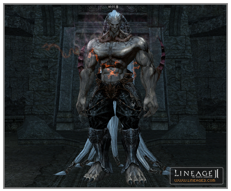
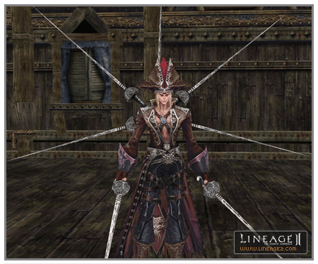
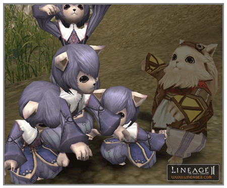

# Monsters (NPC)

**NPC Additions and Changes**

- Baium of Temple of Insolence and Zaken of Devil's Island were added. They are both boss-level monsters and Baium can only be approached through a quest.

- Many raid monsters were added. Raid monsters are semi-boss-level monsters. Characters must gather their power together in parties of two or more of the same level to kill them. Raid monsters are shown on the title line as "raid boss" or "raid underling".

- Party-type monsters, half the level of monsters having the same HP and experience points, were added. These monsters are effective for hunting by classes that must face multiple monsters alone, such as the warlord.

- **Treasure Chest and Mimic**
  - **Treasure Chest:** These were made to appear randomly in places like dungeons and fields. If opening a chest using unlock skill or a chest key, a reward can be obtained according to a fixed probability. There are also different levels of treasure chests. If the unlock skill or chest key level is less than the level of the treasure chest, the chest cannot be opened. If a forceful attack or debuff magic is used just once on a chest, it is not possible to receive a reward, because the chest is destroyed. When opening a treasure chest, the probability of opening the chest and the probability of obtaining a reward are increased, when using unlock skill rather than when using a chest key. If the chest opening fails, the treasure chest disappears immediately without yielding any reward.
  - **Mimic:** These appear randomly in dungeons and fields and look the same as treasure chests. They start to attack, if a character tries to use unlock skill or a chest key on them. Of course, they also attack if they are attacked forcefully. Because a mimic is a monster, a player can obtain item rewards at a fixed probability in the same way as with other monsters. If unlock skill or chest key are used on a mimic, the mimic attacks the respective character much harder than an ordinary attack.

- Guards were added to the hunting areas around Talking Island and the Elven, Dark Elven, Dwarven and Orc Villages.
