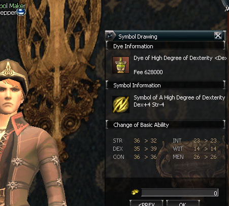
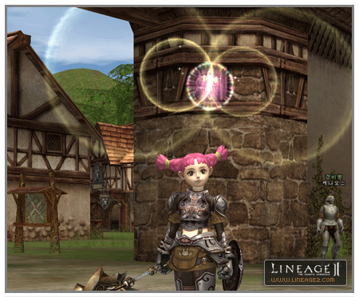

# Items

**Dyes and Symbols**

Items have been added that can change the basic ability values (STR, DEX, CON, INT, WIT, MEN). To change the basic ability values, the desired symbol must be carved through the symbol maker NPC after acquiring each dye item to serve as ingredients. The symbols that can be carved depend on the types of dye that one has. The basic ability values that can change also differ according to what symbol is carved.

**Dyes**

Dyes are items that serve as ingredients for carving symbols. The dyes have + or - values for the basic ability values that can be changed by drawing the symbols. There are ordinary dyes and high-quality dyes. The ordinary dyes can be used as ingredients for carving symbols after a single class transfer. The high-quality dyes can be used after the secondary class transfer.

**Symbol engraving**

Characters of level 20 or above have slots where they can use dyes in the inventory window to engrave symbols. If players have enough quantity of dyes and want to engrave a symbol, they must go find a symbol maker NPC. Symbol maker NPCs charge a fixed fee to carve the symbol for the player. Carving a symbol in this way consumes the dye used as an ingredient. A character must specialize before being able to carve a symbol. Characters that haven't yet completed their first class transfer do not have the right to carve symbols and after completing the first class transfer, they can carve two symbols. After the second class transfer, they can carve one more symbol so that the total number of symbols that can be carved is three. Also, the symbols that were affixed before the second class transfer lose their effect when the character does the second class transfer.

The amount that can be increased from symbols for a single basic ability value cannot be more than +5. Even if two symbols cause STR to increase by +3 and +4 respectively, the total increase of STR cannot exceed +5. There is no limit to the reduction in values but it's not possible to reduce an ability value all the way to zero.

Players can check in advance the change in basic ability values through the symbol maker NPC before carving the symbol.

**Symbol removal**

To remove a symbol again, the player must go in the same way to the symbol maker NPC. And removal of a symbol also costs a certain fee and once removed, half of the dye used for carving the respective emblem is returned to the player.

**Special abilities**

Special abilities can be granted to most weapon items of level C or above. In order to bestow abilities to weapons, "soul" stones that can be obtained through quests and certain fees are required. Depending on the level and type of the "soul" stone, the types of abilities that can be bestowed and the number of items also varies. For items having special abilities, attack magic, buff and debuff magic are used automatically with a certain probability according to the conditions.

| Name | Effect |
|:--|:--|
| Guidance | Increases accuracy. |
| Evasion | Increases evasion. |
| Focus | Increases critical attack rate. |
| Anger | Enhances P. Atk. while decreasing maximum HP by a certain percent. |
| Health | Increases maximum HP by a certain percent. |
| Backblow | Increases critical attack rate when attacking the enemy from behind. |
| Crt. Bleed | Percent chance that target will bleed during critical attack. |
| Crt. Damage | Inflicts extra damage to target when critical attack is launched. |
| Crt. Anger | Decreases players HP while causing damage to target during critical attack. |
| Crt. Drain | User absorbs HP from target during critical attack. |
| Crt. Stun | Percent chance of stun effect during critical attack. |
| Crt. Poison | Percent chance that target will be poisoned during critical attack. |
| Rsk. Focus | Increases critical attack rate when HP becomes low. |
| Rsk. Evasion | Increases Evasion when HP becomes low. |
| Rsk. Haste | Increases Atk. Spd. when HP becomes low. |
| Might Mortal | Increases the success rate of Mortal Blow and Deadly Blow. |
| Mana Up | Increases maximum MP by a certain percent. |
| Light | Reduces a weapon's weight. |
| Quick Recovery | Reduces re-use delay. |
| Cheap Shot | When launching a general attack, MP consumption is reduced. |
| Haste | Increases attack speed. |
| Longblow | Increases attack range. |
| Wideblow | Broadens angle of attack. |
| Magic Mental Shield | Chance to cast Mental Shield magic upon the target when using good magic. |
| Magic Focus | Chance to cast Focus magic upon the target when using good magic. |
| Magic Bless the Body | Chance to cast Bless the Body magic upon the target when using good magic. |
| Magic Hold | Chance to cast Dryad Root magic upon the target when using bad magic. |
| Magic Poison | Chance to cast Poison magic upon the target when using bad magic. |
| Magic Weakness | Chance to cast Weakness magic upon the target when using bad magic. |
| Magic Chaos | Chance to cast Chaos magic upon the target when using bad magic. |

- The images of items were changed and revised overall. The main things changed include C-level and B-level weapons, shields and armor item types.

- The one-piece upper and lower body armor success probability was changed. Currently, all items can be enchanted safely only up to three times but for one-piece upper and lower body armors, it was changed so that they can be enchanted safely up to four times.

- Set effects were added to the following items:
  - **Zubei's Breastplate:** Increased max HP. Increased physical P. Def.
  - **Avadon Breastplate:** Increased HP. Increased shield defense probability (+ shield).
  - **Zubei's Leather Shirt:** Increased evasion.
  - **Avadon Leather Mail:** Increased magic P. Def. Increased weight limit.
  - **Tunic of Zubei:** Increased magic power. Increased MP recovery speed.
  - **Avadon Robe:** Increase physical P. Def. Increased casting speed.
  - **Blue Wolf Leather Mail:** Increased P. Def. Increased casting speed. Increased MEN. Decreased INT and WIT.
  - **Blue Wolf Tunic:** Increased MP. Increased MP recovery speed. Increased WIT. Decreased INT and MEN.
  - **Blue Wolf Breastplate:** Increased speed. Increased HP recovery speed. Increased STR. Decreased CON and DEX.
  - **Leather Mail of Doom:** Increased attack power. Increased MP recovery speed. Increased DEX. Decreased STR and CON.
  - **Tunic of Doom:** Increased speed. Increased MP recovery speed. Increased INT and MEN. Decreased WIT.
  - **Doom Plate Armor:** Increased HP. Increased shield defense probability (+ shield). Increased CON. Decreased STR.

- The game was changed so that spiritshot can also have an effect on heal and the graphic effects for spiritshot and soulshot were also changed.
