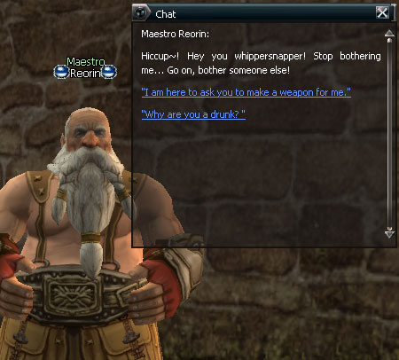
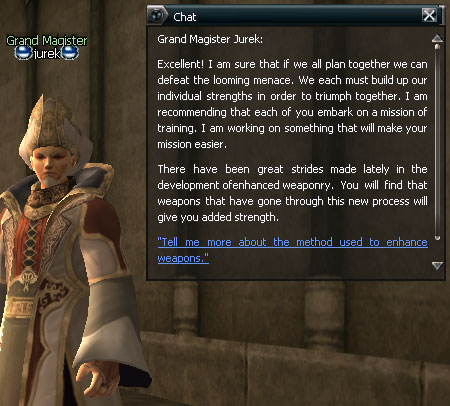

# Quests

**Eighteen new quests were added**

A. **Acts of Evil (Guard Alvah of Gludin Village)**

Investigate the suspicious movements of the turek orcs and ol mahums near Gludin Village. The rumor starts that the legionnaire of the creatures will attack Gludin Village soon.

B. **Fate's Whisper (Maestro Reorin outside Oren Castle Town)**

Listen to the call of fate. You are the one that will shake up the destiny of the territory. Provide a new hope in the hell of despair and equip the flames of tempered hell.

C. **Alligator Hunter (Trader Enverun of Heine)**

Alligator Island is a place where fierce alligators roam a land of opportunity. Are you the hero that takes the request of Trader Enverun to hunt the vicious creatures?

D. **Subjugation of Lizardmen (Guard Weisz of Gludin Village)**

The merchants and pilgrims around Gludin Village and Giran often get attacked by lizardmen. Due to the cargo car of the Aden Commercial Alliance getting attacked, the Gludin guardsmen are hiring you as a mercenary in order to get rid of the lizardmen. In the process of repeated close fighting with the lizardmen, you learn that an even bigger evil exists behind the lizardmen...

E. **Hunting for Wild Beasts (Grocer Pano of Floran Village)**

Grocer Pano intends to open a salmon fishing area but is perplexed because of the bears that appear around the edges of the water. He asks the heroes to chase away the riverside bears.

F. **Under the Shadow of the Ivory Tower (Trader Cema of Hardin's Academy)**

Trader Cema, who is the student of Hardin, has asked you to get ingredients to be used in an experiment at the crater of Ivory Tower. She promises to give you various useful items as payment.

G. **One Thousand Years, the End of Lamentation (Antharas Watcher Gilmore of Dragon Valley)**

The Antharas Watchman came to Dragon Valley in order to conquer Antharas a thousand years ago, but lost all his underlings. Now he is undead, and he asks you to resolve the hate of the lost underlings.

H. **Method to Raise the Dead (Locksmith Dorothy of Heine)**

An adventurer that got the treasure of Pirate Zaken was eaten up by Crokian of the fields. She challenges the hero to take on the bizarre hunting task of gathering relics from the Crokian and to save the dead people in order to find out where the treasure is.

I. **Go Get the Calculator (Blacksmith Brunon of Dwarven Village)**

Blacksmith Brunon, who wants to go to the moon, wants a newly developed calculator in order to make precise estimations. Heroes that agree to get this have to look for the guild to get the clues...

J. **An Arrogant Search (Magister Hanelin of Aden Castle Town)**

Heroes wander around everywhere to find the chests of secrets that are scattered around in order to fight with Baium. But Einhasad does not want them to face Baium. What could be the fate of the heroes that oppose the will of the goddess?

K. **Enhance Your Weapon (Grand Magister Jurek of Giran Village, Magister Gideon of Oren Village, Magister Winonin of Aden Town)**

The Magisters observed that a new threat is coming to this world and are gathering people to face this threat and form a single force. As a means of gathering the individuals for the fighting force, they are developing a method of bestowing elemental characteristics to weapons. They say it is now time to raise up the individual forces to oppose the threat that is coming and to make and use weapons in which elemental characteristics have been added.

L. **Black Swan (Captain Costa of Heine)**

The freight of Iason Heine, who is the leading royalty of Innadril, has been attacked by the lizardmen in transit and was lost. What could be the reason that Iason Heine said he would pay a price that is more than the value of the goods if you go recover the box?

M. **Bard's Mandolin (Bard Swan of Dion Castle Town)**

Bard Swan is in the village teaching the mandolin and sometimes plays together with performers of other races. At the last performance, he was the only one to bring instruments for the other performers. In order to find his mandolin...

N. **Sorrowful Sound of Flute (Nanarin of Dion Castle Town)**

Dark Elf Nanarin sets her eye on the desirable beard of Dwarf Barbado and wants to make friends but can't talk to Barbado directly. Become the messenger of love and communicate the love of Nanarin to Barbado.

O. **Jovial Accordion (Musician Barbado of Dion Castle Town)**

Dwarf Barbado falls in love with the mandolin music of Bard Swan and wants to play in concert with him. However, Swan avoids Barbado because of his relationship with Nanarin. The tangled love goes beyond a triangle-shaped relationship to a square or pentagon-shaped relationship!

P. **Little Wing's Big Adventure (Wiseman Cronos of Hunters Village)**

The hero must find Fairy Mymyu in order to make a grown hatchling into a respectful strider. Mymyu says that the hatchling must eat the sap of four elven trees, which inject poison that is fatal to humans.

Q. **Repent Your Sins (Black Judge in the southern part of the Wastelands)**

There are those called Black Judges that appear in the area where the criminals that were once banished gather. They say that they will give an opportunity to clean away sin and request that you take care of some ugly monsters called "Sin Eaters".

R. **Competition for the Bandit Stronghold (Messenger of the Bandit Stronghold)**

Five factions of ol mahums carry out a fight for position as chief, which has been vacated. The five ol mahum heads set their eyes on the rights to use the clan house and each brings other races into this fight...

**Changes in Existing Quests**

A. **Rancher's Plea**

If you take ten giant spider husks to Marius, they can be exchanged for a healing potion, Soulshot: No Grade, or wooden arrows.

B. **Reclaim the Land**

You may now start the quest not only through Farmer Piotur but also through Guard Leikan of Gludin Village.

C. **Tutorial Quest**

The tutorial quest explanation was supplemented to include information about raiders, the changes of night and day, conversation of the guide and information messages when a level is coming up.

**Quest NPCs**

It has been made so that an exclamation mark appears above the heads of NPCs for which repetitive quests start. For this quest start mark, the player must satisfy the conditions for being able to start the respective quest and the mark is not shown if the player's level is six levels or more than the starting level.
