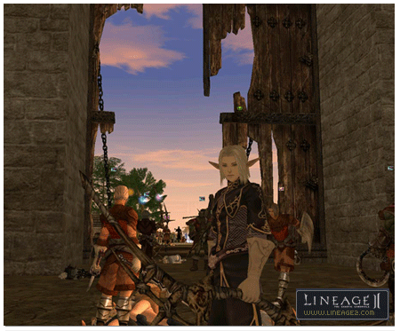
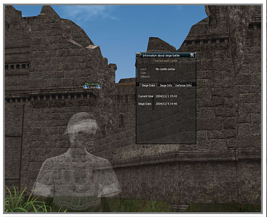
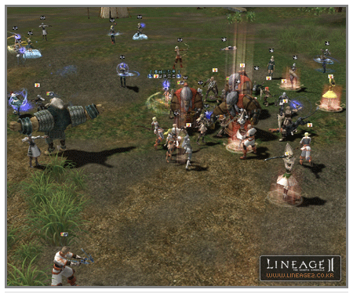

# Clan Halls

**Devastated Castle**

The Devastated Castle is an occupied clan hall for which ownership can be acquired by siege battle with NPCs. The siege is set up to take place with the NPCs every week, which is different from other sieges. The clan hall battle for the Devastated Castle is always defended by an NPC clan and the ownership to the castle is maintained for one week by the PC clan that is able to defeat the defending NPC clan and take the castle.

A. **Time of the Occupying Battle**

The time when the Devastated Castle occupying battle takes place is at the same time each week after the very first occupation battle.

B. **Registration Participation**

Clan that wants to participate in the battle to occupy and acquire the clan hall must register to participate in advance. Participation in the battle to occupy takes place in clan units and only clan leaders having clans of level 4 or above can apply to register. Clans that already own another clan hall cannot register. The clan that had owned the Devastated Castle previously is automatically registered for the siege and the registration for the battle to occupy must be done at least two hours before the start time. Clans that participate in the battle to occupy the Devastated Castle cannot participate in another battle to occupy another clan hall or siege at the same time.

C. **Start of the Siege Battle**

When the time set for the siege starts, the area inside and around the Devastated Castle is designated as the battleground and the players that are already inside the castle are all kicked to the outside. Leader of the clans that are registered in the battle to occupy the castle can build a headquarters. The rules of battle during the battle to occupy the castle are the same as ordinary sieges except for the fact that everyone is on the attacking side and not on the defending side. However, even if the headquarters are destroyed or an unregistered character enters the battlefield and is killed, players are not restarted at the second closest village like in a siege.

D. **Conditions of Victory**

A battle to occupy lasts for one hour and the clan recorded as having contributed the most to killing the head NPC of the Devastated Castle becomes the owner of the clan hall. If the leader is killed, the battle to occupy ends immediately. If no clan is able to kill the leader within the time period, the Devastated Castle continues to be occupied by the NPCs until the next battle to occupy.

**Brigands Hideaway**

A. **Registration for clan battle**

In order to participate in a battle to occupy the Brigand's Hideaway clan hall, the head of a clan of level 4 or above must complete the Brigand's Hideaway quest within a certain time before the clan hall battle is started. Only the first five clans that complete the hideaway quest first can participate. The number of clan members that can participate per clan is limited to 18 people. The quest to participate in the Brigand's Hideaway clan hall battle is only valid for participating in the clan hall battle on that date. Having completed the quest previously does not make it possible to participate in the clan battle.

Once the decision is made to participate in the clan battle, the clan leader must register the 18 clan members and select the NPC that he will protect by conversing with the herald NPC. Clans that currently occupy the clan hall must register the 18 clan members to participate in the defense.
