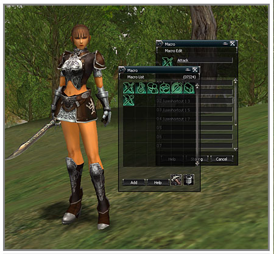

# Macros

A macro is inputted through the keyboard and is a function that makes it possible to perform a series of actions at once that can be performed after creating them in advance.

**Creating and Editing Macros**

A macro can be created, edited and saved by using the macro button in the system window. A single macro saved in this way becomes an icon so that it can be used by placing it in the shortcut bar. A name and explanation can be added to the macro. The name can be used with up to 12 characters and the explanation up to 32 characters.

All slash (/) commands and chatting symbols supported in the game can be used in macros. Substitute characters can also be used to add additional delays or input a desired name. This means that the commands input into a macro are the ones that can be performed by inputting them directly into the chat input window.

All characters have 24 user-defined macros and each individual macro has 12 input windows. One slash command and its accompanying details can be typed into the input window with a maximum of 32 characters.

**Substitute characters for macros**

Substitute characters are commands for which the target's name has been automatically given. The types and methods of using substitute characters are as follows.

- `%target`: The name of the target being targeted is shown.
- `%self`: One's own name is shown.
- `%pet`: One's own pet name is shown.
- `%party1` ~ `%party8`: The first – eighth party member names are shown.

**Macro commands**

- `/delay [time]`: Wait until time (sec). If this command is entered, the following command is performed after waiting the set number of seconds.
- All other actions can be used with slash commands and so they can be used in macros.
  - `/sit`, `/stand`, `/sitstand`, `/walk`, `/run`, `/walkrun`, `/attack`, `/attackforce`, `/exchange`, `/targetnext`, `/pickup`, `/assist`, `/invite`, `/leave`, `/partymatching`, `/vendor`, `/buy`, `/personalmanufacture`, `/mountdismount`, `/socialno`, `/socialyes`, `/socialbow`, `/socialunaware`, `/socialwaitinga`, `/sociallaugh`, `/socialapplause`, `/socialdance`, `/socialsad`
- Chat input is also used in the same way as the method of inputting into the chat window.
  - `~` (ordinary chat), `#` (party chat), `@` (clan chat), `$` (alliance chat), `!` (all chat), `+` (buy/sell chat)
- When using chatting in a macro, to prevent excessive chat that just fills up the window, the output is delayed automatically in the chat window. However, the buy/sell window is an exception to this.

**Use of the shortcut bar through macros**

By dragging and dropping the shortcut icons to the macro edit window, the use of the respective shortcuts becomes possible. Directly editing with slash commands is as follows.

- `/useshortcut [container number] [shortcut slot number]`: Uses the respective shortcut. In the event that a component that is designated to a shortcut is a delayed skill, it is used after waiting the delay time.
- `/useshortcutforce [container number] [shortcut slot number]`: Uses the respective shortcut with the effect of the Ctrl key. In the event that a component that is designated to a shortcut is a delayed skill, it is used after waiting the delay time.

**Using skills with macros**

Use is made possible by dragging and dropping the desired skill icon to the macro edit window. The direct editing of slash commands is as follows.

- `/useskill [skill name]`: Uses the respective skill. For skills with a delay time, it is used after waiting the delay time.
- `/useskillforce [skillname]`: Uses the respective skill with the effect of the Ctrl key. For skills with a delay time, it is used after waiting the delay time.

**Stopping a macro**

In the event that the user carries out some action directly while performing a macro, the respective macro stops immediately. This includes speaking in the chat channels and moving the character.

In the event of using another macro again within a macro, the macro stops while a message saying "This is an unsuitable macro" appears.

*For more detailed information about macros, please refer to the macro section of Help in the game.*
