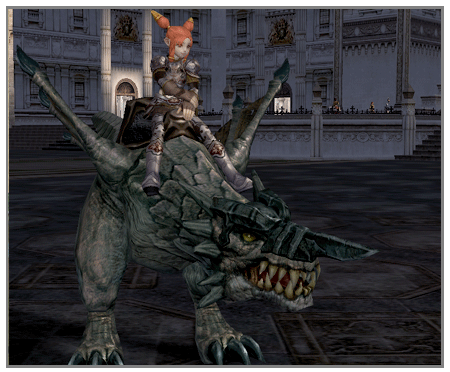
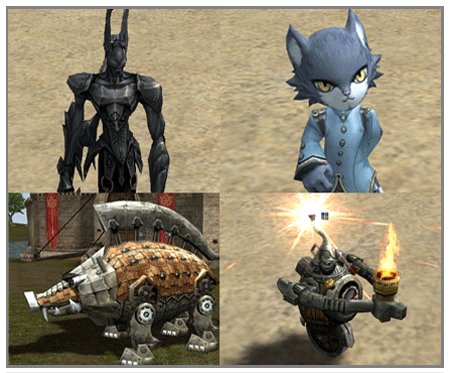

# Summon and Pet Systems

**Strider (Swift Horse)**

Once a hatchling reaches level 55, it can be evolved into a strider through a quest. The name of the evolved strider is the same as the name of the hatchling before its evolution and it obtains the ability values of a strider. The other strange conditions it had succumbed to before and hunger gauge are both re-initialized. A strider that has been evolved cannot be returned to a hatchling again. Summoning of the strider is possible anywhere, if one has an item for summoning it.

**Strider as a pet**

A strider is a pet that can fight together when hunting and is used in the same way as an ordinary pet, such as a hatchling wolf.

**Strider for riding**

A player that summons a strider can ride it through the actions of mount/dismount. If a player rides on a strider, there are a variety of ability value changes and interface changes.

When riding a strider, the P. Atk. and movement speed are the same as the ability values of the respective strider and the other ability values are the same as the PC that is riding. If the PC that rides is much less than the level of the strider, then a penalty is applied to P. Atk. and movement speed of the strider. If the level of the player is more than five levels less than the strider, P. Atk. falls by 50% or more and then it is reduced an additional 5% for each level. The movement speed of the strider is cut in half if the level is 10 levels or more lower.

**Restrictions on riding mode**

Basic battle is possible even when riding a strider but the physical skills that the player has cannot be used and the items worn do not have an effect on the strider. However, passive skills of players are still effective and magic can be used. When being cast with heal, buff or debuff magic, this is cast on the PC that is riding and the strider is not affected by this.

While riding on a strider and opening the inventory, because the PC's inventory is opened, the inventory of the strider cannot be seen. When using items, the effects of items used on oneself, like potions, are applied to the player. It is possible to escape or teleport while riding a strider. Social actions, personal shop sales/purchases and item enchanting cannot be done while riding a strider.

When going underwater while riding a strider, the underwater physical strength gauge used is the gauge of the player. If this underwater physical strength gauge disappears, the HP of the rider decreases.

In the event of riding a strider and then getting off, the strider automatically returns and goes back to inventory. Even when logging out or disconnecting while riding, it returns automatically in the same way.

The experience points obtained while riding a strider all go to the experience points of the PC. If battling while riding a strider, the consumption of food increases. When not fighting, food consumption decreases.

**Death and extinguishment of a strider**

What happens when a strider dies depends on whether it was a pet or whether it was being ridden. If it was a pet, then it exists as a corpse for a fixed period of time just like other pets. As with an ordinary pet, a strider disappears if not resurrected. When riding a strider that dies, the rider also dies. If the hunger gauge of the strider falls below a certain level, the strider disappears, even if it is being ridden.

**Summon monster**

Kai the cat, unicorn marrow, soulless, bigboom, wild hog cannon, spark cubic, aqua cubic and binding cubic were all added.

