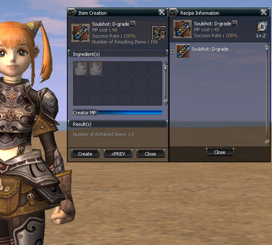
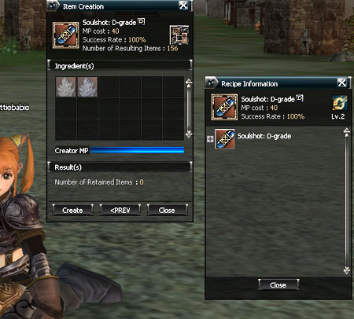

# Item Mixing

**Recipe Book Addition and Personal Manufacturing**

The method of mixing items has been changed from the previous method of mixing by double-clicking on each recipe item. Now, manufacturing is done in the item manufacturing window after registering the recipe in the recipe book.

**Recipe Book**

If a player double-clicks (or right-clicks) the recipe in the inventory, a confirmation window asking whether to register that recipe in the recipe book appears. If the recipe is registered in the recipe book, the recipe that was in inventory disappears and the recipe registered in the recipe book is added. A total of 50 recipes can be registered in the recipe book, which is necessary for mixing. However, recipes of a higher level than one's own create item level cannot be registered. If a player opens the recipe book and double-clicks on the recipe that he/she wishes to use, the item manufacturing window appears.

**Item Manufacturing Window**

If a player double-clicks on the recipe that he/she wants in the recipe book, the item manufacture window is activated. In the manufacture window that is activated, the information of the item to manufacture (name, number/quantity, MP consumed, probability of success) and information about the required ingredients (primary ingredients, name, number held/number required, MP of the manufacturer) are shown. A gray indicator is shown on the icon, just as in a personal purchase, when the required number is not held. The explanation of the items respective to each icon are shown. If the information button of the manufacture window is clicked, the recipe tree window appears. If all conditions for the mixing are satisfied, then the item manufacture is possible by using the manufacture button. If successful at item manufacturing, the name and the resulting number of the respective items are shown in the resulting item information section.

Since it doesn't return to the recipe book status after manufacturing, if a player wants to do manufacturing multiple times in that situation, it can be done by continuing to click the manufacture button.

**Recipe Tree**

The outer appearance of the tree structure shown in the recipe tree window is similar to the tree structure of a Windows folder.

For ingredients that can be expanded, the + symbol is shown and if looking at the sub-section information after clicking the + symbol, the - symbol is shown. Ingredients that cannot be expanded do not have a symbol shown.

**Personal Manufacturing**

The manufacturer opens the item manufacture window by using personal manufacture in the action section and puts the recipe that he/she intends to manufacture into the manufacture list in the same way as when doing a personal sale. A total of 10 recipes can be put up into the recipe list and when putting the recipe into the list, the fee for a single manufacturing can be determined. If the start button is pressed, the player sits down the same way as with a personal shop. If the requestor clicks a character that is doing personal manufacturing, he/she can view the list of recipes that can be manufactured and in the recipe tool-tip, the name/grade/manufacturing fee/success probabilities are shown. After selecting the desired recipe, the same item manufacturing window as when manufacturing is shown on the screen of the requestor. The following manufacturing method is as above.

**Success Probabilities**

The success probabilities of recipes of B-grade or more that have been added until now have been changed to 100%.
