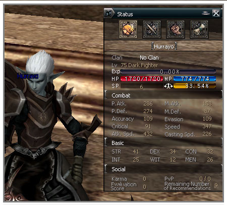

# Evaluations of Others

Evaluation of others is a function of being able to recommend other players. Recommending another player doesn't have any effect on the ability values of that player or on other systems, but characters that have received recommendations from many other people have their character name changed to blue.

The number of recommendations each player can give depend on one's level. You must be level 10 to recommend another player.

People that have received recommendations from others can know through a system message who has recommended them. Characters with a high evaluation value have their character's name changed to blue. However, chaotic characters still show their chaotic condition in red, even if they have a high evaluation value.
