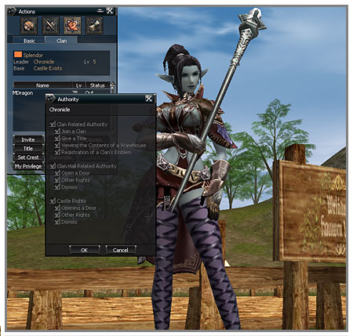

# Clans and Alliances

1. The clan leader can delegate the clan leader's unique rights to his/her own clan members. This is done by clicking the rights delegation button after selecting the clan member in the clan action section that one wishes to delegate to. The clan leader can delegate the following rights to clan members.

    A. Clan rights: clan joining, bestowal of titles, viewing of warehouse, registration of clan crest
    B. Clan hall rights: gate opening, other rights (function adding/restoration), banning
    C. Castle rights: gate opening, other rights (function adding/restoration, related to manors, mercenary placement), banning

2. The game was revised so that, while the maximum number of clan members had been 40 when the clan level reaches 5, the maximum number is 40 even before the clan reaches level 5. The number of clans that can be included in an alliance was increased to 12.
