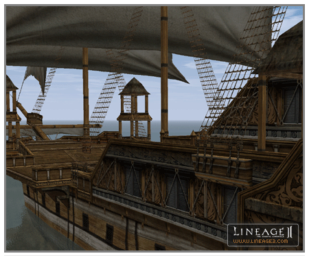

# Other Changes

1. With the addition of Devils Island, the path of the current boat going between Giran <-> Talking Island was changed a bit.

2. New background music for villages, character creation, login screen and character selection screen was added.

3. When using a gatekeeper, you can now confirm the name of the village to go to in the confirmation window.

4. The system messages for acquiring all kinds of items were changed to yellow.

5. The petition receipt window was changed. The window for inputting petition content was added, so that categorization can also be selected in the petition window. When using /gm, please submit your petition after first selecting the category for the content of the petition.

6. New faces and hairstyles have been added for each race and gender.

7. The item quantity selection window interface was supplemented with the addition of an ALL button that automatically enters the entire quantity of the item.

8. When the player is not eligible to receive a quest, the message "Conditions are not right to make this quest available" has been changed to "I have no tasks for you right now".

9. When using the /loc command to find the player's location, the information now includes the closest village to the player.

10. Flooding or spamming the chat channels results in an automatic and temporary chat ban.

11. The Boat Announcements on Talking Island now include the destination city in each announcement. The range was also decreased to reach only players close to the harbor.

12. The pet window has been updated; the icons have changed and the pet's special skills now include a description. If a pet does not have a special skill, there is no button.

13. Wolves, Hatchlings, and Striders can now use Potions.

14. Wolves, Hatchlings, and Striders can no longer carry arrows, soulshots, or spiritshots in their inventories.

15. New loot distribution methods have been added.
