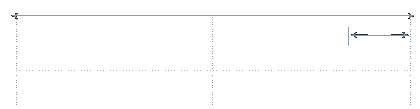
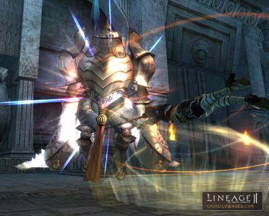
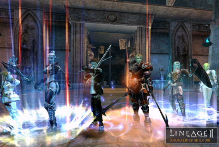
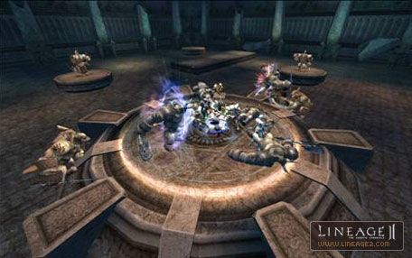
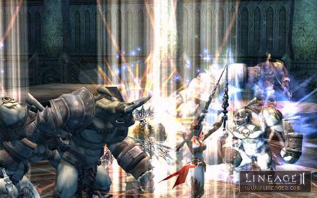
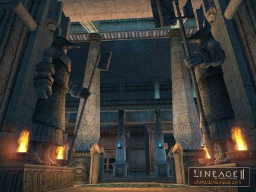
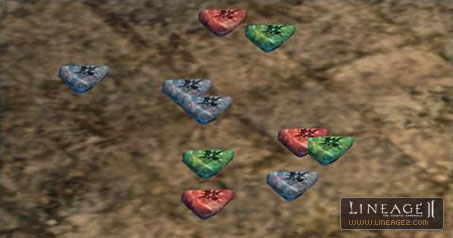

# Seven Signs

## Seven Signs

As the Seven Seals that bind the power of Shilen, Goddess of Death, are opened one by one, the world moves closer to the brink of chaos. Each Seal contains a great power that can make the world tremble. The one who opens the Seals can control the power contained within them. The Revolutionary Army of Dusk and the Lords of Dawn compete against each other toward this end. Players join one of these two cabals, which vie for control over the power of the Seals.

An unlimited number of players can join the Seven Signs quest, which repeats in two-week intervals. By participating in the Seven Signs, players are given the opportunity to shape their server in ways that were not possible until now.

The war between the Cabals is between those who hold a castle and those who do not. Players who have not yet reached their second occupation fall into the 'neutral group' and may participate in either side.

---

## Joining and Withdrawing from the Seven Signs Cabals

Players who want to participate in the Seven Signs must join one of the Cabals, either the Revolutionary Army of Dusk (hereinafter "Dusk") or the Lords of Dawn (hereinafter "Dawn"). Once they join one of the Cabals, it is impossible for them to withdraw until a new Seven Signs starts after two weeks. At the time they join, they must vote upon the Seal they wish to possess.

**1) Characters With a Second Class Transfer:**

**Lords of Dawn:**
Members of clans who own a castle may join the Lords of Dawn. Players who are not members of castle-holding clans or alliances, but who are willing to pay 50,000 adena, will be able to choose Dawn through the Priests of Dawn in each village during the competition period. At this time, the Lord of each castle may purchase an additional 300 Approval Certificates through the Chamberlain and transfer them to other characters.

Characters who are not members of castle-holding clans need to get an Approval Certificate from their castle's Lord to join Dawn, or pay 50,000 adena. Approval Certificates never expire and are re-usable.

**Revolutionary Army of Dusk:**
Only characters who are not members of the castle-holding clans and guilds may join Dusk. During the registration period, they may join through the Priests of Dusk in each village.

**2) Characters Without a Second Class Transfer:**
They may freely join either the Lords of Dawn or the Revolutionary Army of Dusk.

**3) Characters Without a First Class Transfer:**
They may not participate in the Seven Signs.

---

## Competition Period

Characters who joined a Cabal may participate in the competition period from the first Monday until the Monday of the following week. Each Cabal may hunt the Seven Signs monsters (Lilim, Nephilim, Lilith, and Gigant), within the Catacombs and Necropolis' to acquire Seal Stones. They can participate in two kinds of competitions: acquiring items necessary for their Cabal, and participating in the Festival of Darkness.

**1) Collecting Seal stones (Blue, Green, and Red)**
Each Cabal may hunt monsters within the Catacombs and Necropolis' to acquire Seal Stones. Items acquired in this way are entrusted to the Priest of each side. Scores contributed to the Priests by each player are accumulated and included in the total score of the whole Cabal. [Contribution points to the Cabal will be different based on stone color: Blue (1), Green (5), and Red (10)]. Seal Stones are items that can be exchanged among players. Even if these items are not entrusted to the Priest during the competition period, they do not disappear and can be used during the next competition period.

- Players hunt the monsters in Necropolis' or Catacomb to get Seal Stones.

**2) The Festival of Darkness**

- **Overview:** Among the players participating in the Festival of Darkness, the party that records the best score in each level will contribute points to their Cabal. The Festival of Darkness is divided by level and any players belonging to either of the Cabals can participate.

- A party comprised of 5 to 9 members participates in the Festival of Darkness.

- **How to Participate:** Players may participate only during the competition period. The party wishing to participate should pay Seal Stones to the Guide of the Festival in the Oracle. Priests in towns will teleport you to the Festival for free. Entry fees vary depending on level, and must be paid by party leaders. Parties must consist of a minimum of 5 members belonging to the same Cabal. Members of each party must correspond to the level of the Festival in which they want to participate. Characters who correspond to the level of the Festival, but who have higher level skills than the party members, may not participate. This happens when the character is de-leveled, but his skills learned from the previous higher level remain. These challenges are always possible during the competition period and there is no limit in the number of challenges.

- **Place of the Festival:** During the Festival, items are not dropped on death and experience loss is reduced by one-fourth. However, chaotic players may still drop items upon death. In the center magic array of the Festival, recovery of MP is faster than elsewhere. Players can be teleported to the Festival and can return to their original location free of charge through the Priest of each village. Upon death, players restart inside the room.

- The place where the Festival of Darkness occurs.

- **Festival Costs:** The Festival of Darkness is divided into five grades, such as less than a 32 level, less than a 43 level, less than a 54 level, less than a 65 level and an unlimited level.

* For each level listed below, pay the indicated amount of either Blue, Green or Red Stones.

| Level | Blue Seal Stones | Green Seal Stones | Red Seal Stones |
|:--:|:--:|:--:|:--:|
| Below 32 | 900 | 540 | 270 |
| Below 43 | 1500 | 900 | 450 |
| Below 54 | 3000 | 1800 | 900 |
| Below 65 | 4500 | 2700 | 1350 |
| No Limit | 6000 | 3600 | 1800 |

- **Process:** Teleporting to the battleground is possible only two minutes before the Festival of Darkness begins. Once enrollment is completed through the Festival Guide, parties are immediately teleported to the Festival location. After two minutes of prep time, the Festival begins and continues for 18 minutes while the participants kill the monsters and collect the 'Blood of Sacrifice'. The number collected corresponds to the score registered in the Festival of Darkness. All of the 'Blood of Sacrifice' acquired from the hunt is automatically given to the party leader.

- During the Festival the party leader will obtain 'Blood of Sacrifice'.

If the party feels the need to leave the Festival early they can do so via the Festival Witch located in the center of the room. If they think the Festival needed added challenge, then they can request stronger minions from the Festival Witch. The stronger the monster killed, the more 'Blood of Sacrifice' they can acquire. If pets are used to hunt in the Festival then the drop chances for Blood of Sacrifice will be lowered.

- **Registering Your Score:** After the Festival ends, the leader of the party must register the result to the Guide of the Festival within 40 minutes. Please note that if the party fails to register within this time, the result will become invalid. If the registered result is lower than the previous highest record, the record is not updated.

- **Prize:** After the competition period ends and their Cabal has won, party members who set the highest score for each grade can receive Ancient Adena as compensation from the Festival Guide. Although a party may set the high score for a specific level, they cannot receive a prize if the Cabal they belong to loses. Please note that the prize is paid only before the start of the next competition period.

---

## End of the Competition Period, Victory and Defeat

**1) Determination of Victory and Defeat**
Victory is determined by combining the high scores recorded in the Festival of Darkness along with the amount of Seal Stones each Cabal has entrusted to their priest.

| Maximum Level | Points |
|:--:|:--:|
| ~ 32 | 70 |
| ~ 43 | 70 |
| ~ 54 | 80 |
| ~ 65 | 80 |
| Unlimited | 100 |

**2) Settlement of Ancient Adena**
Once the Seal Effective period begins, the Priest in the village rewards Ancient Adena to the player on the winning Cabal based on the amount of Seal Stones turned in during the competition period. If the player kept their Seal Stones and did not turn them in, they are still able to turn them into the Priest in exchange for Ancient Adena. The only time one may receive Ancient Adena is if they are on the winning Cabal of this particular Seal Period. The losing side may not turn in their Seal Stones until their Cabal is able to win a competition period.

**3) Purchasing Items**
The winner can purchase a variety of items that cannot be purchased in the general stores by paying with Ancient Adena to the Priest of Dusk or Dawn.

**4) Change in the Ownership of the Seal**
Seals are owned based on being victorious during the competition period and having the required voting percentage for the Seal.
- If the seal was not in effect or owned by the opposing Cabal, then the new winner must receive 35% or more of the total votes to obtain it. If the vote is less then 35% then they cannot own the Seal.
- If the cabal owned the Seal in the previous Seven Signs competition, then they can retain the seal if 10% or more members have voted for it.

**5) Change in the Environment**
If Dawn wins, a solar eclipse occurs and the sky turns violet; if Dusk wins, an eye is created in the moon and the sky turns green.

- If Dusk wins, an eye is created in the moon and the sky turns to a green color.

---

## Seal Effects

If a party owns each Seal, the following changes will occur.

**1) Seal of Avarice**
- The teleport NPC at the entrance of the Necropolis moves the winner inside the dungeon, and they can purchase various kinds of buffs with Ancient Adena.
- Able to enter all 8 Necropolis freely.
- In the Necropolis, monsters are generated for the winner to hunt.

**2) Seal of Gnosis**
- The teleport NPC at the entrance of the Catacombs moves only the winner inside the dungeon.
- Able to enter all 6 Catacombs freely.
- The winner can purchase teleports from the Priests to various hunting areas with Ancient Adena.
- Hostile NPCs are located around each village, except starting towns, and randomly cast various kinds of de-buffs onto the members of the losing Cabal.
- Friendly NPCs are located around each village, except starting towns, and randomly cast various kinds of buffs onto the members of the winning Cabal.
- An NPC named The Blacksmith of Mammon will appear inside the Catacombs. He accepts Ancient Adena for performing A-grade weapon enhancements, removing the Seal on armor, equipment exchanges to higher-level items, as well as free exchange for equipment of the same level. The Blacksmith of Mammon wanders around each Catacomb.

**3) Seal of Strife**

**- If Owned by Dawn**
- During a siege, it is now possible to hire elite Dawn Mercenaries in addition to the existing mercenaries.
- The cost required to upgrade the castle gates and walls is slightly reduced.
- The defensive power of the castle gates and walls is slightly increased.
- The maximum tax rate that the lord of each castle can establish is increased to 25%.

**- If Owned by Dusk**
- During a siege, defenders are unable to hire anything but low-level mercenaries.
- The cost required to upgrade the castle gates and walls is greatly increased.
- The defensive power of the castle gates and walls is greatly reduced.
- The maximum tax rate that the lord of each castle can establish is decreased to **5%**.

---

## Catacombs, Necropolis', and The Oracle

Sixteen dungeons were added in relation to the Seven Signs. The Oracle is the place where the Festival of Darkness is held. The Catacombs and Necropolis' are dungeons where the players can hunt monsters and get Seal Stones necessary for the acquisition of the Seals. These monsters, represented by Lilim and Nephilim, drop Seal Stones, but do not drop Adena. Access to these dungeons is limited based on participation in the Cabal and ownership of the Seals.

**1) Necropolis**
- **Necropolis of Sacrifice**: level 20~30 monsters appear and it is located on the southern seashore of the Gludio Territory.
- **Pilgrims Necropolis**: level 30~40 monsters appear and it is located near the Partisan's Hideaway in Dion Territory.
- **Worshipers Necropolis**: level 40~50 monsters appear and it is located near the Alligator Island in the Innadril Territory.
- **Patriots Necropolis**: level 50~60 monsters appear and it is located above the Gludio Castle in the Gludio Territory.
- **Ascetics Necropolis**: level 60~70 monsters appear and it is located near the Altar of Rites in the Oren Territory.
- **Martyrs Necropolis**: level 60~70 monsters appear and it is located near the Giran Castle in the Giran Territory.
- **Saints Necropolis**: level 70~80 monsters appear and it is located near the Field of Whispers in the Innadril Territory.
- **Disciples Necropolis**: level 70~80 monsters appear and it is located near the Devastated Castle in the Aden Territory. From here, the players can move to the place where Anakim or Lilith appear, based on the ownership of the Seals.

**2) Catacomb**
- **Heretics Catacomb**: level 30~40 monsters appear and it is located near the Execution Ground in the Dion Territory.
- **Catacomb of the Branded**: level 40~50 monsters appear and it is located near the Giran Port in the Giran Territory.
- **Catacomb of the Apostate**: level 50~60 monsters appear and it is located near the Plains of the Lizardmen in the Oren Territory.
- **Catacomb of the Witch**: level 60~70 monsters appear and it is located near the Forest of Mirrors in the Aden Territory.
- **Catacomb of Dark Omens**: level 70~80 monsters appear and it is located near the Dark Elven Village in the Oren Territory.
- **Catacomb of the Forbidden Path**: level 70~80 monsters appear and it is located near the Hunters Village in the Aden Territory.

**3) Oracle**
- **Oracle of Dawn**: located near the Orc Barracks in the Gludio Territory.
- **Oracle of Dusk**: located near the Windy Hill in the Gludio Territory.
- One cannot create a Private Store while inside the Oracle of Dusk or Dawn. The Oracles are considered Peace Zones.

**4) Access to the Dungeons**
During the first week of the Seven Signs, the competition period, any characters who join a Cabal can access the dungeons. After the competition period is over and the Seals are effective, only the Cabal who owns the appropriate Seal can have access. The loser, or even the winner who did not achieve the voting percentage necessary to obtain the Seal, cannot access the dungeons for the week following the competitions when the Seals are in effect.

- Any characters who joined the Cabal can access dungeons during the competition period.

---

## Other Matters

**1) Seal Stones**
Seal Stones are exchangeable and can be acquired by hunting Lilim, Nephilim, and Gigant in the Catacombs and Necropolis'. The value of the Stones are higher in the order of Blue < Green < Red. If the player entrusts the stones to the Priests in town, it will add points to your Cabal. Blue, Green, and Red contribute 3, 5, and 10 points respectively.

- Entrusted Seal Stones will contribute to grand total points of Cabal.

**2) Ancient Adena**
Ancient Adena is acquired through Seal Stones during the competition period. Ancient Adena is used to purchase the items from the Priests of Dawn or Dusk, Blacksmith of Mammon, Trade of Mammon, or to utilize various functions. The Black Market Trader of Mammon will also convert Ancient Adena to regular Adena at a one to one ratio.

**3) The Record of Seven Signs**
This is the item that allows you to see overall situations, main events and Seal states of the Seven Signs at a glance. Anyone can buy this item at 500 adena through the Priests of Dawn or Dusk.

**4) Approval Certificates of the Lord**
With this item characters that are not members of castle-holding clans, who have done their second class transfer can join Dawn.

**5) The Black Market Trader of Mammon**
They exchange Seal Stones and also exchange Ancient Adena with Adena.
