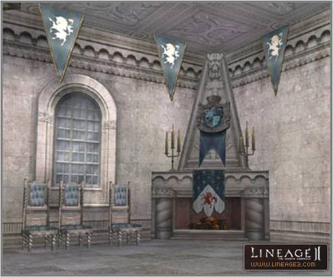

# Clan Hall

**1.** Six auction-type Clan Halls have been added to the Town of Aden.

**2.** Each house has been granted a unique name. Each house has been given its own name; for instance, the first house in Gludin Village has been given the name Gludin Crystal Hall.

**3.** Clan halls are now classified into grades.
- Town of Aden Houses: A grade
- Gludio Castle Town/Gludin Village Houses: B grade
- Dion Castle Town Houses: C grade

**4. Clan Hall Decorations**
Players can add a variety of decorations and new functions to their Clan Hall. The inside features can now be changed in Gludio Castle Village and Aden Castle Village. In other villages, the functions are working, but the graphic changes have not been added yet. The decorations for Clan Hall will be added over time. The following decorations can be added if a fee is paid:

- Players can add a variety of decorations and new functions to the Clan Hall.

1) **Recovery Facilities** (Higher levels can be chosen for higher-grade houses)
- Fireplace: Same as existing HP recovery ability.
- Carpet: Same as existing MP recovery ability.
- Chandelier: When a character dies and returns to the clan house, a fixed % of experience is recovered.

2) **Miscellaneous Equipment**
- Mirror: Allows teleportation to nearby regions and hunting areas.
- Interior curtains: Offer a variety of buffs through Clan Hall manager NPC. Higher levels available for higher-grade houses.
- Magic Machine: For B-grade and higher houses, item production is available by grade.

3) **Decorative Additions**
- Curtain, Foyer: These are decorations to make the house look more beautiful.

**5.** If the production function is enabled through the house manager, consumable items not sold in the store can be purchased in limited quantity per hour through the house manager.

**6.** The method to enter the Clan Hall has been changed to allow access through the opening and closing of the Clan Hall gate. The gate of the Clan Hall can be opened through the NPC, or by directly clicking on it.

**7.** Auction base prices, security deposits and weekly rent have been changed for each house as follows:
- Town of Aden: auction base value (50,000,000 adena), deposit (1,500,000 adena), weekly rent (1,000,000 adena)
- Gludio Castle Town, Gludin Village: auction base value (20,000,000 adena), deposit (1,000,000 adena), weekly rent (500,000 adena)
- Dion Castle Town: auction base value (8,000,000 adena), deposit (500,000 adena), weekly rent (200,000 adena)
