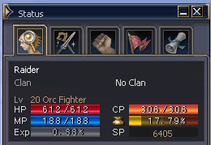

# Combat Will Points

**Extra damage protection adds a new dynamic to Player vs. Player combat!**

Combat Will Points (CP) offer a new dynamic to PvP situations, by adding an extra layer of protection when attacked by another player. CP total varies by class, recovers over time, and acts as a buffer that must be depleted before damage will affect your hit-points.

1. CP is the statistic consumed through PvP. If damaged by a PC (including servitors and pets of PC), CP is consumed first and HP is not consumed. If the CP is not enough to consume all the damage, HP begins to be consumed as much as the difference. The total quantity of CP is applied differently by level/class. Like HP, CP is also gradually recovered as time passes.

2. In PvP, a chaotic character with a PK count of 5 or less will no longer drop items upon death.

3. The success rate of an equipped shield defending against a critical attack has been greatly increased.

4. Similar to the idea of a critical, a shield has a chance to completely defend against an attack.

5. For smooth solo-play, the experience penalty received from hunting monsters of a level lower than one's own has been changed so the penalty no longer applies when the monster is less than 5 levels below one's own (target name appears light green).

6. To improve the benefits of hunting in a small party, the party experience bonus obtained when killing monsters has been changed as follows:
   - 2 member party 7% -> 30%
   - 3 member party 14% -> 39%
   - 4 member party 23% -> 50%
   - 5 member party 31% -> 54%
   - 6 member party 40% -> 58%
   - 7 member party 50% -> 63%
   - 8 member party 61% -> 67%

7. The penalty applied at 80%+ weight has been relaxed to be the same as the penalty applied at 66%+ weight.

8. Those characters who have achieved 100% at level 75 and cannot acquire further experience, when partied with others, will absorb the amount of experience like someone of level 70 so that other party members may obtain a bit more experience.
