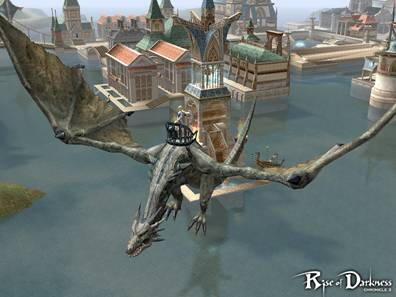

# Pet & Servitor

## 1. Wyvern

- The lord of the castle can ride a Wyvern freely throughout the sky.
- Wyverns can only be ridden by speaking with the wyvern manager at the uppermost floors of the castle.
- To ride a wyvern, one must be in strider-riding mode.
- To ride a wyvern, B-grade crystals are required.
- Wyverns, like other pets, need to be continuously fed (with wyvern food). If they are not fed, they will be forcibly unsummoned and players will be returned to the closest village.
- While riding a Wyvern, you may not attack any monsters. But you may use the wyvern's special breath attack skill to attack other players.
- You cannot pick up items while astride a wyvern, and characters cannot use skills.
- When /mount is used, wyverns will promptly disappear. When the wyvern is unsummoned in mid-air, falling damage can be applied - so beware!
- When riding wyverns into special regions, like the top floor of the Tower of Insolence, where one cannot go under normal circumstances, dismounting is not allowed.
- When riding a wyvern, if a castle lord changes, the player will be forcibly unmounted.

- Wyvern

**2.** When summoning, the total amount of crystals required for summoning will not be used upfront. Only some portion is consumed at this time; as time passes, more of the crystals will be used, so that the total number of crystals will be used by the end of a complete summoning. The amount of required crystals and summon duration is the same as before.

**3.** Pets and summons had been classified as humanoids and have been fixed to properly match their species' true classification.

**4.** Pets took penalties based on its master's level, but now pets will receive penalties independently of its master's level.

**5.** If pet food is in the pet's inventory and its hunger gauge falls below 55%, it will automatically consume food to increase its hunger gauge.
