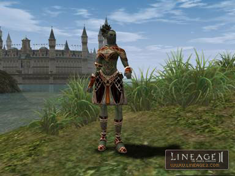

# Items

## 1. A-grade Items

A-grade items have been added. A-grade items can only be obtained through crafting. When crafted, they are crafted into a sealed state. Sealed A-grade items are not shown with the normal graphics.

| Item | Description |
|:--|:--|
| Weapons | A-grade weapons are not sealed and can be crafted and obtained by killing special raid bosses. If a special weapon option is bestowed upon an A-grade weapon, when attacking other players physically and/or with magic, additional damage is delivered. |
| Armor | When armor pieces are obtained or crafted, they will exist in a sealed state. Sealed A-grade items, if worn, are displayed with the normal graphic, however the icon with the item sealed and unsealed are different. The defensive rating of a sealed armor piece and its unsealed equivalent are the same. But to acquire the item set bonuses, the seals must be released. When unsealing boots and gloves, one must select light armor, heavy armor, or robes. The boots and gloves must be of the same class of armor as the body armor when worn to have the set bonus to take effect. |
| Accessories | Accessories, like armor, are crafted in a sealed state. In Chronicle 3, the seal on accessories cannot be undone. |

## 2. Special Abilities Options for Weapons

### 1) New special weapon options:

| Option | Details |
|:--|:--|
| Conversion | The maximum MP is increased with a fixed percentage and the maximum HP is decreased with a fixed percentage. |
| Acumen | Magic casting speed increases with a fixed percentage. |
| Magic Damage | When using harmful magic on a target, it delivers additional magic damage with a fixed percentage. |
| Magic Power | When attacking with magic, the amount of MP used increases with a fixed percentage and magic power also increases. |
| Magic Paralyze | When using harmful magic on a target, it will paralyze the target with a fixed percentage. |
| Magic Silence | When using harmful magic on a target, it will silence the target with a fixed percentage. |
| Empower | Increases magic power. |

### 2) Changes to the existing weapon special abilities options:

| Option | Details |
|:--|:--|
| Light | Originally it lowered the weapon's weight by 50% but it has been changed to lower the weight by 70%. |
| Rsk. Haste | The 20% or lower requirement for HP has been changed to be 60% or lower. |
| Rsk. Evasion | The 20% or lower requirement for HP has been changed to be 60% or lower. |
| Rsk. Focus | The 20% or lower requirement for HP has been changed to be 60% or lower. |
| Crt.Bleed/Poison/Stun | During a critical, the probability of the special abilities taking effect has been greatly increased. |
| Crt.Damage/Crt.Anger | During a critical, the damage formula used has been changed. Therefore, the numbers have also changed. |
| Cheap Shot | Originally, this ability randomly reduced the amount of MP used when attacking with a bow. It has been changed so that a very little amount of MP is always used. |
| Back Blow | When attacking a target's back, the critical has been fixed to increase by a non-absolute probability. |
| Anger | Decreases the maximum amount of HP by 15% and increases attack power. |

### 3) A-grade Weapon Options

The newly added A-grade weapons have the following options available. To bestow the weapons with an option, an 11/12 level soul stone is required and can only be performed by Mamon's Blacksmith.

| Weapon | Options |
|:--|:--|
| Dasparion's Staff | Mana-Up, Conversion, Acumen |
| Meteor Shower | Focus, Crt.Bleed, Rsk.Haste |
| Elysian Axe | Health, Anger, Crt.Drain |
| Branch of the Mother Tree | Conversion, Magic Damage, Acumen |
| Carnium Bow | Light, Crt.Drain, Mana-Up |
| Bow of Soul | Cheap Shot, Quick Recovery, Crt.Poison |
| Bloody Orchid | Focus, Back Blow, Crt.Bleed |
| Soul Separator | Guidance, Crt.Damage, Rsk.Haste |
| Blood Tornado | Haste, Focus, Anger |
| Dragon Grinder | Rsk.Evasion, Guidance, Health |
| Halberd | Haste, Crt.Stun, Wide Blow |
| Tallum Glaive | Guidance, Health, Wide Blow |
| Tallum Blade | Crt.Poison, Haste, Anger |
| Elemental Sword | Magic Power, Magic Paralyze, Empower |
| Sword of Miracles | Magic Power, Magic Silence, Acumen |
| Dragon Slayer | Health, Crt.Bleed, Crt.Drain |
| Dark Legion | Crt.Damage, Health, Rsk.Focus |
| Keshanberk*Keshanberk | Ability to increases attack speed by 8% if the enchant level is 4 or more. |
| Keshanberk* Damascus | Ability to increase maximum HP by 25% if the enchant level is 4 or more. |
| Damascus * Damascus | Ability to increase accuracy by 6 if the enchant level is 4 or more. |

* Level 11/12 Soul Crystal: Even without using soul absorption skills, the soul collection is possible, and when killing a boss monster (Antharas, Baium, Anakim, Lilith, etc.) the party whose member delivered the last blow may have entire members upgrade the soul crystal.

### 4) Additional C-grade Weapon Options

The newly-added C-grade two-handed sword Berserker Blade and the weapons that previously could not have C-grade weapon options added: Sword of Limit, Deathbreath Sword, and Homunkulus Sword, can now be given special weapon options.

| Weapon | Options |
|:--|:--|
| Sword of Limit | Guidance, Crt.Drain, Health |
| Deathbreath Sword | Empower, Magic Power, Magic Silence |
| Homunkulus Sword | Acumen, Conversion, Paralyze |
| Berserker Blade | Focus, Crt.Damage, Haste |

### 5) Daggers from which the might mortal option had been removed have had the following option added:
- Dark Elven Dagger: Rsk. Haste
- Stiletto: Rsk. Haste
- Crystal Dagger: Crt. Damage
- Demon Dagger: Crt. Damage

### 6) Since the attack power of dual-swords has been increased when enchanting, the value of the special effects that appear at enchant level 4+ have been adjusted.

## 3. A-grade Set Items

A-grade Set Items have been added. To receive A-grade set bonuses, the seals must be undone.

- Dark Crystal

| Set | Pieces | Bonus |
|:--|:--|:--|
| Dark Crystal Heavy Armor Set | Dark Crystal Breastplate, Dark Crystal Gaiters, Dark Crystal Gloves (heavy), Dark Crystal Boots (heavy), Dark Crystal Helmet, Dark Crystal Shield | Amount of healed +4%, probability of paralysis -50%, STR-2, CON+2. When the Dark Crystal Shield is also worn, increases shield defense +18%. |
| Dark Crystal Light Armor Set | Dark Crystal Leather Mail, Leggings of Dark Crystal, Dark Crystal Gloves (light), Dark Crystal Boots (light), Dark Crystal Helmet | Physical attack speed/physical attack power +4%, probability of paralysis -50%, STR+1, CON-1. |
| Dark Crystal Robe Set | Dark Crystal Robe, Dark Crystal Gloves (robes), Dark Crystal Boots (robes), Dark Crystal Helmet | Physical defense +8%, magic casting speed +15%, movement speed +7, reduces probability of spell cancellation slightly, probability of paralysis -50%, WIT+2, MEN-2. |

- Tallum Plate

| Set | Pieces | Bonus |
|:--|:--|:--|
| Tallum Heavy Armor Set | Tallum Plate Armor, Tallum Gloves (heavy), Tallum Boots (heavy), Tallum Helmet | Physical attack speed +8%, weight +5759, probability of receiving poisoning/wounds -80%, STR+2, CON-2. |
| Tallum Light Armor Set | Tallum Leather Mail, Tallum Gloves (light), Tallum Boots (light), Tallum Helmet | MP recovery speed +8%, maximum MP +222, probability of receiving poisoning/wounds -80%, MEN+2, WIT-2. |
| Tallum Robe Set | Tallum Tunic, Tallum Hose, Tallum Gloves (robes), Tallum Boots (robes), Tallum Helmet | Magic casting speed +15%, magic defense +8%, probability of receiving poisoning/wounds -80%, INT-2, WIT+2. |

- Nightmare Robe

| Set | Pieces | Bonus |
|:--|:--|:--|
| Nightmare Heavy Armor Set | Armor of Nightmare, Gauntlets of Nightmare (heavy), Boots of Nightmare (heavy), Helmet of Nightmare, Shield of Nightmare | Physical attack power +4%, probability of being affected by sleep/hold -70%, CON+2, DEX-2. When the Shield of Nightmare is also worn, damage from an enemy's melee attacks will be reflected slightly by 5%. |
| Nightmare Light Armor Set | Nightmare Leather Mail, Gauntlets of Nightmare (light), Boots of Nightmare (light), Helmet of Nightmare | Magic defense +4%, probability of being afflicted with sleep/hold -70%, recovers about 3% in HP from the melee damage delivered to an enemy, DEX+1, CON-1. |
| Nightmare Robe Set | Robe of Nightmare, Gauntlets of Nightmare (robes), Boots of Nightmare (robes), Helmet of Nightmare | MP recovery speed +4%, magic attack +8%, probability of being afflicted with sleep/hold -70%, INT+2, WIT-2. |

- Majestic Plate Armor

| Set | Pieces | Bonus |
|:--|:--|:--|
| Majestic Heavy Armor Set | Majestic Plate Armor, Majestic Gauntlets (heavy), Majestic Boots (heavy), Majestic Circlet | Physical attack power +4%, accuracy +3, probability of being afflicted with stun -50%, STR+2, CON-2. |
| Majestic Light Armor Set | Majestic Leather Mail, Majestic Gauntlets (light), Majestic Boots (light), Majestic Circlet | Bow attack power +8%, maximum MP +240, weight +5759, probability of being afflicted with stun -50%, DEX+1, CON-1. |
| Majestic Robe Set | Majestic Robe, Majestic Gauntlets (robes), Majestic Boots (robes), Majestic Circlet | Maximum MP +240, magic casting speed +15%, MP recovery speed +8%, probability of being afflicted with stun -50%, MEN+1, INT-1. |

## 4. B-grade Sealed Items

All B-grade gloves and boots have been placed into a sealed state and any more B-grade items obtained from here on will be similarly sealed upon acquisition. To unseal, visit the town blacksmiths and unseal them for free. When removing a seal, one needs to select the correct type for one's item: heavy type, light type, robes.

## 5. Other Added Items

**1) Consumable items:**
- SP Scroll: Charge certain rate of SP to the users.
- Blessed Scroll of Escape to Hideaway: A magic scroll that teleports you to your hideaway. If you don't have a hideaway, it will relocate you to the nearest village.
- Blessed Scroll of Escape to Castle: A magic scroll that teleports you to your Castle. If you do not have a Castle, it will relocate you to the nearest village.
- Sleep Dissolution Scroll: If you use it on a sleeping target, it awakens it from sleep.
- Energy Stone: Charges the energy of the Gladiator and Tyrant one step at a time. It can charge up to the second step.
- CP potion: Recovers CP as much as 50.
- Advanced CP potion: Recovers CP as much as 200.
- Spell Casting Speed Haste Portion: Spell casting speed increases. Intensity: Acumen 2
- Advanced Spell Casting Speed Haste Portion: Spell casting speed increases. Intensity: Acumen 3

**2) Other Normal Items:**
- The two-handed swords: Zweihander (no grade), Heavy Sword (D grade), and Berserker Blade (C grade), have been added.
- Food for wyverns has been added. It can be purchased from the Grand Chamberlain.
- The fashion-item 'Party Mask' has been added. During Seal Effect period of the Seven Signs, they may be purchased from the Priests (of Dawn or Dusk).
- Squeaking Shoes that when worn emit a unique 'bbok-bbok' sound have been added. During Seal Effect period of Seven Signs, they may be purchased from the Priests (of Dawn or Dusk).
- Ingredients required for crafting A-grade items have been added: Metallic Thread, Reinforced Metallic Plate, Reorin's Mold, Warsmith's Mold, Archsmith's Anvil Lock, Warsmith's Holder. Out of the added ingredient items, Reorin's Mold, Warsmith's Mold, Archsmith's Anvil Lock, Warsmith's Holder can only be crafted by speaking with town blacksmiths.

## 6. Enchantment-Related Changes

1. The amount of attack power a scroll of enchant weapon adds to a dual-sword, two-handed sword and blunt weapon, fist weapon, or bow-class weapons has been increased.

   **- Dual-sword/Fist/Two-handed Sword and Blunt Weapons**
   C/B-grade: For an enchant level of 3 and lower, it has been increased from 3 to 4, and for an enchant level higher than 3, it has been changed from 4 to 8.

   **- Bows**
   C/B-grade bows: For an enchant level of 3 and lower, it has been increased from 3 to 6, and for an enchant level higher than 3, it has been changed from 6 to 12.
   D-grade bows: For an enchant level of 3 and lower, it has been increased from 3 to 4, and for an enchant level higher than 3, it has been changed from 4 to 8.

2. The amount of crystals obtained when crystallizing a +4-enchanted one-piece item has been lowered.

## 7. Item Crafting-Related Changes

1. When crafting dual-swords, instead of requiring adena as a fee, crystals will be needed instead.
2. The amount of Rope of Magic needed when crafting normal/greater compressed packs of A-grade spiritshots or blessed spiritshots has been increased. The method of making C-grade compressed packs has changed.

**8.** The graphical animation displayed now differs by grade of soulshot. When using soulshot, a graphical effect for a critical hit has been added. For Dark Elves and Orcs, the graphical effect is different.

**9.** For smooth solo-play, the effects of Lesser Healing Potion, Healing Potion, and Greater Healing Potion have been increased. The effect of a beginner's health potion has been greatly increased.

**10.** A reuse delay of 0.5 seconds has been added to antidotes and bandages so they cannot be used in succession. The reuse delay of health recovery type of items is now 10 seconds.

**11.** The weights of Lesser Healing Potion, Healing Potion, Greater Healing Potion, and Beginner's Health Potion have been reduced from 20 to 5.

**12.** The grade for Reinforced Mithril Boots has been changed from D to C. Therefore, the amount of crystals obtained when crystallizing has been adjusted to reflect the amount of a C-grade items.

**13.** The amount of MP consumed when using bows has been reduced.

**14.** The prices for pet weapons/armor have been slightly adjusted.

**15.** For easy classification, the recipe icon color differs for each grade of recipes.
- A-grade recipe: purple
- B-grade recipe: red
- C-grade recipe: yellow
- D-grade recipe: blue
- No grade recipe: white
