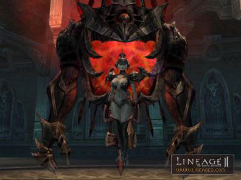

# Monsters and Hunting Ground

## 1. Re-arrangement of the Entire Hunting Ground

To increase the efficiency of hunting as a small party or when alone, the wide distribution of monsters in the entire hunting field was changed to a more concentrated arrangement and monster appearance time was adjusted. Due to this change, the total number of monsters was reduced. In the dungeon hunting ground, monster arrangement and appearance time was adjusted to make hunting more efficient and interesting. The HP ratio of dungeon-type monsters (those with higher HP than general monsters) was adjusted overall.

## 2. Deployment and Adjustment of the Monsters

1. The existing monsters of Blazing Swamp in Aden Territory were deleted, and level 70~75 monsters were added.
2. Monsters of the Fairy Valley were changed to dungeon-type monsters.
3. The total number of monsters of the Elven Ruins in Talking Island were reduced, and dungeon-type monsters were replaced by general monsters.
4. Salamander and Undine of the Elven Ruins on Talking Island were placed elsewhere in the dungeon.
5. Dark Horrors and Lesser Dark Horrors were removed from the School of Dark Arts in the Dark Elven region, but they still exist in neighboring marshlands.
6. The Ol Mahum Transcender was added to the Forest of Outlaws in Oren Territory.
7. Monsters that appeared only at night were removed from the Ruins of Sorrow, Ruins of Despair, Execution Ground and Dragon Valley.
8. The Timak Orc type monsters deployed in the field around the Crater of Ivory Tower were moved to Timak Outpost, and the level of these monsters was re-adjusted.
9. The location of Raid Boss Elf Renoa was moved from Partisan Hideaway to the southwest of Elven village.
10. Monsters around Lake Iris, south of Elven Village, and in the field, east of the Altar of Rites in the Dark Elves region, were removed, except for the Quest monsters.
11. Treant Bremec was moved near Elven Village.
12. Raid Boss Verfa was moved to the east mountain range.
13. Raid Boss King Tarlk was moved from southwest of the Bandit Stronghold to northwest of the Ivory Tower.
14. The Ghost of Peasant Leader was moved from around the south entrance of the Execution Ground to north of Giran Port.
15. Barion was moved from the Bee Hive (name changed from "Hatu Bee Hive") across the river.
16. Vuku Grand Seer Gharmash was moved from the west to the east of Gludio Castle.
17. Bearded Keltirs, which new players hunt for the Tutorial Quest, have been replaced with Gremlins.
18. The levels of many event monsters were re-adjusted, and their locations were changed.
19. The recognition range of Orfen was greatly reduced.

## 3. Anakim and Lilith

Anakim, the Sacred Flame and Lilth, the Holy Mother of Abyss were added. To meet Anakim, you must join the Cabal of Dawn, win the event and possess the Seal of Greed. Then you may reach Anakim only through a specific NPC in the Disciples Necropolis. To meet Lilth, you must join the Cabal of Twilight and proceed in the same manner.

- Anakim, the Sacred Flame

- Lilith, Holy Mother of Abyss

## 4. New Raid Monsters

| Monster | Place |
|:--|:--|
| Soul Collector Acheron (level 42) | West of the Execution Ground |
| Roaring Lord Kastor (level 62) | Southwest of the Bandit Stronghold |
| Wing of Wind Naga (level 75) | South of the Border Outpost |
| Timak Seer Ragoth (level 57) | East of the Spore Sea |
| Revenant of Traitor Andras (level 78) | South of the Devastated Castle |
| Ancient Weird Drake (level 65) | South of the Hunter's Village |
| Vanor Chief Kandra (level 72) | West of the Aden Castle Village |
| Nightmare Drake (level 67) | Northeast of the Narsell Lake |
| Harit Hero Tamash (level 64) | West of the Anghel Waterfall |
| Last Titan Olcs (level 75) | Inside of the Giants Cave |
| Last Lesser Giant Glaki (level 78) | Inside of the Giants Cave |
| Doom Blade Tanatos (level 73) | North of the Ancient Battleground |
| Tree of Blood Virmilion (level 75) | Southeast of the Tower of Insolence |
| Palibati Queen Themis (level 70) | Seal of Shilen |
| Gargoyle Lord Tiphon (level 65) | Southwest of the Silent Valley |
| Taik High Prefect Arak (level 60) | The Cemetary |
| Zaken's Butcher Krantz (level 55) | The island above the Pirates Tunnel |
| Totem of Iron Giant (level 50) | Northwest of the Ivory Tower |
| Malruk's Witch Sekina (level 67) | North of the Dragon Valley |
| Bloody Empress Decarbia (level 75) | North of the Seal of Shilen |
| Beast Lord Behemoth (level 70) | West of the Narsell Lake |
| Partisan Leader Talakin (level 45) | Partisan Hideaway |
| Carnamakos (level 56) | Second Story of Cruma Tower |
| Death Lord Ipos (level 75) | Blazing Swamp |
| Lilith's Witch Marilion (level 50) | Catacomb of the Branded |
| Pagan Watcher Cerberon (level 55) | Catacomb of the Apostate |
| Anakim's Nemesis Zakaron (level 70) | Catacomb of the Witch |
| Death Lord Shax (level 75) | Disciples Necropolis |

## 5. Various NPC AI

- If monsters are attacked by multiple players, and among them are characters of much lower level, these monsters will attack the lower level characters with a certain success rate.
- The haste for certain classes could be set higher for each monster.
- Monsters that have the healing skill will use it when they determine that the monsters in their party are in danger.
- Certain monsters can be transformed into other monsters in Combat.
- Certain monsters tend to like one-on-one fighting against a player. If there are any characters within a two level difference, these monsters begin to attack them and call out their names. During a one-on-one fight with a monster, if other characters attack, that monster will request help from other monsters.
- Sometimes, certain monsters use special skills.
- During combat, a group of monsters sometimes target a specific character and use a concentrated attack.
- Monsters who appear to be alone will sometimes summon their subordinates, once combat begins.
- If a player is in danger during a fight against a monster, a hero monster appears to help the player.
- Some monsters hide their real shape, and once the combat starts, they reveal their true form and fighting style.
- Whenever monsters see other monsters in the same tribe and party dying, their attacking power increases by a certain numeric value.
- If a character turns his back, monsters who use a dagger to make a surprise attack gain a certain success rate.

**6.** The names of the hunting grounds are broken down. Also, the name of the hunting ground called Hatu Bee Hive was changed to Bee Hive, and Tanor Silenos Barrack was changed to Tanor Canyon.

**7.** The list of items dropped by monsters was changed, and the maximum number of items that can be acquired through Spoil was increased to three. The success rate for getting finished goods through Spoil was added for high-level monsters.

**8.** For A-grade items, accessories, finished armor products and required material items can be acquired from general monsters. Finished weapon products can be acquired only through Raid Boss monsters. The required weapon material items can be acquired through Quest and Raid Boss monsters. There are only 60% and 70% recipes, all of which can be acquired through Quest monsters. A-grade crystals are no longer dropped.
