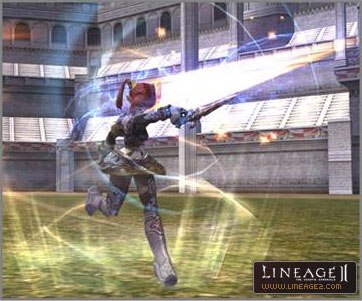

# Subclasses

**1.** When you finish the Mimir's Elixir quest, you can go to each occupation grand master and select a subclass.

**2.** If you increase one subclass to level 75, you can select up to three additional subclasses.

**3.** If you select a subclass, level and first ability value, the skills are changed to the character with a level 40 in the subclass.

**4.** You can switch between your main class and your subclasses through the appropriate Master of each class in the village.

**5.** There is no time limit or number of times that you can switch classes.

**6.** When switching classes, the buff state and symbol information is not maintained.

**7.** Property of character, PvP/PK counter, information related to the clan/siege, recommended numeric value and number of votes, friends list, party information, numeric value related to the Seven Signs, and quest information are retained as in the previous class. Warehouse and inventory are also shared. Therefore, please note that, when switching classes, in some cases, you are not able to move due to weight restrictions.

**8.** If the race of the main class is Elf or Dark Elf, you may not select either class as a subclass to the other class. You may not select either the Overlord or Warsmith class as a subclass.

- You can choose a subclass by finishing the Spring Water of Mimir quest.

**9.** You may not select a similar class as the subclass. The occupations classified as similar classes are as follows:
- Treasure Hunter, Plainswalker and Abyss Walker
- Hawkeye, Silver Ranger and Phantom Ranger
- Paladin, Dark Avenger, Temple Knight and Shillien Knight
- Warlocks, Elemental Summoner and Phantom Summoner
- Elder and Shillien Elder
- Swordsinger and Bladedancer
- Sorcerer, Spellsinger and Spellhowler

**10.** The subclass is connected to the Hero System that will be implemented later. You can switch the main class to Hero, only when one or more subclasses reaches level 75. Whatever subclass you select, the kinds of subclasses do not affect the Hero System, and the subclasses are not switched to Heroes.
