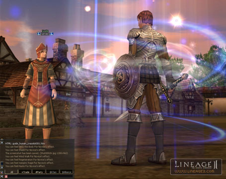
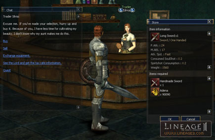

# New Player Bonuses

To make it easier for newly starting customers of Lineage II to enjoy the game, special bonuses are offered to distinguish them from already playing customers of Lineage II.

## 1. New Character Definition

If an account has no characters at level 25 or above on a particular server, the new character bonuses are activated and applied to only one character at the highest level among the characters at level 25 or below on that account. If there are no characters on that server, the new character bonuses will be applied to the first character that becomes level 5 or above and, if this character becomes level 25 or above, the bonuses are rescinded.

## 2. New Character Exceptions

- If the very first character past level 6 is deleted, the remaining characters will not receive any new character bonuses.
- Even if the very first character past level 6 levels down, and another character is made level 6, the bonuses are only given to the original, first level 6+ character.
- Information for characters on other servers is not taken into account. Only the server which is being played on currently will be taken into account. That is, even if there are characters above level 6 on other servers, the new character bonuses will not be given out.
- Once level 25 is achieved, the bonuses are no longer given. After that, if the character levels down, the bonuses will still not be given.
- New characters are defined using the character information at the time of the Chronicle 3 update. If there are two characters of the same level, 25 or lower, then one character is selected randomly.
- If there are any classes that have done the 2nd class transfer, then no matter what the level is, the new character status will not be given.

## 3. New Character Bonus

**1) Additional Quest Rewards**
New characters receive additional quest rewards that are not given to the other characters. Fighters receive 13,000 no-grade Soulshots, and Mystics receive 6,000 no-grade Spiritshots. They receive Soulshots and Spiritshots twice: when they begin the game for the first time and when they perform the sword quest early on at level 10.

**2) Buff Magic from Newbie Guides**
New characters may receive various kinds of support magic free of charge through the Newbie Guide NPC located in each village. These buffs last for 60 minutes and are based on the following character levels:
- Levels 10-24 - Wind Walk
- Levels 11-23 - Shield
- Levels 12-22 - Bless the Body (Fighter), Bless the Soul (Mystic)
- Levels 13-21 - Vampiric Rage (Fighter), Acumen (Mystic)
- Levels 14-20 - Regeneration (Fighter), Concentration (Mystic)
- Levels 15-19 - Haste (Fighter), Empower (Mystic)
- Levels 16-19 - Life Cubic

- Guide NPC

**3) Equipment Exchange**
New characters can purchase higher-level items by paying the difference in the price between the equipment they have now and the higher-level equipment they want to buy.

In the starting villages, Gludin, and Gludio Castle Town, all No Grade weapons, armor, and jewelry can be traded at the weapons, armor, and accessory traders.

- Exchange of Equipment
