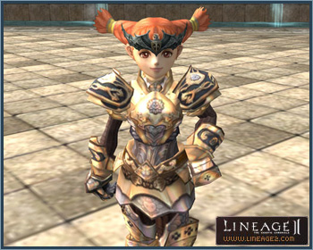

# Noblesse

## Overview

A player who has reached level 75 in their subclass and completes the Path to a Noblesse quests is able to become a Noblesse. Noblesse are granted special abilities that are primarily used in sieges and raids, giving the Noblesse a leading role in combat. Once a character earns the title of Noblesse, both main class and subclasses are given the title. Special skills conferred by the title can also be used in both classes.

## Noblesse Abilities

1) **Exclusive Teleports** - The Noblesse have access to exclusive teleports from the village gatekeepers, which transport them to various locations that are ordinarily unavailable, including dungeon interiors.

2) **Conferring Titles** - Noblesse can give themselves a title without joining a clan. Noblesse can designate or modify their own titles with the Title and Delete Title buttons in the Clan window.

3) **Monument of Heroes** - Upon earning the title of Noblesse, the player's performance in raids and sieges will be recorded. When the character becomes a Hero, their battle records are archived in each village's Monument of Heroes.

4) **PvP Ability** – The player's attack ability in Player vs. Player combat increases once they become a Noblesse.

5) **Battle Progress Report** - This function is available only to Noblesse clan leaders who are registered for a castle siege. It indicates the location of the clan members and the number of their kills and/or deaths. This function is only available to clan members who are logged in during the game. Use the `/clanwarstatus` command to determine whether the clan member is within the siege zone. It is refreshed every 30 seconds. Kill and death numbers are saved even while a server may be down and are reset upon completion of the siege.

6) **Noblesse Tiara** - Noblesse are awarded accessories by the Noblesse quest NPCs, which distinguish them from other players. Hair accessories can only be deleted from the inventory and cannot be traded, dropped, or sold in stores.

## Noblesse Skills

1) **Blessing of Noblesse** - A buff that can be cast on oneself or other players in a raid against boss-class monsters, this skill retains the buffs on a character who has been killed by the raid boss and resurrected. When the character has died, all other buffs cast are rendered ineffective and they take effect only after the character has been resurrected. Upon resurrection, the Lucky Charm and Blessing of Noblesse will be rendered ineffective. Consumes 5 spirit ore.

2) **Strider Siege Assault** - A Noblesse mounted on a strider can perform this strong attack against the castle wall or castle gate during a siege. Consumes 5 Spirit Ore.

3) **Build Advanced Headquarters** - A Noblesse who is a clan leader is able to summon a headquarters with twice the HP of an ordinary siege headquarters. This skill can be mastered regardless of the Build Headquarters skill. 300 C-grade Gemstones are consumed when cast.

4) **Wyvern Aegis** – A Noblesse castle lord can temporarily maximize magic defense abilities while riding a wyvern. Consumes 20 Spirit Ore.

5) **Summon CP Potion** - Summons 20 vials of high-grade CP potions. Consumes 80 Soul Ore.

6) **Fortune of Noblesse** - Confers the ability of the Lucky Charm to all party members regardless of level. Consumes 4 Lucky Charm: A Grade.

7) **Harmony of Noblesse** - This Noblesse skill combines the energy of 4 individual Wizards (Sorcerer, Spellsinger, and Spellhowler). The energy of each individual must be received consecutively in intervals of 5 seconds or less regardless of type or order, and the skill must be used within 5 seconds of receiving the energy of the 4th individual. It is a non-elemental magic attack with twice the potency of Elemental Assault.

8) **Symphony of Noblesse** - This Noblesse skill combines the energy of 8 individual Wizards (Sorcerer, Spellsinger, and Spellhowler). The energy of each individual must be received consecutively in intervals of 5 seconds or less regardless of type or order, and the skill must be used within 5 seconds of receiving the energy of the 8th individual. It is a non-elemental magic attack with four times the potency of Elemental Assault.
