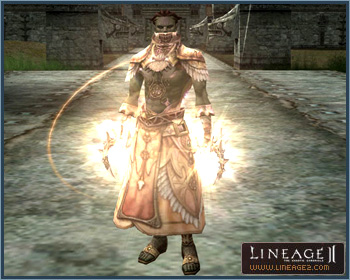
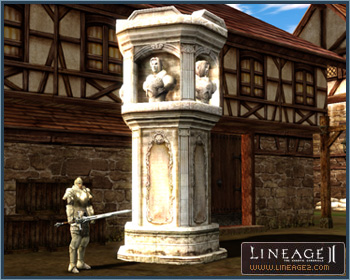
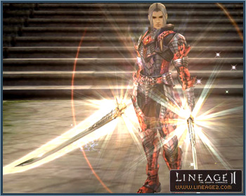

# Heroes and Olympiad

A player who has recorded the highest score in each class in the Grand Olympiad, a Player vs. Player tournament played among the Noblesse, is conferred the title of Hero. Heroes are awarded exclusive weapons and abilities along with a distinct aura.

## Hero Abilities

1) **Exclusive Weaponry** - Heroes are able to use weapons provided for their exclusive use. Once selected, weapons cannot be replaced. However, after one month, all weapons are automatically returned and Hero players will be able to select another weapon. The weapons are available from the Monument of Heroes and cannot be dropped, traded, enchanted, and/or destroyed. S-grade spiritshots, soulshots, and arrows are consumed.

2) **Aura** - A glowing aura surrounds the Hero's body.

3) **Hero Voice** - Heroes are able to chat in a special channel (%). This chat font color is sky blue and is displayed to all players on the server. Heroes are only able to speak in the global channel once every 10 seconds. It is possible to turn Hero Voice on and off in the chat message options.

4) **Monument of Heroes** - The names of Heroes are listed in the commemorative Monument of Heroes in each village.

## Gaining Hero Abilities

The Noblesse symbol will appear in Status window when the character is a Noblesse; the Hero symbol displays when the player is a Hero or on stand-by Hero status. The Hero gains Hero abilities when by visiting the Monument of Heroes, not just when the Noblesse has been ranked 1st in the Olympiad.

If an individual who was conferred the title of Hero in a previous phase is awarded the title again, he must first be on stand-by and activate the Hero abilities by visiting the Monument of Heroes again.

## Determining the Hero

Following a month-long PvP competition, the Hero is selected according to Olympiad points, and the Hero retains the title throughout the duration of the next month's competition. The Hero is determined on the first day of every month.

The Hero will be the individual who has accumulated the most Olympiad points according to their main class, has competed more than 5 times in that period, and claimed at least 1 victory. The Hero will be placed in stand-by mode and exclusive abilities and weaponry are removed after the one month period.

For example, even if a player has accumulated the most Olympiad points in the current period, if he has competed less than 5 times or has never claimed a victory, he is ineligible to become a Hero; it is possible that periods may pass without a Hero being designated.

When two players with the same class have accumulated identical Olympiad points, the one who has competed most will be designated Hero.

## Rank Confirmation

All Noblesse have access to the top 10 ranking of the last period's Olympiad results. Those who have competed on less than four occasions will be excluded from the ranking. In the list, the Olympiad point value, which determines the final standing, will not be revealed. Only the character names are listed on the ranking. In cases where players have accumulated identical points, up to 15 individuals with equal points can be displayed.

## Grand Olympiad

The Grand Olympiad is a one-on-one PvP competition held to determine the Hero. It is held in one month periods, and at the end of each period, the Noblesse with the most Olympiad points in each class is appointed Hero. Only Noblesse who have completed the third class transfer can participate in the Olympiad competition.

### Competition Method

1) The Olympiad is classified into two competitions: the class competition and the non-class competition. Only members of a certain class can partake in class competitions. There are no class restrictions for participating in non-class competitions.

2) Participating in a competition is possible only through the Olympiad Master, and the hours of competition are 8:00 PM CST to 12:00 AM CST (8:00 PM GMT+1 to 12:00 AM GMT+1 on the Teon server). No competition requests are taken outside of competition hours.

3) Competitors will be matched randomly and summoned to the coliseum for competition.

4) Instructions will be regularly provided through system messages, starting 30 seconds before being summoned to the coliseum.

5) The summoned competitors are allotted 45 seconds of preparation time. The coliseum will then transform into a battlefield and the competition will begin.

6) The maximum competition time is 3 minutes, and the player whose HP drops to 0 first will lose. If no victor has emerged at the 3 minute mark, the character who has inflicted the most damage will be determined the winner.

7) Upon completion of the competition, the Olympiad point changes will be announced in a system message and the competitors will be returned to the village.

8) During the competition, a character whose HP has reached 0 will merely lose the competition, but not die.

9) Once transported to the coliseum, if a character abnormally leaves the game, he will lose the competition. If the server goes down while a competition is in progress, the competition will be nullified and the competitors will restart at the villages.

10) Before the competition begins, HP, MP, and CP are all recovered and the pre-existing buffs and debuffs will be removed. Any summoned pets will be returned, but the servitors/cubics will accompany the player to the coliseum. The servitor's buffs will also dissolve before the start of the competition.

### Olympiad Requirements

1) Only players in their main classes are able to compete. If the player changes from the main class to a subclass after applying for the competition, he/she will be ineligible to compete.

2) If the character belongs to a party when summoned to the Coliseum to compete, he/she will automatically withdraw from the party.

3) Characters with 0 Olympiad points are ineligible to compete.

4) In the Olympiad competitions, no items other than soulshots, spiritshots, Echo Crystals, energy stones, and firecrackers are allowed.

5) Recall and Party Recall abilities cannot be used in competition.

### Olympiad Points

1) At the beginning of each Olympiad period, 18 points are equally awarded to all Noblesse, and 3 points each week thereafter.

2) The loser's Olympiad points are transferred to the winner upon completion of the competition.

3) Competitors are able to check their current point status with the Grand Olympiad Manager.

4) At the end of competition, if a character has accumulated more than 50 Olympiad points, they can be exchanged for Noblesse Gate Passes. The rate of exchange is 1,000 Noblesse Gate Passes for 1 Olympiad point.

For example, while 50 Olympiad points is exchangeable for 50,000 Noblesse Gate Passes, and 49 Olympiad points are not worth any Noblesse Gate Passes.

5) Noblesse Gate Passes may be used for purchasing items from the Grand Olympiad Manager or while teleporting to various locations via the Gatekeeper.

The following items can be purchased from the Olympiad master with Noblesse Gate Passes:

**Blessed Scrolls:**

- Blessed Scroll: Enchant Weapon (Grade S): 300,000 Noblesse Gate Passes
- Blessed Scroll: Enchant Weapon (Grade A): 150,000 Noblesse Gate Passes
- Blessed Scroll: Enchant Weapon (Grade B): 70,000 Noblesse Gate Passes
- Blessed Scroll: Enchant Weapon (Grade C): 30,000 Noblesse Gate Passes
- Blessed Scroll: Enchant Weapon (Grade D): 9,000 Noblesse Gate Passes
- Blessed Scroll: Enchant Armor (Grade S): 45,000 Noblesse Gate Passes
- Blessed Scroll: Enchant Armor (Grade A): 18,000 Noblesse Gate Passes
- Blessed Scroll: Enchant Armor (Grade B): 3,500 Noblesse Gate Passes
- Blessed Scroll: Enchant Armor (Grade C): 3,500 Noblesse Gate Passes
- Blessed Scroll: Enchant Armor (Grade D): 1,000 Noblesse Gate Passes

**Scrolls:**

- Scroll: Enchant Weapon (Grade S): 50,000 Noblesse Gate Passes
- Scroll: Enchant Weapon (Grade A): 18,000 Noblesse Gate Passes
- Scroll: Enchant Weapon (Grade B): 5,000 Noblesse Gate Passes
- Scroll: Enchant Weapon (Grade C): 1,100 Noblesse Gate Passes
- Scroll: Enchant Weapon (Grade D): 500 Noblesse Gate Passes
- Scroll: Enchant Armor (Grade S): 5,000 Noblesse Gate Passes
- Scroll: Enchant Armor (Grade A): 2,400 Noblesse Gate Passes
- Scroll: Enchant Armor (Grade B): 800 Noblesse Gate Passes
- Scroll: Enchant Armor (Grade C): 150 Noblesse Gate Passes
- Scroll: Enchant Armor (Grade D): 60 Noblesse Gate Passes

**Other:**

- Secret Book of Giant: 5,000 Noblesse Gate Passes

## Watching the Grand Olympiad

1) The Olympiad competitions can be watched with the Grand Olympiad Manager stationed in every village.

2) Players are able to see the venue where the current competition is under way, and the name of the participants.

3) In the competition spectator mode, the player can view the competitors' names, HP, CP, and buff status.

4) While watching the competition, the competition window of each competitor can be maximized to show the skills being used and critical hits.

5) In the competition spectator mode, players are able to watch competitions under way in other coliseums without leaving the current coliseum.

6) The Return button exits spectator mode. If the spectator mode is interrupted by a server reset or other abnormal conditions, you will begin at the village where you entered the spectator mode.

7) If a player starts watching a competition after calling a pet, the summon will be dismissed.

8) There is no charge for watching Olympiad competitions.
