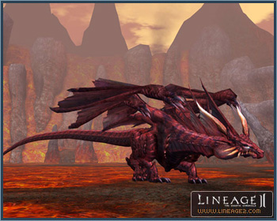
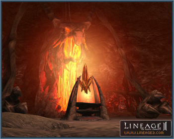

# Valakas the Fire Dragon

Valakas is the second dragon to make an appearance in Lineage II and one of the first ancient dragon children of Shilen. Valakas inhabits a volcanic terrain in Goddard known as the Forge of the Gods. Fearing Gran Kain, who watches over humans, he unleashes the wrath of fire at human trespassers who venture into his territory.

Players must traverse the Hall of Flames at the top of the Forge of the Gods to arrive at the Lair of Valakas.

In order to enter the Hall of Flames, players must first complete the quest of Watcher of Valakas Klein, in the Forge of the Gods, to obtain Floating Stones.

## Hall of Flames

Replicas of the four guardians of hell, made of lava, stand watch over the Hall of Flames to eliminate those who interrupt the sleep of the fire dragon or infiltrators who intend to do him harm.

Players can obtain special items to aid in the confrontation with Valakas such as talismans from the gatekeepers and the four head guardians of hell.

Inside the Hall of Flames, Gatekeepers of Fire Dragon open and close doors for players. Each gatekeeper is assigned to a different door; he enlists help of his colleagues to open the doors at the same time.

The Heart of the Volcano, used to teleport to the Lair of Valakas, is located deep in the corridor. A maximum of 200 players can enter the lair at once. No additional players are allowed entry.

## Lair of Valakas

Those who set foot in the lair cannot emerge intact unless they defeat Valakas or escape. You will move to a mountain summit after traversing through the cave connected to the lair. If players choose to jump off the mountain onto the battlefield, they will incur falling damage, but damage will be minor if they choose where to land carefully.

The site serving as the battleground is divided into a hill and battlefield. Serious damage can be incurred by exposure to flowing lava.

## Other Details

If the server or the NPC server goes down, Valakas's HP will revert to the amount prior to the server going down.

When restarting at the Lair of Valakas or the Hall of Flames after a server returns to service, if a player fails to log in within 30 minutes, the character will be transported to the nearest town upon reconnection.

If there is no server down and a player disconnects or restarts while in battle with Valakas, the character will be transported to the nearest town upon reconnection even if they log in within 30 minutes.
