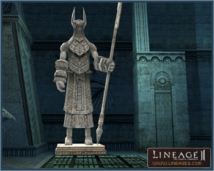
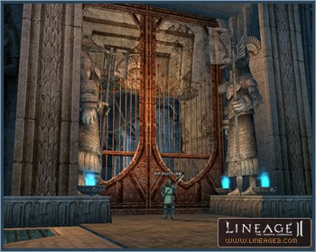

# Dimensional Rift

The Dimensional Rift is a labyrinth created as a result of the Seven Signs. Devils in other worlds are attempting to find their way into the real world through this gap. Time and space is distorted here, forcing players to travel to different destinations in the labyrinth.

## Entry Prerequisite

To be transported to the Dimensional Rift, you must be assigned the "In Search of Dimensional Fragments" quest by the Dimensional Rift Doorman stationed at the Seven Signs dungeon entrance, hunt down monsters in the dungeon, and talk to the Dimensional Rift Doorman.

You will be able to gain free entry into the Dimensional Rift if you acquire a set number of points at the Festival of Darkness. The time limit is one hour, and after the hour elapses free entry is no longer offered.

## Hunting Rules

There are 6 Dimensional Rift zones for each level, and each zone comprises 9 chambers. The Dimensional Rift comprises numerous rooms, and if you hunt in one chamber for 8-10 minutes, you will automatically be teleported to a different chamber. If such teleports are repeated four times in the Dimensional Rift, hunting will conclude and the party will be transported to the waiting room.

When entering the Dimensional Rift, party members located beyond a set distance from the party will not be allowed entry.

When the party changes (such as leaving or banning from party) in the Dimensional Rift, the party will be transported to the waiting room. However, the party leader may be replaced. When the party leader is replaced, rights and privileges are automatically transferred.

After entering the Dimensional Rift, if the party is disbanded due to restarting, logging out, or a downed server, the party will be transported to the waiting room. If all members of a party are killed in a hunt, the party will be automatically teleported to the waiting room after 8 minutes.

The number of dimensional fragments required for individual entry into each zone of the Dimensional Rift is listed below.

| Distinction | Dimensional Fragments |
|---|---|
| Level 30 | 18 |
| Level 40 | 21 |
| Level 50 | 24 |
| Level 60 | 27 |
| Level 70 | 30 |
| Unrestricted | 33 |
