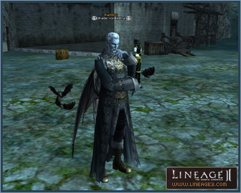

# Monsters

## New Raid Bosses Added

Most event monsters have been changed to raid boss monsters. Due to the addition of difficulty levels of raid monsters, there are varieties of raid monsters, ranging from relatively easy to difficult with high rewards.

| Name | Level | Location |
|---|---|---|
| Madness Beast | 20 | Entrance of Ascetics Necropolis |
| Discarded Guardian | 20 | Elven Ruins |
| Zombie Lord Farakelsus | 20 | Elven Fortress |
| Malex Herald of Dagoniel | 21 | Elven Fortress |
| Sukar Wererat Chief | 21 | Looting Area of Evil Spirits (NE of Gludio) |
| Kaysha Herald of Icarus | 21 | School of Dark Arts |
| Tracker Leader Sharuk | 23 | Vicinity of Forgotten Temple |
| Kuroboros' Priest | 23 | Southern area of Gludin |
| Mammon Collector Talos | 25 | Northeastern area of Dwarf Village Hunting Grounds |
| Soul Scavenger | 25 | Ruins of Agony |
| Betrayer of Urutu Freki | 25 | Eastern area of Orc Village Hunting Grounds |
| Patriarch Kuroboros | 26 | Western area of Forgotten Temple |
| Tiger Hornet | 26 | Central area of Beehive |
| Giant Wasteland Basilisk | 30 | Northeastern area of Wasteland |
| Skyla | 32 | Northeastern area of Dragon Valley |
| Captain of Queen's Royal Guards | 32 | Northeastern area of Cruma Marshlands |
| Nurka's Messenger | 33 | Southern area of Partisan Hideaway |
| Corsair Captain Kylon | 33 | Pirate Tunnel |
| Ghost of Sir Calibus | 34 | Central area of Tanor Canyon |
| Gargoyle Lord Sirocco | 35 | Central area of Wasteland |
| Nakondas | 35 | Eastern area of Martyr's Necropolis |
| Red Eye Captain Trakia | 35 | Central area of Partisan Hideaway |
| Eye of Beleth | 35 | Southern area of Monster Derby Track |
| Evil Spirit Tempest | 36 | Central area of Execution Ground |
| Premo Prime | 38 | Northeastern area of Field of Whispers |
| Gwindorr | 40 | Southern area of Field of Whispers |
| Road Scavenger Leader | 40 | Southern area of Death's Pass |
| Water Spirit Lian | 40 | Central area of Field of Silence |
| Thief Kelbar | 44 | Southeastern area of Catacomb of the Forbidden Path |
| Dread Avenger Kraven | 44 | Northeast of Sea of Spores |
| Evil Spirit Cyrion | 45 | Northeastern area of Catacomb of the Forbidden Path |
| Archon Suscepter | 45 | Cruma Tower 2nd Floor |
| Timak Orc Gosmos | 45 | Central area of Timak Outpost |
| Fafurion's Henchman Istary | 45 | Eastern area of Alligator Island |
| Necrosentinel Royal Guard | 47 | Central area of Dragon Valley |
| Orfen's Handmaiden | 48 | Western area of Sea of Spores |
| Mirror of Oblivion | 49 | Southwestern area of Forest of Mirrors |
| Zaken's Mate Tillion | 50 | Devil's Isle |
| Deadman Ereve | 51 | Southern area of Narsell Lake |
| Grave Robber Kim | 52 | Northern area of Forsaken Plains |
| Bandit Leader Barda | 55 | Southern area of Border Outpost |
| Ghost Knight Kabed | 55 | Southern area of Forbidden Gateway |
| Fairy Queen Timiniel | 56 | Central area of Enchanted Valley |
| Harit Guardian Garangky | 56 | Northern area of Anghel Waterfall |
| Lord Ishka | 60 | Eastern area of Dragon Valley |
| Gorgolos | 64 | Giant's Cave |
| Priest of Shilen, Hisilrome | 65 | Northwestern area of Forsaken Plains |
| Enmity Ghost Ramdal | 65 | Tower of Insolence |
| Last Titan Utenus | 66 | Giant's Cave |
| Demon's Agent Falston | 66 | Southeastern area of Valley of Saints |
| Flame of Shine Barakiel | 70 | Eastern area of Valley of Saints |
| Minas Anor | 70 | Western area of Fields of Massacre |
| Eilhalder Von Hellman | 71 | Cursed Village |
| Immortal Savior Mardil | 71 | Tower of Insolence |
| Icicle Emperor Bumbalump | 74 | Eastern area of Hot Springs |
| Guardian Deity of Hot Springs Hestia | 78 | Western area of Hot Springs |
| Daimon the White-Eyed | 78 | Central area of Wall of Argos |
| Cherub Galaxia | 78 | Tower of Insolence |
| Varka's Hero Shadith | 80 | Southern area of Varka Silenos Outpost |
| Ketra's Hero Hekaton | 80 | Central area of Ketra Orc Outpost |
| Soul of Water Ashutar | 81 | Varka Silenos Barracks |
| Soul of Fire Nastron | 81 | Ketra Orc Outpost |
| Varka's Commander Mos | 82 | Southern area of Varka Silenos Outpost |
| Ketra's Commander Tayr | 82 | Southern area of Ketra Orc Outpost |
| Ember | 85 | Southwestern area of Flame Path |
| Varka's Chief Horus | 87 | Southwestern area of Varka Silenos Outpost |
| Ketra's Chief Brakki | 87 | Central area of Ketra Orc Outpost |

## NPC/AI Addition and Changes

**1) Orfen** - The number of Orfen's minion monsters in Orfen's Nest has decreased. The attack power of Orfen's minion monsters has been slightly lowered, while Orfen's attack power has been increased.

**2) Core** - The attack power of Death Wraith has been slightly lowered. Core's minion monsters cannot move downstairs any longer.

**3)** New monsters have been placed in the Goddard and Rune territories.

**4)** The battle/behavior actions of monsters have been more diversified:

- Monsters that use soulshots and spritshots have been added.
- Monsters whose bodies get bigger after using buff skills have been added.
- Ninja-type monsters that summon mimics and teleport to ally monsters under attack have been added.
- Couple-type monsters have been added.
- Monsters that change weapons to attack have been added.
- Monsters that can summon minions when dying have been added.
- Monsters that run away when ally monsters are killed have been added.
- Monsters that interrupt taming in farms have been added.
- Monsters that call to other monsters nearby have been added.
- Self-destructing monsters have been added.
- Monsters that patrol their area have been added.
- Monsters that run away when attacked have been added.
- Monsters that specialize in healing have been added.
- Monsters that can use debuffs when attacked and cancel those debuffs right before death have been added.
- Monsters that use strong skills out of rage when ally monsters are killed have been added.
- Monsters that spawn minions when finding a player have been added.
- Corpse monsters have been added.
- Monsters that teleport to attack when finding a player have been added.
- Monsters that resurrect dead NPCs have been added.
- Monsters that can resurrect dead minions have been added.
- Monsters that only appear during daytime or night have been added.
- Monsters that look around to find a player with specific quests and give items have been added.
- Monsters that control traps have been added.
- Monsters that teleport to random locations in dungeons to interrupt a player's hunting have been added.
- Monsters that afflict diseases have been added.

## Treasure Chests

Treasure chests and mimics have been relocated across the territories.

Treasure chests have been placed in more hunting zones and will appear randomly in dungeons and fields. Even though you can always open a chest with 100% success, some chests will be empty or will have rewards.

Adena is given normally as a reward of treasure chests, but there is also a low probability of big rewards.

Mimics have been placed in selected dungeons and hunting zones and will appear in fields randomly. These monsters have the same shape as Treasure Chests and will attack players.

Treasure Chest Keys, necessary to open treasure chests, have been added. New keys are set with Grade 1 through Grade 8. Pre-existing keys cannot be attained from monsters any more but can be used for Treasure Chests. Unlock can also be used to open a treasure chest.

## Changes to Existing Hunting Areas

Polymorph-type monsters have been added in Devil's Isle. Monsters in Devil's Isle have been relocated in general and a large number of monsters will spawn at the same time in certain areas.

Field of Silence is designed to promote battles that take a short amount of time with rare resting. In this hunting area every monster is a clone type with low constitution.

## Other Changes

If the Queen Ant's minion Guard Ant leaves its guarded area, it has been changed to teleport to the location where it spawned.

The below under level 20 monsters will no longer spawn:

- Pirate Captain Uthanka, Uthanka Pirate
- Vrykolakas, Vrykolakas Wolfkin
- Varikan Brigand Leader, Varik's Bandit
- White Fang, Gray Wolf
- Kobold Looter Bepook, Bepook's Pet

The player who wakes Bauim from his paralyzed state will now naturally receive damage and die after being summoned toward him.
