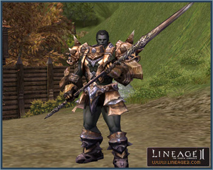
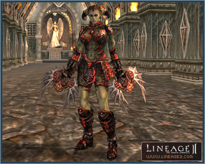
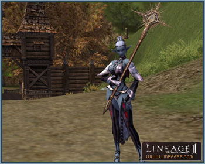
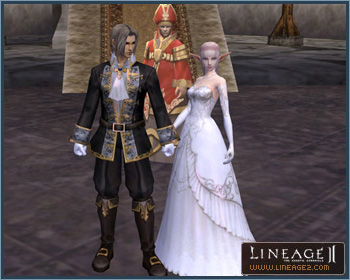
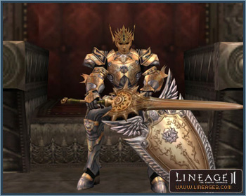

# Items

## Items Exclusive to Heroes

Upon being crowned Hero in the Olympiad, the Hero gains access for the duration of the term to exclusive items from the Monument of Heroes.

## S-Grade Items

S-grade weaponry, armor, and accessories have been added for players Level 76 and above. As with A-grade items, S-grade items are also sealed. They can be unsealed by the Blacksmith of Mammon. The prerequisite item for endowing S-grade weaponry with special abilities is a Level 13 Soul Crystal. They can be obtained by completing the Enhance Your Weapon quest.

S-grade armor set effects are listed below.

### Imperial Crusader Heavy Armor Set

| Item Name | Set Effect |
|---|---|
| Imperial Crusader Breastplate | P Def. +8%, Maximum HP +445, Sleep/Hold Probability -70%, DEX -2, STR +2. Probability of Poison/Bleed -80% with Imperial Crusader Shield equipped. |
| Imperial Crusader Gaiters | |
| Imperial Crusader Helmet | |
| Imperial Crusader Gauntlets | |
| Imperial Crusader Boots | |
| Imperial Crusader Shield | |

### Draconic Leather Light Armor Set

| Item Name | Set Effect |
|---|---|
| Draconic Leather Armor | Attack Speed/P. Atk +4%, Maximum MP +289, Weight Limit +5759, DEX +1, STR +1, CON -2. |
| Draconic Leather Helmet | |
| Draconic Leather Gloves | |
| Draconic Leather Boots | |

### Major Arcana Robe Set

| Item Name | Set Effect |
|---|---|
| Major Arcana Robe | M. Atk +8%, Movement Speed +7, Casting Cancel Probability -50%, Weight Limit +5759, WIT +1, INT +1, MEN -2. |
| Major Arcana Circlet | |
| Major Arcana Gloves | |
| Major Arcana Boots | |

### S-Grade Weapon Special Abilities

Special abilities of S-grade weaponry are listed below. Level 13 Soul Crystals are required to add these enhancements. However, dual weapons above +4 automatically acquire special abilities when enchanted.

| Name | Special Abilities |
|---|---|
| Forgotten Blade (Sword / One Handed) | Haste, Health, Focus |
| Heaven's Divider (Sword / Two Handed) | Haste, Health, Focus |
| Basalt Battlehammer (Blunt / One Handed) | HP Drain, Health, HP Regeneration |
| Dragon Hunter Axe (Blunt / Two Handed) | HP Regeneration, Health, HP Drain |
| Arcana Mace (Blunt / One Handed) | Acumen, MP Regeneration, Mana Up |
| Imperial Staff (Blunt / Two Handed) | Empower, MP Regeneration, Magic Hold |
| Angel Slayer (Dagger / One Handed) | Crt. Damage, HP Drain, Haste |
| Saint Spear (Pole / Two Handed) | Health, Guidance, Haste |
| Demon Splinter (Fist / Two Handed) | Focus, Health, Crt. Stun |
| Draconic Bow (Bow / Two Handed) | Cheap Shot, Focus, Crt. Slow |
| Tallum Blade*Dark Legion's Edge (Dual Sword) | When enchanting above +4, maximum HP increases by 15%, maximum MP increases by 20%, and maximum CP increases by 30% |

## Lifting Seals on A-Grade Accessories

Seals placed on A-grade accessories can be unsealed. When the seal is lifted the item's ability will increase.

## Special Abilities Added to C and B Grades

Special abilities to C- and B-grade weaponry have been added.

### C Grade

- Stick of Faith: Mana Up, Magic Hold, Magic Shield
- Stick of Eternity: Empower, Rsk. Evasion
- Soulfire Dirk: Mana Up, Magic Hold, Magic Silence
- Nirvana Axe: Magic Power, Magic Poison, Magic Weakness
- Club of Nature: Acumen, Magic Mental Shield, Magic Hold
- Mace of the Underworld: Mana Up, Magic Silence, Conversion
- Inferno Staff: Acumen, Magic Silence, Magic Paralysis
- Poleaxe: Critical Stun, Long Blow, Wide Blow

### B Grade

- Sword of Valhalla: Acumen, Magic Weakness, Magic Regenerative
- Hell Knife: Magic Regeneration, Magic Mental Shield, Magic Weakness

## Item Additions and Changes

### 1) Scrolls of Escape to Town

Scrolls for returning to each town have been added. For example, if you use Scroll of Escape to Giran Castle Town, the character will be transported to Giran Castle Town regardless of current location. In order to obtain town return scrolls: a) produce them in clan halls or b) purchase them from each town's gatekeeper with Dimension Diamonds obtained from the second class transfer quests.

### 2) Blessed Scrolls of Enchant Weapon/Armor

Unlike the normal Scrolls of Enchant Weapon/Armor, the item will not disappear when the enchant fails. However, upon failure to enchant, the item will be reverted to +0. The probability of success for a Blessed Scroll of Enchant Weapon/Armor is identical to that of normal Blessed Scrolls of Enchant Weapon/Armor.

### 3) Wedding Formal Wear

Appearing as a tuxedo on male characters and wedding dress on female characters, Formal Wear is a quest reward (level 60+). Characters donning Formal Wear cannot use skills and magic. If they equip weapons or shields, the Formal Wear will automatically be unequipped.

### 4) Exclusive Accessories for Clans

**Crown of Lord:** A crown able to be worn solely by the clan leader of a clan possessing a castle has been added. The crown can be acquired from the castle's lord Chamberlain and can be obtained after the end of a siege. Only one Crown of Lord can be obtained, and they cannot be dropped on the ground or sold. Also, if castle ownership is surrendered, the castle lord will be stripped of the crown and it will be removed from the inventory.

**Exclusive Castle Circlet:** Circlets exclusively worn by members of a clan possessing a castle have been added. Alliance members do not have access to circlets. If castle ownership is surrendered or if the player withdraws from the clan, the circlets can no longer be worn.

**Shields:** Shields worn exclusively by members of a clan with possession of a castle or clan hall have been added. Shields can be acquired from the castle's lord Chamberlain or Clan Hall Manager, and the shield may display the clan insignia. The insignia can be registered as a 64*64 pixel 256 color bmp file by clicking on the Register Insignia button in the Clan window. If the clan has possession of a clan hall, item production must first be activated in order to purchase a clan shield. The shield will no longer be accessible upon surrendering ownership of the castle/clan hall or withdrawal from the clan.

### 5) Exclusive Circlets for Noblesse and Heroes

**Noblesse Tiara:** Awarded upon completion of the Noblesse quest; exclusively worn by Noblesse and Heroes.

**Wings of Destiny Circlet:** Awarded by the Monument of Heroes upon being crowned Hero; exclusively worn by Heroes.

### 6) Hair Accessories

Hair accessories that can be worn by all classes regardless of gender have been added. However, Hairpins can only be worn by female characters.

### 7) Boss Monster Accessories

Unique jewelry that is dropped exclusively by boss monsters has been added. Boss accessories possess special effects aside from magic defense ability. Boss monsters which drop exclusive accessories are the Ant Queen, Orfen, Core, Zaken, Baium, Antharas, and Valakas.

### 8) Recipes

Recipes have been changed to stackable items. Recipes for ordinary crafting have been added. Ordinary crafting recipes are consumed upon item creation. These crafting recipes can be obtained by fishing and some recipes are produced in clan halls.

### 9) Additional Miscellaneous Items

Echo Crystals for weddings and birthday celebrations have been added. Exclusive Soulshots, Spiritshots, and Blessed Spiritshots for pets have been added. They can be obtained from the Pet Manager stationed in every village.
