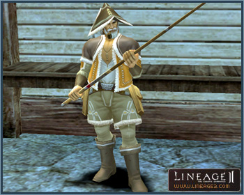
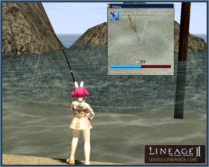

# Fishing

A different experience from combat and leveling up, fishing has been added to catch ingredients for item creation.

Fishing equipment and/or the Fishing skill can be acquired along with other newly added common skills from the Fisherman's Guild Members dispatched at the grocery store or port of each town.

You will need a Fishing Rod and lures to go fishing. These items can be bought from the store or earned through quests. Fishing rods and Fishing Shots exist by grade (no grade, D, C, B, A, S) and item damage will be applied according to grade. A penalty will be applied when using a fishing rod of a grade incompatible with your character level.

You must master the Fishing skill in order to begin fishing. You can acquire Fishing, Reeling, Pumping, and Fishing Mastery skills by speaking with the Fisherman's Guild Members stationed in each town or port.

Although not essential for fishing, Fishing Shots will assist you with your fishing. Fishing Shots, like spiritshots and soulshots, can be accessed by double-clicking on them in inventory or registering with shortcuts. The Fishing Shot grade must be compatible to that of the fishing rod, and they can also be earned through quests.

The Fishing Rod is equipped in the weapon slot and the bait in the left hand, like an arrow. Once you equip the rod and use the Fishing skill, you begin to fish.

Once fishing is under way, the Fishing Window will display and an enlarged image of the bobber will appear.

The fishing skills Pumping and Reeling determine fishing success. These skills can also be mastered by paying adena to the Fisherman's Guild Members. Use the Reeling skill while the fish struggles and resists, and the Pumping skill while the fish is exhausted.

When fishing is under way, the Fishing Window will display. When a fish begins to bite, the HP gauge of the fish and the time allotted to catch it will appear in the Fishing Window. Fishing is successful only if the HP of the fish drops to 0 before the time expires.

Upon successful fishing, fish or treasure chests will be added to the inventory, fishing will end and the Fishing Window will close. When an attempt at catching fish fails, fishing will end and the Fishing Window will close. Fishing will also end if the Fishing skill is re-used during fishing.

If you double-click on fish or treasure chests acquired while fishing, they will turn into other items. These items can be used in common crafting, and certain items can be exchanged for Proof of Catching a Fish with the Fisherman's Guild Member.

Fishing holes are home to fish abundant enough to enable fishing. Fish usually inhabit waters where the breathing gauge is displayed or regions with unique water quality such as the Goddard Hot Springs. Be wary, as monsters instead of fish may be caught with fishing!

Increasing Fishing Mastery enables catching of higher grade fish. However, higher grade fish are stronger and brighter than lower grade fish, so advanced Reeling and Pumping skills are required to catch them.

A Fishing Manual that provides fishing instructions can be purchased from the Fisherman's Guild Member. Beginner tips will be provided when fishing with beginner bait. Beginner bait can be bought from the Fisherman's Guild Member.

If Reeling/Pumping skills exceed Fishing Mastery by more than 2 levels, a penalty will be imposed.
