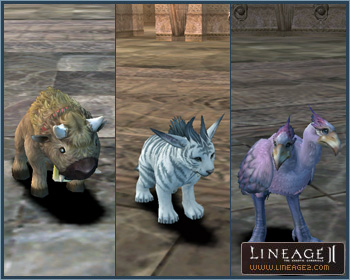

# Pets and Servitors

## New Pets

Three new types of domestic pets have been added. New pets can be acquired by completing pet-related quests or can be purchased from the pet manager with Pet Exchange Tickets produced in each clan hall.

The following new pets have been added:

- Baby Buffalo
- Baby Cougar
- Baby Kookaburra

Domestic pets eat Baby Spice pet food and possess lower combat ability than other pets.

## Hatchlings and Striders

Hatchling types have changed from standard (Wind), defense (Star), and domestic (Twilight) to fighter (Wind), mystic (Star), and movement (Twilight).

The active skills of Hatchlings and Striders are now catered to their individual characteristics.

## Pet and Servitor Changes

1) If the pet owner restarts when the pet is alive, it will immediately return to its control item. But if the pet owner restarts when the pet is dead, the pet will not instantly return to the control item. The dead pet will remain in corpse state for 20 minutes, and then disappear along with the control item. If the pet is dead and less than 20 minutes has elapsed when the pet owner exits the game, the pet will not return to the control item; and upon logging in again the pet will still be dead with no HP.

2) If the server goes down while the pet is dead, the pet will be unconditionally returned to the control item. If the pet is re-summoned it will appear with an HP of 0.

3) The occurrence of a servitor using poison skills acquiring additional experience points based on skill use has been corrected.

4) The discrepancy between the servitor/pet's combat state and the owner's combat state has been fixed. If either servitor/pet or the owner enters into combat, the other party will follow suit.

5) When the pet owner uses return or Gatekeeper, pet/servitor will automatically change to Follow Master after being teleported even if they were in Stay mode.

6) The Unsummon action has been added to cancel a summon at will.

7) The Move action has been added to pets and servitors, enabling them to approach the selected target.

8) When pets level up, the level up effects will be displayed as it does for characters.
