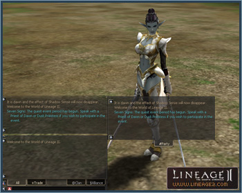
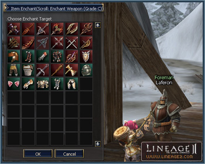

# Interface

In Chronicle 4, interface windows have been added to make gameplay easier for novice players and more convenient for veteran players.

## System Message Windows

A System Message Window has been added above the chat window. Turn off the System Message option in the Chat Options window to display system messages only in that window.

While system message window configuration is possible, the window size is not adjustable.

## Separate Chat Windows

Chat windows can now be separated into channels—All, Trade, Party, Clan, and Alliance. Drag the tab of each channel to separate windows. If you want to include them in the chat window again, place the dragged tab to its original location. However, the size of separated windows cannot be adjusted.

## Manor Interface

The manor interface window has been enlarged and the Search function has been expanded. The status of seeds and crops of other territories can be searched. Crops can be sold to other territories. However, a 5% fee is levied on sales. Information on all crops can be seen in a newly added basic information window.

## Party Window CP Gauge

A CP gauge bar showing each party member's CP gauge has been added.

## Mini-Map

Party members' locations are now shown on the mini-map. The map focus will change to that of the party member by clicking on individual party members. With the addition of the Goddard and Rune territories, the former maps of Aden and Elmore have been combined into one world map.

## Clan Penalty Window

A Penalty button has been added to the Clan window (Alt +N), which shows clan and alliance penalty information. The type and expiration date of penalty imposed on the clan and alliances are indicated.

## Trade Window

The trade window of NPCs that deal in non-adena items has been improved to enable the NPC to directly enter transactions for multiple quantities of item purchase and production.

## Region Names

An option to toggle the display of region names on or off has been added.

## Party Matching

The number of individuals able to enter a party matching room has been raised to 12. The party matching room icon (minimized) will now blink every time a new character enters the room or when a message has arrived. The party matching window will now pop up only for the party leader (party room creator) when opening a party room. If the party leader is replaced, the party matching window will now display only for the new party leader. The party leader's character name will now appear in the party room list.

## Recipe Books

The Recipe Book icon has been moved to the active Skill window. Recipes listed in the Recipe Book can now be registered in the shortcut window. Crafted item recipes placed on the shortcut are distinguished from ordinary items by an overlapping hammer icon symbolizing "production."

## Resurrection Changes

When resurrecting dead characters, the player performing the resurrection and the character being resurrected are no longer required to belong to the same party. When a dead character is being resurrected, a message window pops up indicating who is performing the resurrection and whether the subject consents to the resurrection.

## Esc Key Changes

When the Esc key is pressed while using magic/skills, skill cancellation and target cancellation are now available.

- Previously: When the Esc key was pressed while using magic/skills, the skill and the target were simultaneously cancelled.
- Revision: When the Esc key is pressed while magic/skills are active, the skill is cancelled. When the Esc key is pressed while magic/skills are inactive, the target is cancelled. For example, if the Esc key is pressed twice while using magic/skills, the skill will be first cancelled then the target.

While casting magic/skills, the skill will not be cancelled if you click on the close target window button.

## Item Enchant Window

The Item Enchant window has been added to prevent mistakes that may occur during item enchants and to reconfirm the item to be enchanted.

The Item Enchant window will appear if you double-click on Scrolls of Enchant Weapon/Armor. The items available for enchantment will be displayed. Select the item in the list and click OK to enchant it.

## Multiparty Command Window

A window displaying commands to multiparties has been added. If a clan leader of a clan above level 5 invites a party with the `/channelinvite` command or by clicking on the Channel Invitation button in the party action section of the action window (Alt+C) the command channel will be created and chat window activated.

A maximum number of 50 parties can join one channel. The channel will automatically disband when the channel creator disbands his party.

The command channel window shows information about the channel. If the channel creator terminates the game unexpectedly or transfers party leader privileges to another individual, channel creator privileges are transferred to the new leader. The recipient of these privileges does not have to be a clan leader of a level 5 clan. In other words, the prerequisite of a channel creator is a clan leader of a level 5 clan and a party leader, but merely a party leader is sufficient for subsequent channel maintenance.

Other parties can be invited with the `/channelinvite` command or by clicking on the Channel Invitation button in the party action section of the action window (Alt+C). If channel invitations have been extended to members of other parties, the invitation message will ask for the invited party leader's approval.

After the channel has been activated, the channel creator can deliver notices and messages to all characters in the channel by clicking on the All Command icon. Each party leader can chat by clicking on commander chat icon.

The following commands are used in the multiparty command window:

- `/channeldelete`: Disbands the channel
- `/channelinvite [name]`: Invites parties to channel
- `/channelkick [leader name]`: Expels a party from channel
- `/channelleave`: Withdraws from channel
- `/channelinfo`: Shows information about the channel

Icons registered in the shortcut can now be dragged and dropped to swap locations with each other.

## Private Crafting Stores

In addition to the buttons in the Actions window, the command `/dwarvenmanufacture` is now used to set up a private Dwarven crafting store. The command `/generalmanufacture` sets up a private common crafting store.

## Miscellaneous

The remaining buff time can be seen from the descriptions on the buff status window. The duration of the buff is displayed in seconds when the remaining time dwindles to less than one minute.

If the cursor is placed on the weight gauge in the inventory window, [weight of current items]/[maximum weight] will be indicated in numbers, e.g., [71709] / [460920].

The Target window size is now adjustable.

Slot numbers of warehouse storage and clan warehouse storage are indicated as number of stored items/maximum number of storable items.

A bulk sale function has been added to personal sale stores, enabling the sale of multiple item bundles.

The Numlock key now automatically moves the character in the direction it is facing.

A symbol indicating the target location for character movement has been added.

Audio voiceovers have been added for the Tutorial as well as various system messages. The voiceover can be turned off in the Audio Options in the System Menu.
