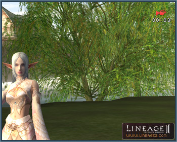

# Recording Gameplay

A function that enables recording and replay of gameplay has been added.

## Recording

Begin gameplay recording with the `/start_videorecording` command or by clicking Begin/End Video Recording in the Action window (Alt+C). When recording begins, a system message displays and a red camera icon at the top right of the screen will blink.

Stop recording with the `/end_videorecording` command or by clicking the Begin/End Video Recording button. When recording stops, a system message with the replay file name displays and the red camera icon will disappear.

Saved files of the recorded game are created in the Replay folder.

## Playback

Click the Replay button at the bottom right of the Login screen to view the list of available replay files. Select the file to be played back and click the OK button.

Check the box above the OK button to lock the camera perspective during playback. If the file is played back without checking the box, the camera can be freely moved during playback with the right mouse button.

The following keys can be used during playback:

- `Keypad +`: Speed increases
- `Keypad -`: Speed decreases
- `Space Bar`: Temporary pause/play again
- `ESC`: Go back to Login screen
