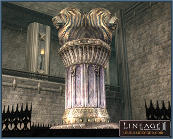

# Changes to Castle Sieges

## Goddard Castle

Goddard Castle in the Goddard territory resembles a fortress tucked away in rugged mountainous terrain. The distinguishing feature of Goddard Castle is that it makes use of two artifacts. Divided into Altar of Water and Altar of Fire, those who succeed in engraving their seal onto the artifacts assume the castle lordship.

Unlike other castles, Goddard Castle is equipped with a rear door that is immune to attacks. This door shuts at the beginning of a siege and opens automatically upon its end.

No castles have been added to the Rune territory with the Chronicle 4 update.

## Castle-Related Changes

The Teleport NPCs stationed at the castle have been removed. In their stead, teleporting into and out of the castle is possible by talking to the gatekeeper. Castle lord privileges can be given to fellow clan members to enable them to teleport.

## Siege-Related Changes

With the addition of Goddard Castle, a maximum of four sieges, each at a different castle, can now be waged at once.

The purchase of siege mercenaries is now only possible before the Seven Signs seal expires.

The number of mercenaries dispatched in each castle has been modified. Players can view the number of mercenaries dispatched at each castle by talking to the Mercenary Master.

Beasts are not able to attack the castle gates.

The inside of the castle has been set up as a non-flying zone during a castle siege. However, a clan leader in possession of the castle can mount a wyvern to fly inside the castle.
