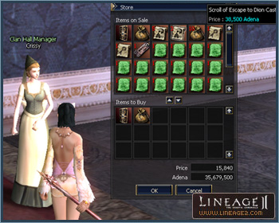

# Clan Halls

## Clan Halls (Auction)

Five clan halls available for auction have been added in Giran Castle Town and four in Goddard Castle Town. These are A-grade clan halls are equal to the Aden Castle Town clan halls and can be decorated.

The six clan halls in Aden Castle Town now give clan leaders the ability to ride a wyvern through the clan hall gatekeeper.

Dion Castle Town clan halls can now produce items.

A map of clan hall locations can be viewed by speaking with the Auctioneer.

## Clan Halls (Hideouts)

The amount of time the hideouts Partisan Hideaway, Devastated Castle, the Bandit Stronghold can be held has been increased from one week to two weeks.

The functions of occupied hideouts have been expanded. Experience points recovery, buffs, and item production functions have been added. A Wyvern Master has been dispatched to the Devastated Castle and the leader of the clan that owns the castle will be able to ride the wyvern. The Devastated Castle and Bandit Stronghold can create Scrolls of Enchant Armor.

Players can now pay adena to participate in the Bandit Stronghold battle in addition to applying through the pre-existing quest. The clans participating in the Bandit Stronghold battle can be viewed by speaking to the messenger.

Teleporting at occupied hideouts now requires a fee of 500 adena, the same as clan halls.

## Miscellaneous Changes

At item production level 3, pet exchange tickets, assorted potions, fish oil, dyes, and recipes can be acquired.

By activating item production in the Devastated Castle or the clan halls of Aden Castle Town, Food for Wyverns can be purchased.
