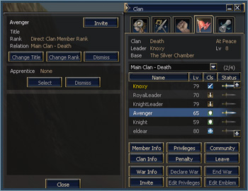

# Clans and Alliances

## Clan Organization

A clan is now organized into several different units, each with its own distinctive role. The main clan consists of the clan leader and standard clan members. In addition, a clan may have an Academy, up to two Royal Guards, and up to two Orders of Knights.

| Organization | Required Clan Level | Max Members |
|-------------|-------------------|-------------|
| Main Clan | 1 | Depends on clan level |
| Academy | 5 | 20 |
| Royal Guard 1 | 6 | 30 |
| Royal Guard 2 | 7 | 30 |
| Order of Knights 1 | 7 | 20 |
| Order of Knights 2 | 8 | 30 |
| Order of Knights 3 | 8 | 30 |
| Order of Knights 4 | 9 | 30 |

## Upgrading Clan Levels

The clan level upgrade system has changed. New requirements for upgrading clan levels are as follows:

| Clan Level | Item Required | Item Amount | SP Required | Member Requirement |
|-----------|--------------|-------------|-------------|-------------------|
| 5 | Proof of Blood | 1 | 0 | 30 members or more |
| 6 | Proof of Blood | 1 | 0 | 30 members or more |
| 7 | Proof of Spirit | 1 | 0 | 50 members or more |
| 8 | Proof of Spirit | 1 | 0 | 50 members or more |
| 9 | Proof of Aspiration | 1 | 0 | 50 members or more |

## Royal Guards and Order of Knights

A clan leader of a level 6 or higher clan may create a Royal Guard through a clan NPC. The clan leader appoints a member as the captain of the Royal Guard. The Royal Guard captain may invite or dismiss members of the Royal Guard.

A clan leader of a level 7 or higher clan may create an Order of Knights through a clan NPC. The leader of a Royal Guard may create an Order of Knights under that Royal Guard. The Order of Knights captain may invite or dismiss members of the Order of Knights.

## Clan Reputation Points

A new system of Clan Reputation Points has been added. Clan reputation points can be earned through various clan activities and can be lost through certain actions.

**Ways to earn clan reputation points:**
- Completing clan quests
- Acquiring a clan member through the Academy (when the member completes their second class transfer)
- Winning a castle siege
- Killing an enemy clan member in a clan war
- Hunting raid boss monsters

**Ways to lose clan reputation points:**
- Losing a castle siege
- Being killed by an enemy clan member in a clan war
- Dismissing a clan member

## Clan Skills

New clan skills have been added. Clan skills are applied to all clan members who meet the rank requirements. Clan reputation points are required to learn clan skills.

| Skill Name | Required Clan Level | Description |
|------------|-------------------|-------------|
| Clan Imperium | 5 | Grants the right to open a clan command channel |
| Clan Magic Protection | 5 | Increases clan members' M. Def. Affects Heir class or higher |
| Clan Luck | 7 | Decreases XP reduction rate and item drop chance upon death. Affects Heir class or higher |
| Clan Guidance | 7 | Increases clan members' Accuracy. Affects Baron class or higher |
| Clan Vigilance | 7 | Increases clan members' resistance to sleep. Affects Viscount class or higher |
| Clan Fortitude | 7 | Increases clan members' resistance to stunning blows. Affects Viscount class or higher |
| Clan Freedom | 7 | Increases clan members' resistance to being held or charmed. Affects Viscount class or higher |
| Clan Cyclonic Resistance | 7 | Increases clan members' resistance to water/wind attacks. Affects Viscount class or higher |
| Clan Magmatic Resistance | 7 | Increases clan members' resistance to fire/earth attacks. Affects Viscount class or higher |
| Clan Aegis | 6 | Increases clan members' P. Def. Affects Knight class or higher |
| Clan Shield Boost | 6 | Increases clan members' Shield P. Def. Affects Baron class or higher |
| Clan Withstand-Attack | 7 | Increases clan members' Shield defense probability. Affects Viscount class or higher |
| Clan Agility | 8 | Increases clan members' Evasion. Affects Baron class or higher |
| Clan Empowerment | 8 | Increases clan members' M. Atk. Affects Viscount class or higher |
| Clan March | 8 | Increases clan members' Speed. Affects Count class or higher |

## Clan Academy

An Academy system has been added in order to ease game play for new players in addition to creating a method for long-term clan expansion.

**Creation Requirements:** Clans level 5 and above may create an Academy.

**Conditions for Joining:** Any character, level 39 or below, who has not yet joined a clan and has not yet completed the second class transfer may join an Academy. The maximum number of members in an Academy is 20.

**How to Create an Academy:** The clan leader can create an Academy through NPCs who are in charge of clan-related activities (a High Priest, Grand Master, etc.).

### Benefits and Withdrawal of Academy Members

When an Academy member completes his/her second class transfer, the member will receive a commemorative item. The Grand Master NPC of the member's own class will award the commemorative item automatically upon the completion of the second class transfer.

The member is then automatically withdrawn from the Academy, and will not receive a penalty for re-joining a clan.

### Academy Members' Rights

An Academy member's clan name is the same as the main clan name, but is displayed in **yellow**.

Academy members may use clan chat and alliance chat.

By default, Academy members may use the clan hall and castle owned by the clan just like any other clan member. However, the clan leader does have the option to set it up so that Academy members may not use them.

Academy members may use the clan warehouse and clan bulletin board just like any other clan member. However, the clan leader does have the option to set it up so that Academy members may not use them.

The rights below cannot be bestowed upon Academy members:
- Join a clan or be dismissed
- Title management, crest management, master management, level management, bulletin board administration
- Clan war, right to dismiss, set functions
- Auction, manage taxes, attack/defend registration, mercenary management

When in a clan war or a siege with Academy members:
- Experience penalties apply even when killed by opposing members of a clan in a mutual war.
- Academy members cannot see an enemy mark displayed on the enemy clan members' character name.
- Academy members have no relationship during a clan war or siege war.

### Sponsors

Academy members who have a sponsor have their names displayed in yellow, but the names of those without sponsors are displayed in white.

Clan members who have master management rights may appoint other clan members as sponsors for Academy members.

Alert messages indicating their logged in status will be displayed for Academy members and their sponsors.

The relationship between Academy members and their sponsors may only be one-on-one.

Clan members who have master management rights may dissolve the relationship between an Academy member and their sponsor.

### Related Quests

Academy members can acquire a D-grade armor set through a quest that may be conducted with ordinary clan members.

Only Academy members and graduates of an Academy may wear the armor set acquired through this quest.

When withdrawing from an Academy, after acquiring the armor set, the armor will not be unequipped automatically. However, once you unequip the armor it cannot be worn again.

## Clan Rights and Delegation

Many different kinds of rights have been added and modified for clan leaders to bestow upon clan members.

Clan leaders need to pay extra attention when they bestow these rights to their clan members especially when related to things such as clan reputation points, clan member joining/withdrawal, and rights related to the clan's castle and manor.

**New rights include:**
- **Dismiss:** the leader can expel clan members.
- **Master Rights:** the leader can appoint or remove a master.
- **Manage Ranks:** the leader can set the rights level of each clan member.
- **Manage Levels:** the leader can set the clan castle and clan manor management levels.

**Modified rights include:**
- **Edit Emblem:** the leader can register or delete the clan emblem or clan insignia.
- **Clan Hall Privileges - Use Functions:** can use the clan hall function.
- **Clan Hall Privileges - Set Functions:** can set the clan hall function.
- **Castle Rights - Manor Administration:** can set the manor.
- **Castle Rights - Manage Taxes:** can set the castle tax and deposit/withdraw the tax.
- **Castle Rights - Manage Mercenaries:** can hire a mercenary.
- **Castle Rights - Set Functions:** can set the castle function. (Reinforce castle gates, castle walls, and set a trap device.)

The clan leader may assign rights related to clan halls and castles even when the clan doesn't own one at the time.

The "Edit Privileges" function has been added for the assignment of simple rights. A clan leader may setup clan rights in advance and according to rank.

To assign rights to clan members by rank:
1. In the Clan Member list, double-click on a character name.
2. Click the "Change Rank" button in the Clan Window menu and bestow the desired rank.

### Clan Leadership Transfer

A clan leader may transfer their rights to other clan members. The leader must request the clan leader transfer from an NPC who is in charge of clan activities. The new clan leader will assume their new role during the next regularly scheduled maintenance time (10:30 CDT on Tuesdays). A clan leader transfer may be cancelled anytime prior to the regular maintenance time.

### Clan Window

Many different functions have been added for easier and more systematic clan-related activities and as such, the related interface has also been improved.

Double click on a clan member's name in the member list to open a menu window displaying the rights given to that member.

Selection tabs have been added to the clan window so that you may see the members of the main clan, Academy, Royal Guard, and Order of Knights.

In order to invite somebody to join a clan, click the "Invite" button and select the organization within the clan you wish to invite the person to.

When clicking the Edit Emblem button, the menu window where you may register or delete the clan emblem or clan insignias is displayed.

An information window to view clan war information by status has been added as well as an Edit Privileges window.

## Other Changes

- The maximum number of clans in an alliance is three.
- The penalty given upon dismissal or withdrawal from a clan has been shortened from 5 days to 1 day.
- Clan Hall Managers now show the amount that will be deducted from the clan warehouse and the date the transaction will occur.
