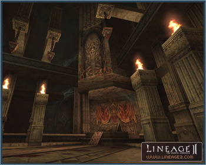
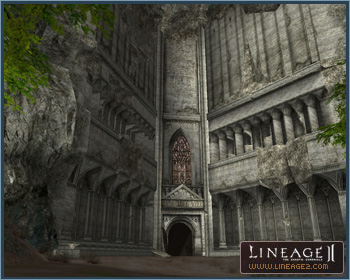
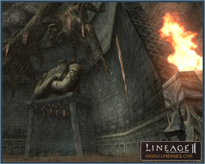
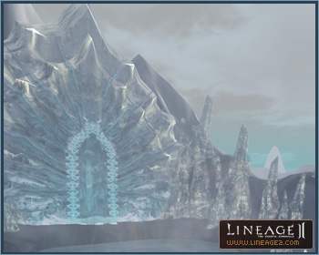
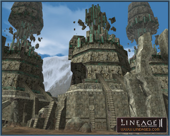

# Rune and Schuttgart Territories

[Rune Territory](#rune-territory) | [Schuttgart Territory](#schuttgart-territory)

New hunting grounds and dungeons have been added to Rune Territory, the Orc areas, and Schuttgart Territory. These will also connect the Dwarf areas to the mainland.

## Rune Territory

Three dungeons have been added to the Rune Territory.

### The Pagan Temple

The Pagan Temple is located in Rune Township. Some of Rune's nobles worship the devil Triole, one of the "4 Kings", and have built this temple in a large area in the underground of Rune Township.

In order to enter the temple, you must be one of the Pagans or make an oath that you will be making an offering to Triole. The monsters appearing here are at levels 80 to 87, some of the highest level monsters in the world.

### The Stakato Nest

The Stakato Nest is located to the east of the Swamp of Screams. In this underground cave, there resides the Stakato Queen (who is almost at the end of her life) and her followers. The Stakato Proconsul, an elite warrior class of the Stakato, is born and raised here. The monsters appearing here are at levels 72 to 80, and present new battle challenges to players.

### The Monastery of Silence

The Monastery of Silence is located to the east of the Valley of Saints and is at odds with The Pagan Temple. This dungeon was built by the priests of Einhasad.

The Monastery has two entrances, and it is possible to enter from both ways since it is adjacent to Goddard and the border of Rune. The monsters appearing here are at levels 80 to 87, some of the highest level monsters in the world.

## Schuttgart Territory

Six hunting grounds have been added to Schuttgart Territory.

### The Frozen Labyrinth

The Frozen Labyrinth is located southeast of Schuttgart Castle and is a field hunting ground composed of many valleys. The structure of the valleys is complicated, much like a labyrinth, and is connected to the The Ice Queen's Castle. You may hunt solo or in a group in this area. The monsters appearing here are at levels 53 to 63, and mean business.

### The Den of Evil

The Den of Evil is located south of Schuttgart Castle. In this area, Ragna Orcs are expanding their power by using evil spirits in league with the Baranka Shamans.

You may hunt solo or in a group in this area. The monsters appearing here are at levels 40 to 50.

### The Plunderous Plains

The Plunderous Plains are located east of Schuttgart Castle. This area was once a very important transportation hub that connected Dwarven villages and the Town of Schuttgart by railroad. This vile and unlawful area is now full of brigands who target Dwarven merchants. There are field hunting ground here with monsters at level 30 to 40.

### The Ice Queen's Castle

The Ice Queen's Castle is located southeast of Schuttgart Castle, and may be entered through the Frozen Labyrinth. Only a party of two or more members can enter. All party members must possess 10 Silver Hemocytes gained through a quest.

This hunting ground is based on a timed attack concept, and only one party may enter every 35 minutes. If the raid boss is not attacked and defeated within the given time, then the party is transported back outside. The monsters inside the castle are levels 55 to 60. Restarting is impossible once you are in the Ice Queen's Castle; even if the server goes down, players must meet the entry conditions and start over from the beginning.

### The Crypts of Disgrace

The Crypts of Disgrace are located southwest of Schuttgart Castle. These crypts are part of a passageway that leads to Schuttgart Castle from the Orc Village. Players may hunt solo or in a small groups here. The monsters appearing here are at levels 25 to 32.

### The Pavel Ruins

The Pavel Ruins are located south of the Town of Schuttgart. Here the giant Pavel used to study weather phenomenon.

The ruins are now under control of a mad dwarf scientist known as Dr. Chaos. The monsters appearing in these ruins are at levels 46 to 54.
